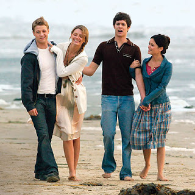

# The O.C.

In show biz, there are innovators and there are copiers. Watch Dark
City and you can see how it influenced the Matrix movies. How I Met
Your Mother? Well, I believe a major influence on the show has been
The O.C.Evidence proving this point is plenty. Except the fact that a
Jewish character is at the center of both shows, there are references
to Craw Magra an Israeli martial art, poking fun at malls, walk of
shame, geekness being shown as cool, etc. In all these, The O.C. has
been the innovator HIMYM he copier.Another point where O.C. has been
an innovator: This show was, except its highly unique entertainment
value, a blatant (and successful) attempt to make Jews in America look
cool. I mean, the show is great, and I have Jewish friends and like
them, respect the religion as I do all religions - but you've got to
see the context where the show was filmed. Post 9/11, just when people
starting to think "is this all happening because we protect Israel,
and, excuse me, why are we protecting them again?" we get a show like
this one. The said question happens to be a valid one - but a
dangerous one for US policy makers. Public opinion can change things
in US, therefore decision makers take great care to shape/influence
it, and questions like these need to be managed.And heeereee comes The
O.C. to the rescue. It's Jewish creator Josh Schwartz creates a wonder
product making Jewish Americans as an essential part of US fabric,
while, at the same time, stressing the Judeo-Christian synthesis of
his country AND providing great entertainment. Chrismukkah anyone?
What a great concept and a tool. An über holiday created in the
O.C. universe which combines Christmas and Hannukah, "best of both
worlds where you will feel both Jesus and Moses on your side". :) It
is a perfect concoction and is a source of hilarious jokes which
scriptwriters mine with great success.Yes, O.C. succeeds at its
mission with an A+. Flying colors.  The all-American boy is adapted by
a Jewish father-figure Sandy Cohen who is played brilliantly by Peter
Gallagher, hence the message is sent: "US needs us, we are good
together".  Sandy the Jewish lawyer is the moral pillar of the
show. He helps people, fights injustice, protects his family and
beautiful waspy wife (played by the beautiful actress Kelly
Rowan). You can't do better than this. And you cannot help but feel
the urgency of this show trying to succeed at its misison.  I believe
with all my heart Josh Schwarts took to this project as a man on
mission, as someone would with an energy one would reserve only to
save his own life. Yes, that's how urgent and desperate the show feels
at times to get his point across. This makes the show no less
entertaining, mind you, but a little more obvious.Putting all of this
aside, there is no denying that there is dept to O.C. with which
appeals to anyone. There is love in this show - the protective,
caring, friendly kind. The shows uses this emotion in abundance and
without apologizing for it. It can get a bit Southern in its use of
it, through is real-life Southerner Ben McKenzie (a Texan) who is
portrayed at times as overly protective friend/lover, but in the
defense of the show, looking at the larger picture you get the feeling
that people caring for and depending on each other is what makes
O.C. tick.  It all starts with one act of kindness (Sandy adopting
Ryan) and the show ends with a premise of another, in the end of 4th
Season Finale where a grown-up Ryan, now an architect, looking at a
younger version of himself across the street and clearly thinking to
adopt this boy. Family members, friends help each other all the time,
when they don't, the story line seem to punish them.But there is more:
I reveled in the fact that the show just picks apart the phony glamor
culture of "It girls" and the overall jet set mentality. Seth Cohen is
the geeky outsider of the show but as the stories unfold, his ranks
grow - first Ryan, then Marissa, Summer and finally, Luke join the
geek, outcast ranks. I can't help but appreciate the fact that getting
education is shown as über cool in O.C. world, Paris Hilton who does a
cameo as a famous It girl admits going to grad school secretly (makes
Seth promise not to tell anyone in the fear of losing her ditzy
image), the "slut" of the show Julie Cooper gets a diploma during the
fast forwarded scenes at the end that beautifully tried to fit in
couple of O.C. seasons in one tight run. And, last but not least,
Summer, the "shallow" girl becomes a fighter for the environment,
becoming a sophisticated and smart woman by the end of the show.I felt
like cheering when, at the end of S4, Cohens move to their original
house close to their alma matter Berkeley - after an earthquake
destroys their phony make-believe "too good to be true" world of
Orange County along with their expensive home with its view and a pool
house. This act was nothing short of a wake-up call reminding viewers
what "reality" is really about, and it turns out reality isn't so bad
after all, and in fact, was everyone's ideal to begin with. Since the
beginning, main characters seemed to want to get out of Orange County,
and finally at the end of S4, Josh Schwartz destroys this house of
cards that was Orange County along its parties, phony lives, and
overpriced cars making way for the characters to join real and more
substantitive lives. The message was "it was all fun and good here,
but that's all it was - fun... for a while".Thanks for the great
entertainment and the lessons O.C. - we get you and love you for what
you are. Sophisticated, great entertainment with heart.

