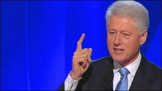

# Bill Gave a Great Speech
Son of a gun.. During the Denver speech where he pledged support to Barack Obama, Bill Clinton brought the house down. It started with cheers that seemed to go on forever - Bill had to calm the crowd many times so he could start his speech. This level of outpouring enthusiasm for him shows that there is still a lot of support for Bill the President out there. In fact Bill, in so many ways, was so right on the money on so many issues that it makes me question the two-term limit that's been placed on the presidency. Wouldn't you want to see a Bill against W race? I would. I bet Bill would kick W's ass too.The speech actually made me remember one paragraph from Bill's autobiography; He was talking about his nomination where Cuomo was going to make a speech to support him... and you could almost feel the excitement and unsureness of a young man who clinched the nomination so unexpectedly, and all of a sudden, he is surrounded by well-known Democratic hunchos and was very much in need of that support he was going to get from the larger than life figures around him. Of waiting for Cuomo speech Clinton says: "then came the big moment: Mario Cuomo's nominating speech. He was still our party's best orator, and he didn't disappoint".Well; I think Bill Clinton was Obama's Cuomo this time around, and he didn't disappoint either. Just like the young man at 1992 needing all the support he can get from his party, he returned the favor to another newcomer with a great speech at 2008. Clinton uttered some nice catcy sentences like "the world always admires our power of example more than our example of power". Slam dunk. I had never seen 1992 Cuomo speech, but I would say it can't be better than this one.Job well done. Now all that's left to do is to get rid of this monkey boy W and "dead man walking" McRepublican McCain.You can download/watch the whole speech here:

at

August 28, 2008

