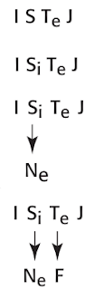

# MBTI Formula

How do we determine MBTI  components  by just looking at four letter type info? Let's take ISTJ as an example; first we look at the last letter, it's either J or P. This letter defines intro/extraversion for the letter before it. J implies extraversion, P interversion. For ISTJ, it means previous letter T, thinking is being extraverted, we get Te. Second letter from start is always the opposite of the third, in terms of i/e, in this example, that means introversion, meaning Si.

These are dominant functions, the weaker ones are the complete opposite of dominants, that is, Si opposite is Ne, Te opposite is Fi. That is the entire list, Si,Te,Ne,Fi.

If the type was ESTJ, the components would come out the same, because the first letter plays no part in determining components, but the ordering would change. ESTJ has an E, that means extraversion is preferred, that would push Te in front of Si.

Take the Test (see mbti_en.html file for English)

at

January 09, 2012

