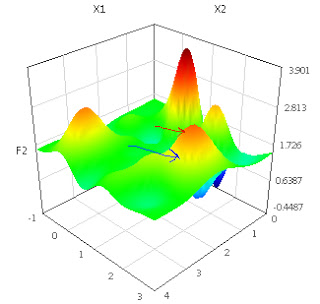

# Being Stuck at a Local Optimum

In a branch of mathematics called Optimization, the practitioners are interested in finding maximums or minimums of some function. A function might look like the picture below:

But there is a problem: most of the time, it is not possible to find a maximum using clean analytical means, meaning we cant calculate a simple global function that will point to the maximum.  

In those cases, one is forced to use "local" methods. Meaning: Find the direction of maximum hill climb, and follow that direction. You only look around, your immediate surroundings. The hope is that by doing this, eventually you reach the top.

It is a nice technique. But such methods,  can stuck at a local maximum, IOW by simply looking at our immediate surroundings, we might not be able to reach the "true" top. In the picture above, we could be at the bottom (blue arrow), we can only reach a local maximum (red arrow). 

Let's say LIFE is a function. LIFE is pretty complicated, so no clean solution can exist to find the true "maximum" straightaway. IOW by simply trying to do one better than your current situation, you might arrive the top, but not the true top.

This is where humanity finds itsef at this juncture in history. We climbed that local hill, tried to do one better, only to improve our current situation, using local methods, but when we reached the top, we gazed out and saw there were other hills that were much higher than our own, and we are realizing we need try again, and for that we need to climb down, and try to climb other mountains, face other challenges. 

at

September 03, 2012

