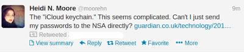

# Ouch

Link

Apple’s trying to do away with your desktop sticky notes of passwords with the iCloud Keychain.  It will encrypt and store website logins, credit card numbers, Wi-Fi networks and account information to help you have a different password for every site, as security experts suggest. 

at

June 10, 2013

