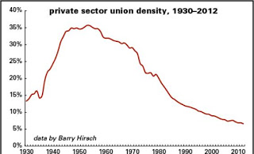

# Still More on Phase Transition

Continuing from here

We talked about B. Bueno de Mesquita's recent focus on "buying influence", and watching money flows. There are some weaknesses of this approach, for example, using his new favorite tool he dismisses Occupy Wall Street movement a little too quickly ("they just want more money"), keeps looking at existing 
institutions (i.e. unions),  and existing power structures. Money is but 1 out of
 the 3 sources of power, and nowhere near as varsetile as knowledge, hence the limitations of this approach becomes clear.

Such preoccupation with existing institutions plaques Daron Acemoglu's thinking as well, who recently discovers unions as important pieces in the development puzzle. That could have been true until the 50s, in Europe and US, however it probably will not be replicated in other parts of the world, during the 21st century, as developing countries will likely jump to having a white-collar workforce without bothering to stay in low-cost production for a long time oblivating the need to have the accompanying union structure. To see how hapless unions have become in US already, one only needs to look at the graph below:

That is union membership as percentage of the workforce in US. This the picture of 2nd Wave disappearing right there.

at

August 26, 2013

