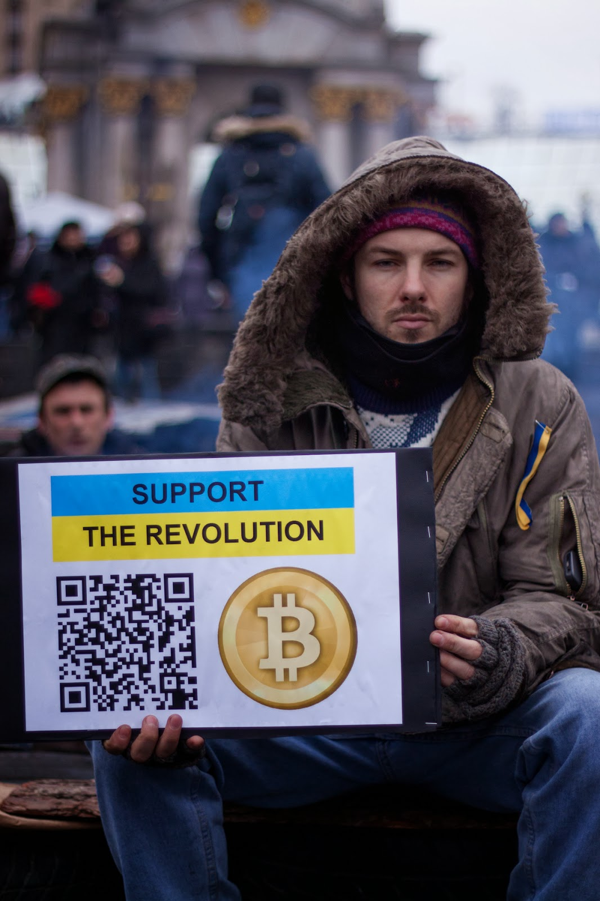

# Ukraine Protestors Turn to Bitcoin

Link

The dust is yet to settle on the recent, often violent protests in Ukraine that began last November [..] President Viktor Yanukovych was removed from office and has gone into hiding [..] Not only [was the protests] a major logistical and people-management feat to co-ordinate, but it must all be paid for somehow. So, expatriate Ukrainians around the world have joined the fight to campaign and raise funds to assist the struggle back home [..]. PayPal only allows money to be sent out of Ukraine, while international bank transfers can take days to complete. Much of the time, transfers happen through friends and trust networks.This week sees a new campaign to raise funds directly via bitcoin. Photos are beginning to appear online with protestors holding up QR code signs, as part of a co-ordinated effort to collect donations from anywhere in the world, in any amount, in an instant.

--

Basically you can point your mobile phone to that QR code which contains a bitcoin address, and send money to that address directly, right away. No intermediaries. This is the future. 

at

February 28, 2014

