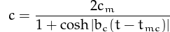

# Peak Oil After Shale

How much did the "US Shale Oil Revolution" change the peak oil scenarios? The famous Hubbard curve would assume oil is drilled the same way throughout the span of its analysis, fracking  is a different technology, so it makes sense this new tech changing projections somewhat. However as it turns out, the peak year changed only by a few years. 

US scientist Hubbard had correctly predicted US peak oil years as 1965-1970.  His  curve, the so-called Hubbard curve function,

takes into account new oil resources becoming harder and harder to find and exploit. We applied his formula to world crude oil production data, and before shale oil "revolution" the peak oil year was 2004. Now peak oil year is at 2011. 

A post talking about the difference shale made (basically covering up the peak oil sceneario we calculated around 2004, but it can only do so much). The key about Hubbard curve is that it detects the tapering off, the decrease of the increase and not get fooled by the overall increase year by year.

Python code

import pandas as pd, mathimport scipy.linalg as linimport lmfitdef find_peak(df,cminit,bcinit,tmcinit):    minyear = df['year'].min()    df['year'] = df['year'] - minyear    def err(w):        cm=w['cm'].value;bc=w['bc'].value;tmc=w['tmc'].value        tmp = (1.+np.cosh(bc*(df['year']-tmc)))        yfit = 2.0 * cm /  tmp        return df['production']-yfit    p = lmfit.Parameters()    p.add_many(('cm', cminit), ('bc', bcinit),('tmc', tmcinit))    mi = lmfit.minimize(err, p)    lmfit.printfuncs.report_fit(mi.params)    print mi.params['tmc'].value + minyear    return mi

world = pd.read_csv('world.csv',sep='\s')minyear = world['year'].min()resworld = find_peak(world.copy(),0,0,0)

ciworld = lmfit.conf_interval(resworld)for ci in ciworld['tmc']: print ci

print [minyear+56, minyear+68]

The 95% onfidence interval is [2006, 2018]. 

Data, CSV

at

September 14, 2014

