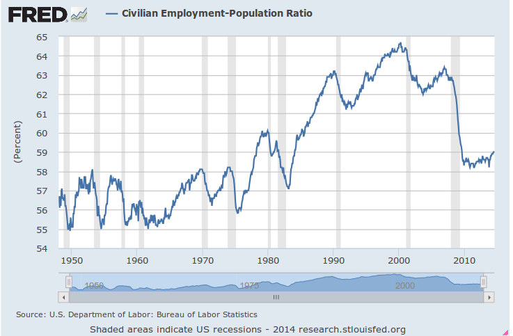

# Q&A - 8/9

Question

If modelers work with snapshots, does that mean time always needs to be  frozen?

No

Snapshots can even have change itself as a variable. 

A slice of change
 can depend on a frozen attribute, or,on other slices of change of
other attributes.

How big is this slice? Since we are talking 
snapshots, the slice cannot be any slice, it is usually the smallest 
slice, or the infinitesimal slice. "Change in population depends on the current population size" - here population change is a slice. dp(t)/dt = k p(t).

BTW, usually this part of Calculus, D. Equations are not shown to students until much later in their education, they are forced into some rote on taking derivatives etc. That is not the essence of this field - Newton didnt develop Calculus so he could "take derivatives" all day. He invented it to model planetary motion. 

Question

So all this quantum worlds, possibilities is bullshit, what about this fork in the road stuff. I had one in my life, I had to choose A or B - I chose B, and I am now, like, a stockbroker. I could have been a washmachine repairman.

No you wouldn't

My old man tells us a story sometimes - apparently at certain point in 
school he had a choice between going to medical school or studying 
engineering, in agriculture. He chose the latter, now he says "son, if I became a doctor, I would have been the rich as king" (in a 
Turkish accent of course). I mean, sure, it is true doctors in 
TR were in high demand at certain point, so it is understandable pops thinks if that particular road was followed, he'd be richer. But could he have done it? When I profiled him it turned out he had this particular attribute called Free To Roam. These people need open spaces, be able to move around,  physical freedom of movemement is very important for them; Working in agriculture, even as an engineer gave my dad an opportunity 
to be at these open spaces - at these huge industrial farms, or on the 
road.

The medical alternative would have required him to spend time in closed spaces, and uh.. develop some  bedside manners..Everyone who knows dad knows he'd never be able to do 
this. Fork in the road? It's an illusion. There really never was one.

Character attributes define likes and dislikes, and these likes and dislikes are very strong. "A man will do as he will but not will as he will" says the wise man. Dude is right. 

Question

If 2008 crisis came out of nowhere, could not be predicted, with the models of that day. That sounds like a Black Swan.

What black swan!?

Graph

See  the gray bars (vertical) on the graph above, these are economic crisis points. Every 10 years or so a a crisis arrives.. What black swan is this guy talking about? There are no surprises here. 

Question

Some blame the innovation gap for the recent crisis [..]

What innovation gap!?

The exact opposite is happening as a matter of fact - science and engineering is moving at such a breakneck speed people are having a hard-time keeping up. Prices in tech related fields are going down like a rock; DNA sequencing now can be done for $1000, this used to cost over $250,000 (sequencing single human genome).

This kind of change beats Moore's Law.

Question

On the graph above, the employment rate is shown. But isnt unemployment 6.1%?

It is not

On that graph, the % of people (over 16+) who are working, in proportion to population is at 59%. On another graph we can also see  # of people who are between 25-54 years of age and are employed, this count is 95,365 K. US population has 40% of ppl in this age group, then roughly 300000 * .4 / 95365 * 100 = 79% is employed, this is for people who are in working age, not retired, and/or out of school. Then true unemployment is at 21%.

Link

Take for example, Bill O'Reilly's show, "The O'Reilly Factor." O'Reilly had his lowest month since 2001 in the key demo, with 308,000 viewers. Yes, O'Reilly is still the No. 1 program in cable news in both total and demo viewers, averaging 2,136,000 total viewers in May.

But the majority of those viewers are over the age of 55. In fact, the median age for O'Reilly is now just over 72 years old. The average Fox News viewer overall is 68.8, while the average ages of MSNBC and CNN viewers were 62.5 and 62.8, respectively.

Wow

Yeah - pretty much noone I know (friends, coworkers) watch TV these days. TV is part of mass-media, one-size-fits-all approach, which belongs to second wave.

at

September 08, 2014

