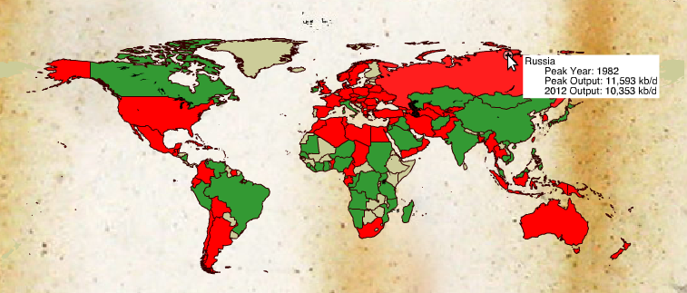

# Interesting Map

From David Strahan's site

The interactive map shows peak oil year for each individual country - Russia apparently peaked already (red means past peak), Iraq, Saudia Arabia still have not. No wonder why Iraq was invaded, huh? Canada is still in the green..  time to do a little Canada invasion? US numbers need some updating because of the "shale revolution" -- but things will go back to their merry way soon enough. 

at

November 06, 2014

