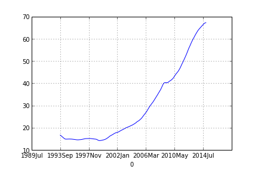

# Q&A - 13/12

Movie Quote

[From the movie Swordfish] Jefferson shot a man on White House lawn for treason.

True, but...

The man was found guily for treason, by the courts, so he was facing the firing squad already, Jefferson only told the firing squad to take a hike, and basically did their job. It's a little gangsta, but not too much. He was enforcing the decision of the courts / the law after all.

The way the movie Swordfish presents it however,  kinda, sorta made it sound like TJ just called some guy in da house and executing the man on the spot (you getting up on my grill fool?). No.. Nothing like that happened.

BTW this movie was probably bankrolled by neo-con "interests". It was all about "doing what's necessary", and generally about "letting go", "letting it rip".

Link

When OPEC announced on Thanksgiving Day that it would maintain oil production at 30 million barrels per day, chaos broke out in the oil market, and the price of oil around the globe spiraled into a terrific plunge. The unity of OPEC, if there ever was such a thing, was in tatters with Saudi oil minister smiling victoriously, and with a steaming Venezuelan oil minister thinking of the turmoil his country is facing [..]

During the closed-door meetings in Vienna, Saudi oil minister Ali al-Naimi told OPEC members that OPEC had to combat the US fracking boom. If OPEC cut output to raise the price of oil, it would lose market share, he argued. The way to win would be to allow overproduction to depress prices to the point where they would destroy the profitability of North American producers [..]

Asked if this was a response to rising US production, OPEC Secretary General Abdullah al-Badri essentially confirmed OPEC had entered the oil war against the American shale revolution: “We answered,” he said. “We keep the same production. There is an answer here.” [..]

Interesting

Personally I'd like to see frackers take a plunge, along with Putin's petro-mafia. Overall tho the latest fall did not change the overall pattern in oil prices. We are talking about a diminishing resource, and overall price trend is up. Even frackers getting ..  fracked, is part of Hubbard's model. I plotted a moving average of monthly oil prices starting from May 1985, 

import pandas as pddf = pd.read_csv('oilprice.csv', header=None, index_col=0)pd.rolling_mean(df[1],100).plot()

That simple duuuude! The output

Whassup. 

The data

Ian Hay

[Talking about modern/industrial war-making] It would be child’s play to shell the road behind the enemy’s trenches, crowded as it must be with ration wagons and water carts, into a bloodstained wiklerness … but on the whole there is silence. After all, if you prevent your enemy from drawing his rations, his remedy is simple: he will prevent you from drawing yours.

Brrr

Scary stuff.. This is how senseless second-wave wars had become. The military/industrial complex of both sides started wars, and they just kept on going, both sides locked into its continuation and neither taking steps to cause "finishing" damage to the other side as is seen from the example above which is quite ironic because that's supposed to be the aim of wars. This kind of war making at a certain level simply made wars for the sake of making them. Great example of mutually assured destruction (MAD) - in its active form.

Europe did not arrive at its present state by accident, some bitter lessons were learned the hard way, as seen above. That is also why victors of WWII, such as Russia, Britain, US have such a hard time today coming to terms with wars and/or military adventures.

at

December 13, 2014

