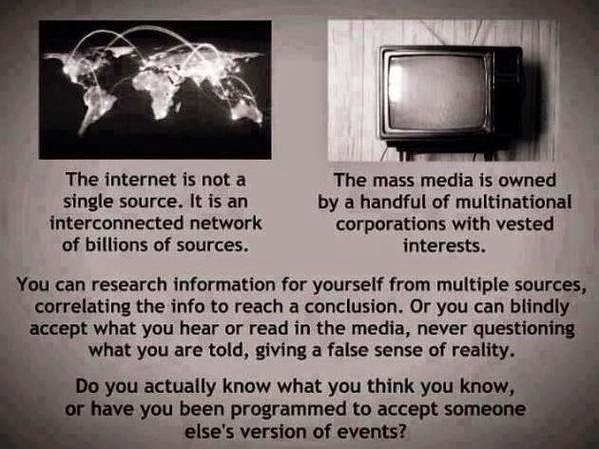

# Q&A - 9/1

Bill Donohue, Leader of the Catholic League

Stephane Charbonnier, the paper’s 
publisher, was killed today in the slaughter. It is too bad that he 
didn’t understand the role he played in his tragic death [..] 
Had he not been so narcissistic, he may still be alive.

So .. he had it coming? 

Times Higher Education

Dutch universities have vowed not to soften their groundbreaking demands for publishers to permit all papers published by their academics to be made open access for no extra charge [..]

Gerard Meijer, president of Radboud University and one of the lead negotiators for the Dutch universities, said that in addition to preserving access to their subscription journals, the universities wanted publishers to permit all future articles whose corresponding author has a Dutch affiliation to be published on an open access basis for no extra charge. He said universities were also unwilling to tolerate any more above-inflation price rises [..].

Professor Meijer insisted that Dutch universities were determined not to bend.

“We are willing to pay publishers for the work they do, but Elsevier’s profit margin is approaching 40 per cent, and universities have to do the [editing] work and pay for it. We aren’t going to accept it any longer. I think from the fact that Elsevier is not willing to move much, they simply still don’t believe it. Well, they got us wrong,” he said.

Go Dutch

A Tweet

No shit

at

January 09, 2015

