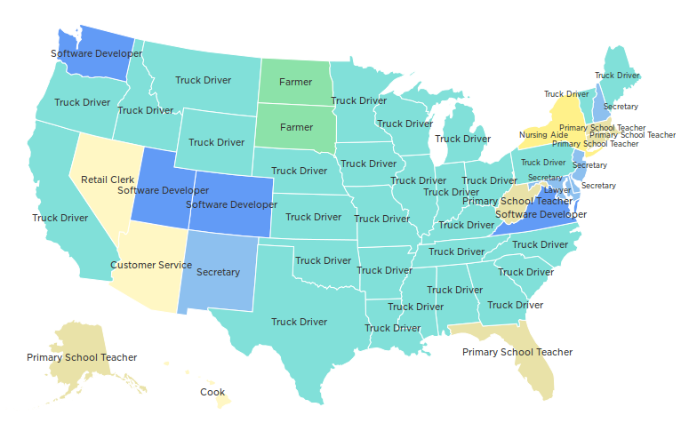

# Q&A - 10/2

Wired

There’s been a lot of fear about the future of artificial intelligence. [Some] worry that AI-powered computers might one day become uncontrollable super-intelligent demons [..] But Baidu chief scientist Andrew Ng—one of the world’s best-known AI researchers and a guy who’s building out what is likely one of the world’s largest applied AI projects—says we really ought to worry more about robot truck drivers than the Terminator.

Yes

NPR

We mapped the most common job in every state

I would definitely forget about the Terminator now

Bill Gates

Why aren't more ppl afraid of [AI calamity]?

I dont know, ask your own research chief

Microsoft Research Chief

Out of control AI will not kill us

Dude

You totally disagreed with your ex-CEO there... Like, not cool. 

at

February 10, 2015

