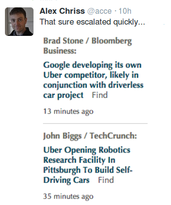

# Q&A - 3/2

News

Google is preparing to offer its own ride-hailing service [..]         

Competition is a good thing

Twitter

Link

The effects of the autonomous car movement will be staggering. PricewaterhouseCoopers predicts that the number of vehicles on the road will be reduced by 99%, estimating that the fleet will fall from 245 million to just 2.4 million vehicles.

Disruptive innovation does not take kindly to entrenched competitors – like Blockbuster, Barnes and Noble, Polaroid, and dozens more like them, it is unlikely that major automakers like General Motors, Ford, and Toyota will survive the leap [..]

Ancillary industries such as the $198 billion automobile insurance market, $98 billion automotive finance market, $100 billion parking industry, and the $300 billion automotive aftermarket will collapse as demand for their services evaporates. We will see the obsolescence of rental car companies, public transportation systems, and, good riddance, parking and speeding tickets. But we will see the transformation of far more than just consumer transportation: self-driving semis, buses, earth movers, and delivery trucks will obviate the need for professional drivers and the support industries that surround them.

The Bureau of Labor Statistics lists that 884,000 people are employed in motor vehicles and parts manufacturing, and an additional 3.02 million in the dealer and maintenance network. Truck, bus, delivery, and taxi drivers account for nearly 6 million professional driving jobs. Virtually all of these 10 million jobs will be eliminated within 10-15 years, and this list is by no means exhaustive.

Damn

Alexis Tsipras

My party, and I personally, disagreed fiercely with the May 2010 loan agreement not because you, the citizens of Germany, did not give us enough money but because you gave us much, much more than you should have and our government accepted far, far more than it had a right to [..]

[L]et me be frank: Greece's debt is currently unsustainable and will never be serviced, especially while Greece is being subjected to continuous fiscal waterboarding [...]

Soo

.. Tsipras is saying instead of repaying some old debt with new debt and trying to repay both, erase some of our old debts? That's what it all comes down at the end right? Who is paying when, or not paying.

