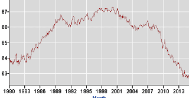

# Q&A - 30/5

Alvin Toffler, Revolutionary Wealth

IBM, Kodak and the NYPD are all large old organizations. But preventing the oncoming implosion requires more than changing in-place institutions It also necessitates creating new types of companies, organizations and institutions, large and small, at every level of society. And that calls for social inventors prepared to face inadequate resources, rivalry, suspicion, cynicism and just plain [idioacy].

Daunting as all that sounds, it helps to remember that none of today's familiar institutions—not IBM, not Kodak, not the United Nations, not the IMF not police forces or post offices-- dropped full-blown out of the heavens.

All
 our institutions, from central banks to blood banks, factories to 
fire-houses, art museums to airports were in fact originally conceived by
 business innovators and social inventors who faced far more entrenched 
resistance to change than we find in the advanced economies today. And
 many of their innovations in business and society have been at least as
 important as those in technology.

We know the names of many 
of history‘s great technological innovators - Savery and Newcomen and 
the steam engine, Whitney and the cotton gin, Edison and electric 
lighting, Morse and the telegraph, Daguere and photography, Marconi and 
the radio, Bell and the telephone. And we justly celebrate their immense contributions.

Unfortunately few —other than specialists and historians, if indeed they—can
 name the social inventor who first came up with the concept of a 
limited-liability corporation. Or the person who wrote it into 
Gesellschaft mit bescrankter Haftung, the 1892 German law that was the 
first to embody it. Can anyone imagine what today's world economy and 
financial system would look like minus limited liability for investors? 
Was that any less achievement than, say, the telegraph?

True   

Martin Ford, Rise of the Robots

[C]onsider a thought experiment. Imagine that Earth is suddenly invaded by a strange extraterrestrial species. As thousands of the creatures stream off their massive spacecraft, humanity comes to understand that the visitors have not come to conquer us, or to extract our resources, or even to meet our leader. The aliens, it turns out, have come to work [..]

Each [alien] is highly intelligent and capable of learning language, solving problems, and even exhibiting creativity. However, the aliens are driven by a single—and overwhelming—biological imperative: fulfillment comes only from performing useful work [..].  Gradually, the aliens integrate into our society and economy. They are eager to work, and they demand no wages. Work, for the aliens, is its own reward; indeed, it is the only reward they can conceive of. The sole cost associated with their employment is the provision of some type of food and water—and given this, they begin to reproduce rapidly.

Businesses of all sizes quickly begin to deploy the extraterrestrials in a variety of roles. They start off in more routine, low-level jobs but rapidly demonstrate the ability to take on more complex work. Gradually, the aliens displace human workers. Even those business owners who initially resist replacing people with aliens eventually have little choice but to make the transition once their competitors do so [..].

Among humans, unemployment begins to rise relentlessly while incomes for those who still have jobs stagnate and even begin to fall as competition for jobs increases [..]

[But a] small number of people—those who own a successful business [..] have been doing extremely well as business profitability has increased. Sales of luxury goods and services are booming. For the rest, it’s the dollar store economy. As more people are unemployed, or become fearful that they will soon lose their jobs, frugality becomes tantamount to survival [..].

Soon, however, it becomes evident that those dramatic increases in business earnings are unsustainable. The profits have come almost entirely from cutting labor costs. Revenues are flat, and soon they begin to fall. The aliens, of course, buy nothing. Human consumers increasingly turn away from any purchase that is not absolutely essential [..]. 

The alien invasion parable is admittedly extreme [..but this is the key point:]

Every product and service produced by the economy ultimately gets purchased (consumed) by someone. In economic terms, “demand” means a desire or need for something, backed by the ability and willingness to pay for it. There are only two entities that create final demand for products and services: individual people and governments. Individual consumer spending is typically at least two-thirds of GDP in the United States and roughly 60 percent or more in most other developed countries. The vast majority of individual consumers, of course, rely on employment for nearly all of their income. Jobs are the primary mechanism through which purchasing power is distributed.

To be sure, businesses also purchase things, but that is not final demand. Businesses buy inputs that are used to produce something else. They may also buy things to make investments that will enable future production. However, if there is no demand for what the business is producing, it will shut down and stop buying inputs. A business may sell to another business; but somewhere down the line, that chain has to end at a person (or a government) buying something [..]

The essential point is that a worker is also a consumer (and may support other consumers). These people drive final demand. When a worker is replaced by a machine, that machine does not go out and consume [..]

So if automation eliminates a substantial fraction of the jobs that consumers rely on, or if wages are driven so low that very few people have significant discretionary income, then it is difficult to see how a modern mass-market economy could continue to thrive. Nearly all the major industries that form the backbone of our economy (automobiles, financial services, consumer electronics, telecommunications services, health care, etc.) are geared toward markets consisting of many millions of potential customers. Markets are driven not just by aggregate dollars but also by unit demand. A single very wealthy person may buy a very nice car, or perhaps even a dozen such cars. But he or she is not going to buy thousands of automobiles [..]. 

In a mass-market economy, the distribution of purchasing power among consumers matters a great deal. Extreme income concentration among a tiny sliver of potential customers will ultimately threaten the viability of the markets that support these industries.

Interesting

In the end, it might actually be businesses themselves that go to governments and ask / beg them to initiate a basic income program. Because without it, chances are high they will have very limited earnings.

Ken Bain, What the Best College Teachers Do
  
Many teachers never raise questions; they simply give students 
answers. If they do tackle intellectual problems, they often focus only 
on their subject and the issues that animate the most sophisticated 
scholarship in the field. In contrast, the best teachers tend to embed 
the discipline’s issues in broader concerns, often taking an 
interdisciplinary approach to problems. When Dudley Herschbach teaches 
chemistry at Harvard, he does so with a combination of science, history,
 and poetry, telling stories about human quests to understand the 
mysteries of nature. Because he regards science as a journey rather than
 a set of facts, he takes his students into the historical struggle to 
fathom the universe. The lesson on polymers becomes the story of how the
 development of nylons influenced the outcome of World War II. He 
invokes the arts, using them to cap- ture the emotional power and beauty
 with which the poet or the painter stirs the imagination and wonder. He
 even asks his chemistry students to write poetry while they struggle to
 comprehend the concepts and ideas that scientists have developed [..]. 

Third,
 the natural critical learning environment also engages students in some
 higher-order intellectual activity: encouraging them to compare, apply,
 evaluate, analyze, and synthesize, but never only to listen and 
remember. Often that means asking students to make and defend judgments 
and then providing them with some basis for making the decision. They 
might judge the argument they encounter on some important question, 
decide when and how to use a certain method, determine the implications 
of what they encounter, or make choices between different methods of 
solving a problem. Or do all of these. Robert Divine raises an important
 question about U.S. history, helps students see that question in the 
context of larger issues, shares with them briefly some of the ways that
 other scholars have attempted to answer that question, then challenges 
the class to evaluate the argument he would make. Donald Saari uses a 
combination of stories and questions to challenge students to think 
critically about calculus. “When I finish this process,” he explained, 
“I want the students to feel like they have invented calculus and that 
only some accident of birth kept them from beating Newton to the punch.”
 

In essence, he provokes them into inventing ways to 
find the area under the curve, breaking the process into the smallest 
concepts (not steps) and raising the questions that will Socratically 
pull them through the most difficult moments. Unlike so many in his 
discipline, he does not simply per- form calculus in front of the 
students; rather, he raises the questions that will help them reason 
through the process, to see the nature of the questions and to think 
about how to answer them. “I want my students to construct their own 
understanding,” he explains, “so they can tell a story about how to 
solve the problem.” 

Now that's teaching

Very cool. I 
remember reading the memoirs of a researcher who, in school, watched 
(the famous physicist) Edward Teller give a lecture. In the first 
lecture teachers usually talk about administrative stuff right, the 
textbook, office hourse, etc. when a student asks "Mr. Teller what is 
your office number?". Teller turns to his TA, asks "what's your room 
number John?", he says "120", Teller says "ah, divide that by 2, add 5 
mine then mine must be 65". Then he says "see, I can't remember but I 
can derive". 

The author of the memoir says this 
comment really stuck with him, and he tried to apply it all throughout 
his research career. Teaching mathematics, or other subjects like this, 
 through derivation is key; it's necessary both for understanding and 
remembering. Starting from simple principles students should be able to 
reach the formula the same way the inventor created it; In teaching (as 
much as I am capable of it) I try to think what it would take to invent 
X,Y,Z and try to present that, in that order.

This is 
why it is painful to see when teachers take shortcuts. This practice is 
rampant in statistics, because it's just data, and some numbers right? 
Slap a formula on top and you are done. So instructors pull out 
formulas, magic numbers out of thin air with little or zero 
explanation. For example the famous "magic number" 1.96 for confidence 
intervals usually arrives out of nowhere. But this 
calculation is based on two mathematical constructs [geek], first P(z1 
< Z < z2) = 1-\alpha 2)  second Z = (Xbar - \mu) / (\sigma
 - \sqrt{n}) as n goes to infinity, [/geek] the first being a simple 
statement of probability, second is the central limit theorem. It is so 
central, it was named the Central fricking Limit Theorem. Put the two together, rearrange around \mu, and you get a confidence interval (for known \sigma). 

News

Unemployment is approaching 5%...

Not really

Here is the percentage of people working (16 or older) in relation to
population - called labor participation.  Taken from a Department of
Labor site;

"But
 isn't the reason for that fall because of baby boomers retiring?". That
 doesn't explain the huge drop, which interestingly started after 2001, 
plus, millenials surpassed the boomers in terms of numbers, and 
millenials are young. So what's going on? 

