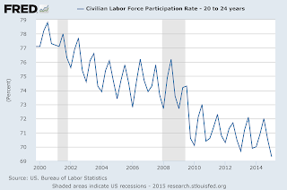

# Q&A - 9/6

Comment

Youth unemployment is falling down

Incorrect

Labor force participation rate for age group 20-24 (shown as quarterly average) says otherwise.

Participation (a.k.a. employment which is the opposite if unemployment) is on the down trend since 2001. Technology is the culprit.

Link: Making 9 Million Jobless Disappear

Question

But wouldn't the new sharing economy fix these issues?

There are no guarantees

A lot of advances need to line up until people can generate reliable income in the new economy; and even then, there are no guarantees. We all know "I'll sell my old shoes on eBay" argument won't fly, you'll run out of shoes, then what? Another case, there are examples of an Uber driver making $40,000/year driving people around,  great, but then Uber is also looking into self-driving cars. "But then people can become car mechanics for those automated Uber cars". Well, that's 1 mechanic servicing, say, 10 cars; what happens to the jobs of 9 other Uber drivers who were displaced by technology?

Give people free money. Guy who thinks he is free market proponent keeps harping "but that's a commie thing to do". Milton F**king Friedman argued in favor of this solution, man.. Can you become more free-market oriented than Milton F**king Friedman? You can't be.

