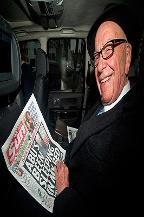

# Q&A - 29/7

Rupert Murdoch

When will Donald Trump stop embarrassing himself and his friends?

Hilarious

For the record,  Rupert Murdoch is this guy

The paper he is holding is one of his, and the title reads "Abu's Been Sleeping in My Bed".

Matthew Yglesias

If robots were taking our jobs, the productivity of the workers who still have jobs — the total amount of work that gets done divided by the total number of people who are employed — would be going up rapidly.

So it's not fast enough for ya? 

The calculation Yshgkjsdfslas presents has "work done" in the numerator, but number of hours worked is not the correct measurement for productivity calculation. You need to look at the output of the economy. And there's been growth, could be better, but it is there. At the same time the divisor is decreasing, number of unemployed people have been steadily increasing since 2001, there is no doubt about that. Then, an increase divided by decrease - what do we have as a result?

John Markoff

There's this wonderful counter situation to the popular belief that there will be no jobs. The last time someone wrote about this was in 1995 when a book titled The End of Work predicted this. The decade after that, the US economy grew faster than the population for the next decade. It's not clear to me at all that things are going to work out the way they felt.

Errr

Wonderful counter-situation? Here is the funny thing about that: the author Markoff refers to, Jeremy Rifkin, is not only patting himself in the back these days, he is doing victory laps because of what he wrote in that book was so extremely accurate. "Economy growing faster" is no proof there isn't unemployment, new tech has displaced workers.

I'd expect better quality from Edge. This is complete junk.

Hillary Clinton 

Enough renewables to power "every home in America".

Nice

We must wean off fossil fuels. This energy source encourages centralized / concentrated power structures, endangers the environment, and causes chaos in the Middle East.

