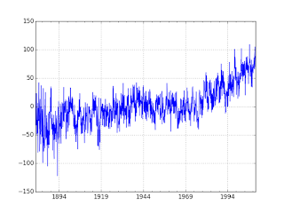

# Q&A - 22/8

Jeremy Rifkin, The Zero-Marginal Cost Society

Between 2008 and 2012, while the Great Recession was bleeding workers, industry was piling on new software and innovations to boost productivity and keep profitable with smaller payrolls. The effect of these efforts is striking. Mark J. Perry, a University of Michigan economics professor and visiting scholar at the American Enterprise Institute, a conservative think tank based in Washington, D.C., ran the numbers. By the end of 2012, according to Perry, the U.S. economy had made a complete recovery from the 2007–2009 recession, with a gross domestic output of $13.6 trillion (in 2005 dollars). That was 2.2 percent higher, or $290 billion more real output, than in 2007, just before the recession, when the GDP was at $13.32 trillion. Perry observes that, while real output was 2.2 percent above the recession level in 2007, industry churned out the increase in goods and services with only 142.4 million workers in 2012—or 3.84 million fewer workers than in 2007. Perry’s conclusion: “The Great Recession stimulated huge productivity and efficiency gains as companies shed marginal workers and learned how to do ‘more with less (fewer workers).

So productivity has been increasing

Otherwise employers would not be able to do more with less. Another proof: Employee participation (the opposite of unemployment) is on the down trend, at the same time, there is annual GDP growth (quick note: 2% growth year-by-year means exponential growth, 2% of a big pie is much bigger than 2% of a smaller pie). More can be done. Outsourcing to China has slowed down to switch to automation. I favor full-automation, hoping employers create conditions where they are shedding jobs en masse causing wide-spread joblessness. This is a good thing.

Question

Why are you against industrial production?

I am not

There was agricultural production during 2nd Wave, and there is / will be industrial production during the 3r Wave. But industrialization will lose its ability to dictate how people live / work / get educated / get healthcare, etc, because most will not be participating in smokestack production. We are not assembly line workers anymore, even though the system thinks that we are.

Denier

The science on climate change is not conclusive

It is

There are many methods here; Within the context of pure time series methods, the best chance of climate change deniers had was arguing that temperature time series data could be random walk. Example for RW is stock price movement where values "can go up or down, in an unpredictable fashion". So deniers try to chalk up the temperature increase in the past 70 years to this kind of movement. They cannot even argue variations of random walk BTW, it has to be pure random walk, if there is a drift, or a trend there (indicating up movement) they are screwed.

It turns out they are statistical tests for that. We used dataset from GISS, temperature anomalies between 1880-2010 are captured here (anomalies are relative to the 1951-80 base period means). We used ADF test, the implementation we used is able to test for combination of hypothesis' -- pure RW, no pure RW no drift no trend, etc. Well, the test shows GISS data is not pure random walk, it is random walk with a trend (trend stationarity).

At this point deniers can try to shift gears and argue for mean-reversion (opposite of random walk), "what goes up must come down and vice versa" surely there is a certain amount of mean-reversion in this data. Traders love mean-reversion by the way, and if you could trade on temperature data wouldn't you? Hell yeah! Buy low in the winter, sell high in the summer. But the deniers can never prove full-mean reversion on this data, and since the ADF test blew through all threshold values all indicators are screaming out a trend.

There are other methods as well, such as cointegration, that took care of the attribution part of the equation. That final analysis was the one that truly sealed the deal. It is game-over for the deniers.

[Data](climate-giss.csv), [Notebook](climate.md)

