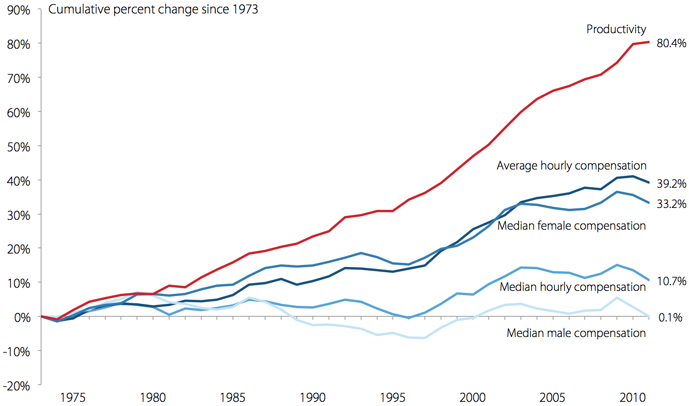
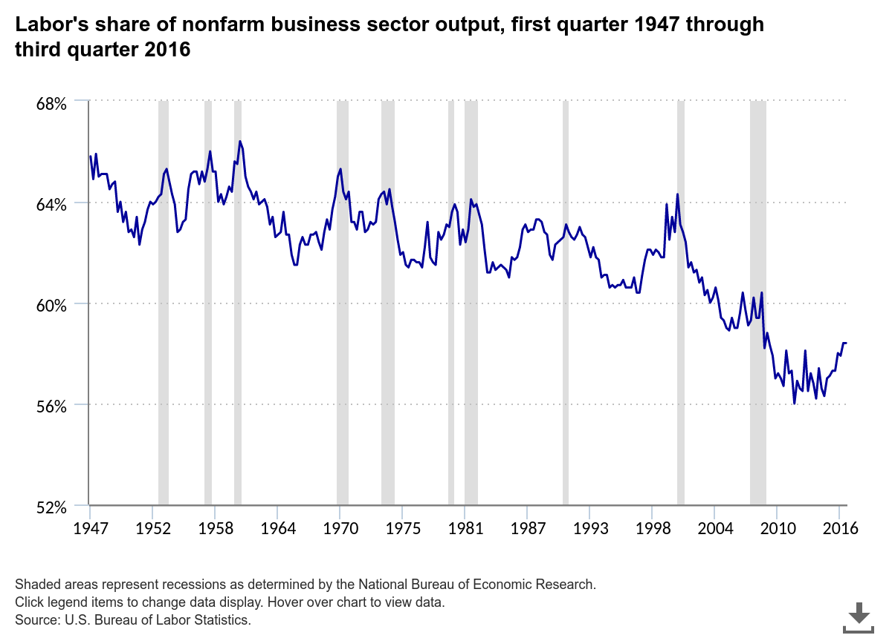

# 1973

I have an odd relationship with this year - so I collected some
big events that happened then. This list will grow.

---

The OPEC oil embargo on the United States.

Committee on the Environment is created in the European Parliament.

The Nixon administration began negotiations on what came to be known
as "the petrodollar recycling system". Under the arrangement Saudis
would only sell their oil in US dollars, and invest the excess of
their oil earnings in US banks, capital markets. The IMF would then
use this money to facilitate loans to oil importers who could be
having difficulty in covering the increase in oil prices. The
arrangement kept the price of dollar high which allowed US to print
money and buy anything it wants. It is claimed making sure most oil is
sold in dollars is at the root of most American wars after the 70s.

The Standard Model of Physics was finalized which unified the three
fundamental forces in one framework. Particle physics came to its peak
(no significant development took place since then).

Syria and Egypt launched the Yom Kippur War against Israel, and
lost. Also, this war was not as much off a slam-dunk as the previous
Six Day War had been during 1967, and probably would not have been won
if US had not supplied Israel heavily.  Egypt also become an American
client-state right afterwards, dumping the Soviets.

Britain entered the European common market: Funny story here is GCHQ
hacked the communications and intercepted messages between other
European countries to get a leg-up in the negotiations. What is it
with Brits and Europe? And what is it with Brits and this hacking?

Roe vs Wade Supreme Court decision on abortion.

On April, the Chicago Board Options Exchange (CBOE) was formed to
trade options on common stocks. This marked the first time an option
was traded on an exchange.

World Trade Center in New York becomes the tallest building in the
world.

The U.S. helped the overthrow of the elected government of Allende and
put in place a military dictatorship under General Pinochet, on
September 11. This is basically 9/11 for Chileans.

The Sears Tower in Chicago is finished, becoming the new world's
tallest building in the world, beating WTC's record, in the same year.

Akaike Information Criteron discovered (Aight, little geeky).

Nixon was inaugurated for his second term in office. Just two days
later, his predecessor, former President Lyndon Johnson, suffered a
heart attack and died.

Vietnam War ended, Paris Piece Accords signed.

Watergate hearings begin.

Nixon abandoned price controls at the start of the year.

The S&P fell 2 percent during September and a shocking 41 percent the
following year.

Student-led rebellion, demonstrations against the military junta in
Greece.

Newly created Bangladesh elects first Prime Minister.

Sydney Opera House is opened.

Bruce Lee dies. 

The Bosporus Bridge is completed joining Europe and Asia in Istanbul,
at the 50th anniversary of the republic's foundation, a few weeks
after a new government was elected (the gov, comprised of largely
leftists, partly Islamists, did not last long, and its only important
decision would be to invade Cyprus next year, which in turn, helped
trigger the fall of the junta in Greece, kinda like British invasion
of the Falklands triggering the fall of the junta in Argentina).

Wage increase started to slow, a situation that lasted until today.

The link between productivity increases and wage increase broke, and
continued to diverge ever since.

Labor's share of income starts decreasing the same year (from [link](https://www.bls.gov/opub/ted/2017/labor-share-of-output-has-declined-since-1947.htm))

Black and Sholes published their seminal paper on pricing options.   

Leonid Brezhnev visits Bonn - first time a Soviet leader ever set foot
in West German territory.

Denis Ritchie published his research paper on the famous computer
language called C. "The development of the C programming language was
a huge step forward and was the right middle ground - C struck exactly
the right balance, to let you write at a high level and be much more
productive, but when you needed to, you could control exactly what
happened" says Bill Dally, chief scientist of NVIDIA and Bell
Professor of Engineering at Stanford. "[It] set the tone for the way
that programming was done for several decades."

Clifford Cocks, working in secrecy at the United Kingdom’s Government
Communications Headquarters (GCHQ) discovered a public-key based
cryptosystem, three years before Ronald Rivest, Adi Shamir, and
Leonard Adleman publicized the same approach called RSA.

Thompson, Ritchie, and others at AT&T Bell Labs began developing a
small operating system on a little-used PDP-7. The operating system
was soon christened Unix, a pun on an earlier operating system project
called MULTICS. In 1972-1973 the system was rewritten in the
programming language C, an unusual step that was visionary: due to
this decision, Unix was the first widely-used operating system that
could switch from and outlive its original hardware [..] The name Unix
(originally Unics) is itself a pun on Multics. The U in Unix is
rumored to stand for uniplexed as opposed to the multiplexed of
Multics, further underscoring the designers' rejections of Multics'
complexity in favor of a more straightforward and workable approach
for smaller computers.

With the Smithsonian Agreement, most of the world's currencies
switched to a floating exchange rate joining United States who had
switched two years previously.

The government agency ARPA funds the outfitting of a packet radio
research van at SRI to develop standards for a Packet Radio Network
(PRNET). As the unmarked van drives through the San Francisco Bay
Area, stuffed full of hackers and sometimes uniformed generals, it is
pioneering wireless, packet-switched digital networks, including the
kind your mobile phone uses today. 

Professor Lighthill was asked by the UK Parliament to evaluate the
state of AI research in the United Kingdom. His report, now called the
Lighthill report, criticized the utter failure of AI to achieve its
"grandiose objectives.". This is the beginning of the so-called AI
Winter where funding for the field were substantially reduced.

The Criticize Lin (Biao), Criticize Confucius campaign was started by
Mao Zedong which lasted until the end of the Cultural Revolution.

The War Powers Act is passed which attempts to define when and how the
US president could send troops to battle by adding strict time frames
for reporting to Congress after sending troops to war, in addition to
other measures.

The first movie based on *Star Trek* TV show was released, not in US,
but in Turkey - *Tourist Omer Travels in Space* is the first movie
based on ST universe.

After the oil embargo Nejat Veziroglu, a Turkish born scientist,
formed the Clean Energy Research Institute (CERI) at the University of
Miami to investigate alternate energy sources. Veziroglu however
already had done extensive research on hydrogen as a fuel use (on
planetary missions) and knew it to be a viable
resource. Organization's findings confirmed this, so Veziroglu
organized the first major conference next year on hydrogen energy, and
started popularizing its use. Words such as "hydrogen economy" were
first coined by Dr. Veziroglu.

(Almost 1973, December 1972) was the last manned moon mission, Apollo
17, the last time humans ever left Earth's lower orbit.

Famous books: The Princess Bride, Rendezvous with Rama.

Famous movies: Soylent Green, The Exorcist, American Graffiti, The
Sting. Oh and Magnum Force (poster is hilarious).

