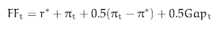
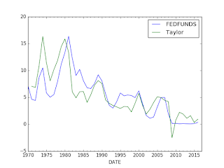

# Q&A - 22/3

Comment

Some criticize the FED, but it has lots of technical capabilities, and they have their formulas [..]

Yeah, but they don't always use their formulas

There is the so-called Taylor Rule that calculates an optimal level for the FED funds rate  (the rate everyone watches like a hawk). The formula is,

which is a simple relationship between inflation, an ideal rate, and GDP. Ideal rate r* is assumed to be 2.0, \pi_t is current inflation, \pi* is target inflation, Gap_t is the difference between real and potential GDP. We get the data from FRED,

Data

Using the following code, and some info from here;

import pandas as pd
df = pd.read_csv('taylorfred.csv', parse_dates=True,\
                  index_col=0,comment='#')
df = df.resample('AS');longrun = 2.0
df['GDPC1'] = df.GDPC1.interpolate(method='spline',order=1)
df['Gap'] =  100. * (df.GDPC1/df.GDPPOT-1)
df['Curr'] = df.PCEPI.pct_change()*100.
df['Taylor'] = longrun + df.Curr + 0.5*(df.Curr - longrun) + 0.5*df.Gap

df[['FEDFUNDS','Taylor']].plot()

we can calculate the optimal rate. FEDFUNDS is what the FED has done instead.

The graphs are somewhat close, but they diverge at certain points. For example during the 80s (Volcker years) the FF rate was much higher than necessary. In the early 2000s, TR prescribes higher rate, but FF was much lower. Lower-than-necessary rates was one of the main causes of the subprime crisis, as everyone knows. 2009 is weird, here TR says "go negative" - and this is precisely the time when "unconventional monetary programs" were started such as QE. For 2016, formula says FF should be higher, and Yellen is desparetely trying to go there, but the market gyrations of Jan-Feb after small-ish hikes scared everyone, so they seem to have slowed down. 

Wouldn't it be great to replace the FED with this 7 lines of code? Hah!

They do more than rate hikes sure, but half of what they do is fiddling with this thing- maybe they would have more time other things, I don't know, like regulation, etc. Fly-fishing, maybe?

Better yet #NOFED. #cybercurreny

Tech Insider

Artificial intelligence is poised to automate lots of service jobs. The White House has estimated there's an 83% chance that someone making less than $20 will eventually lose their job to a computer. That means gigs like customer service rep could soon be extinct. But it's not just low-paying positions that will get replaced. AI also could cause high earning (like top 5% of American salaries) jobs to disappear. Fast.

That's the theme of New York Times reporter Nathaniel Popper's new feature, The Robots Are Coming for Wall Street. The piece is framed around Daniel Nadler, the founder of Kensho, an analytics company that's transforming finance. By 2026, Nadler thinks somewhere between 33% and 50% of finance employees will lose their jobs to automation software [..]

More automation is a great thing

at

March 22, 2016

