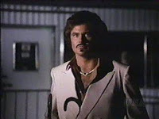

# Q&A - 17/5

Comment 

Warren Bufett picks great stocks, does better than hedge funds.

He is a value investor

.. and a stock picker. Hedge funds have them too. WB is an incredibly good one of course, but his is one style among many. 

Value investors are by nature contrarians. They see value when others don't. They are right, everyone else is a dickhead. It works in the other direction too; some see "un-value" in a company, they short the stock, or an entire industry, and make money when the stock falls. Famous investor John Paulson shorted the subprime mortgage lending market - he is a reverse value-investor - scifi would probably have made him Warren Buffett's evil twin from another universe with a goatee.

Question

Who is your favorite evil twin?

Garth Knight

Hands down.. He had the evil twin car, the friggin cane... Evil Twin perfection.

Anonymous

But Warren Buffett invests in companies, he is in for the long term, he is not a speculator.

Incorrect

WB is a speculator, only his time frame is longer than most. There was a big splash when he bought some shares of Goldman Sachs, year 2008. Where those shares at now? That's right, he sold good chunk of it, and made some $$$$ in the process. This is completely fine - speculators, in any shape or form, are beneficial to the economy, as are high-frequency traders. They all provide liquidity.

The Guardian

The 25 best-paid hedge fund managers pocketed $13bn in 2015, and most of the big winners relied on programs, not contacts, for their big wins.

Nice

Yep - multitude of styles,  different markets... Currency market, futures market, both of which are larger than the equity market. There are trend-followers, value investors, macro investors, and now algorithmic traders who utilize all of these concepts in an algorithmic fashion.

at

May 17, 2016

