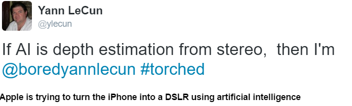

# Q&A - 26/9

Ha ha

(LeCun is one of the inventors of deep learning).  Yeah - I saw a similar paper on arXiv on depth estimation using deep learning. At first I was excited, but the more I thought about it the more I was like "can't these people use some geometry, proper math for God's sake?"

I believe there are hidden gems to be discovered in fitting 3D models to their 2D projections, and getting depth information that way. By model, I mean volumetrically correct 3D representation of known objects such as a car, a cat, a house, etc. So then the model hypothesis is computed, "tracked" in the system in 3D but, sensor data -necessarily- comes in 2D, through projections. The tracking methods maintain the connection by taking movement into account; We take a step, drive forward, look at objects around us, judging from their displacement we can gauge how far they are, 3D model location and size is updated - this is called filtering (continuous sensor to spatial mapping).

Usinng 3D models is advantegous because 3D models have richer information. Sometimes I see a cylinder's top (a circle) sometimes its side (a long rectangle), but I keep tracking nevertheless. Last I checked the state-of-the-art was this. Filtering on its own already had made some nice advances.

My pet hobby / interest is localization through monocular vision. It is incredibly hard to do, as Tesla found out recently. Commercial self-driving can use radar, lidar, sonar, etc.. they are not constrained to pure vision, they'll be fine. These cars can know the location everything around them, it's like stuffing a bat, a hawk, and Michael Schumacher into one box.

And - handling surprise events is also key - our eyes, ears seem to have a built-in mechanism to spot differences very well (is that a hidden source of bigotry I wonder); in the dark we may not see anything, but we can spot movement - probably a by-product of our evolution, spotting danger being "alarmed" about it would have been useful.

Question

Any new world leader profiles?

Yes

Justin Trudeau, and Xi Jinping are High Horse. Victor Orban, Kim Jon Un, Boris Johnson are of type Control Freak. Also, a certain famous historian could be CF, still looking at that one. TBD.

My earlier hypothesis was type HH does not normally become a leader, if they do, the country is in a deep shit. I can understand China, but Canada? Maybe this time it had to do with Liberals being in deep trouble. Long-time conservative control was not good for Canada's chi. And here comes the HH.

It is much harder for Control Freaks to get the top job, and clearly in Urban, Un's case it is not working. At their best CFs relax, work on letting go of control, while always managing to keep running things well (they are almost born with the management gene). They let people around them be themselves - I've seen the weirdest characters being fine around a CF manager at their positive. Maybe not even manage anything / much, that would be positive case for them.

In the negative, they are a sad sack, and everything and everyone around them will almost conspire to make them lose control.

Un is a fan of Dennis Rodman - makes sense now?

at

September 26, 2016

