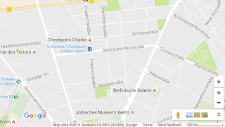

# The Basic Mode

While we are on the issue of mapping; I believe smartphone based mapping apps, and all consumer facing software needs a basic-mode that does not change, offers the minimum, and works offline (if possible).

Let's take mapping as an example; for the city the user lives in, he should be able to see a view like the one below no matter what updates, what version s/he is on.

In between updates, Google Maps on smartphones can wipe its "cache" of maps, if you happen to have no connection at the moment, you don't have a map. For basic needs we should not require the bloody "cloud"; we are not built for constant connectivity, we are built for intermittent connectivity. 

The image above is around 100 KB, it represents roughly 1.2 km^2 of terrain. Let's say Berlin (inside the ring) is 100 km^2, so roughly for 10 MB I should have a map of Berlin that will always work, offline. In "basic mode" this map is stored on the phone, accessible through simple interface. It never gets "updated". There is no version 2. No need for tilt, street view, zoom in, restaurants nearby, other people's photos of the place, etc. Imagine if all software had a basic mode one can switch to anytime. I wonder how the newer versions would compete against that version.

Note: the UI staying the same does not mean the software architecture behind that UI staying the same. The same architecture can support both versions. 

