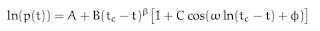

# Q&A - 1/3

News

Le Pen has has said she believes a debate on climate change is required as she dramatically changes her stance on the issue.

Smart move

Her party already has too many extreme positions - respecting climate change consensus will "take the edge off" a little bit. U can't get to and hold on to power by being extremely divisive on everything. Trump can take note.

And let's be honest, climate change is not at the top of rightist's "most wanted" list, alt- or not. This is something they can compromise on. Each side has their ordering of their issues, from "definitely want" to "can live with" to "no way", e.g. for the left, if they had to choose between protecting Roe vs Wade decision, and pushing gun control, they would choose the former, I am guessing.

Question

Is there a bubble in the US stock market? If yes, when will it pop?

Not in near future

(But ask me again in a few months).

I used Sornette's formula for the check.

Here's the doc for calculation and derivation of the reduced form of formula. [geek] For the reduced form (no log oscillations) you start with the logistic equation, but relax the carrying capacity, let it grow along with p(t). Rearrange for a singularity, then the path to singularity is in finite-time. The end of that time is when bubble goes pop. Sornette adds log oscillations to better capture the behavior near the end, similar to oscillations before a material breaks. There is another derivation that uses stochastic calculus, suggesting something about order / chaos (below). Fascinating stuff. [/geek].

Here is another Sornette gem: near the pop-time, it is not chaos that reigns, it is absolutely the opposite. As the bubble pop comes close, everyone starts acting similarly. At the apex, all actors act as if controlled from a single center, following a single command: SELL.

(I could do a whole song and dance now about the parallels of this and authoritarian regimes, but I won't)

Comment

Things are really bad right now.

Rejoice

You could have been born in this decade.

at

March 01, 2017

