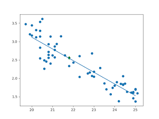

# Q&A - 17/7

Economist

One of the economy’s biggest mysteries is this: The labor market is the strongest it has been in a decade, yet wages are rising barely faster than inflation. For some reason, the booming job market and ultralow unemployment rate, which fell to 4.4 percent in April, haven’t led employers to raise pay in a meaningful way. That flies in the face of a basic assumption of how the economy works: A tight labor market is expected to lead to pay increases [..]

No mystery

This person is using the wrong unemployment number, his model tells him for that incorrect unemployment there has to be more wage growth, that's why he is mystified. If we use the real unemployment, i.e. the number that is opposite of employment, the model's fine. We take prime age labor participation rate and literally subtract that from 100%, that's unemployment. Then with help from this post, and using data from FRED, we fit a linear model between unemployment and wage growth,

import pandas as pd, datetime
from pandas_datareader import data
import statsmodels.formula.api as smf

start=datetime.datetime(1970, 1, 1)
end=datetime.datetime(2017, 1, 1)
cols = ['ECIWAG','LNS12300060','UNRATE']
df = data.DataReader(cols, 'fred', start, end)
df = df.dropna()
df['ECIWAG2'] = df.shift(4).ECIWAG
df['wagegrowth'] = (df.ECIWAG-df.ECIWAG2) / df.ECIWAG2 * 100.
df['unemp_real'] = 100. - df.LNS12300060

results = smf.ols('wagegrowth ~ unemp_real', data=df).fit()
print results.rsquared_adj, results.params.unemp_real
plt.scatter(df.unemp_real, df.wagegrowth)
plt.plot(df.tail(1).unemp_real, df.tail(1).wagegrowth, 'gd')
xx = np.linspace(20,25,100)
yy = results.params.Intercept+results.params.unemp_real*xx
plt.plot(xx,yy)

The fit is good. [geek] For the naive model using UNRATE the fit reports R^2 0.61, the model above reports 0.81 which is clearly superior. [/geek].

How about the larger question, is annual wage growth of 2.5% any good? Maybe. Model says in order to get to annual 4.0%, (real) unemployment needs to fall by 5% which is huge. Graph,

Walter Isaacson

[Einstein intervenes in a public protest at Reichstag, 1918] Years later, when Adolf Hitler and his Nazis were in power, Einstein would ruefully look back on that day in Berlin. “Do you still remember the occasion some 25 years ago when we went together to the Reichstag building, convinced that we could turn the people there into honest democrats?” he wrote Born. “How naïve we were for men of forty.”

Hah

Larger forces play themselves out. It's not possible to change history with a few great speeches, symbolic moves even if those speeches were given by Einstein. Not that the small cannot change things -they can if they are part of a larger dynamic :) so act on them- but the overall result might not always turn out exactly how everyone wants.

And usually the largest force in play is geography.

G. Friedman

[From The Next Decade] History had placed Germany on the north of the North European Plain, an area with a few rivers to serve as defenses, but some of the most productive parts of this new nation-state were on the opposite bank of the Rhine, completely unprotected. To the west was France. To the east was Russia. Both had enjoyed the centuries when Germany was fragmented and weak, but now there was a frightening new Germany, economically the most dynamic country in Europe, with a powerful military and with a deep sense of insecurity.

Germany in turn was frightened by its neighbors’ fears. Germany’s leaders knew their nation could not survive if it was attacked simultaneously by France and Russia. They also believed that at some point such an attack would come, because they understood how intimidating they appeared to their neighbors. Germany could not permit France and Russia to start a war at the time or place of their choosing, and thus Germany, driven by its own fear, devised a strategy of preemption coupled with alliances.

Europe in the twentieth century was defined by these fears, which, being imposed by geography, were both rational and unavoidable [..]

Both world wars were launched according to a single scenario: Germany, insecure because of its geographical position, swept across France in a lightning attack. The goal in both cases was to defeat France quickly, then deal with Russia. In 1914, the Germans failed to defeat France quickly, the troops dug in, and the conflict became a protracted war. The Germans found themselves fighting France, Britain, and Russia simultaneously in both the east and the west.

Interesting

Tim Harford, FT

If we are to take the best advantage of a true gig economy, we need to prepare for more radical change. Governments have been content to use corporations as delivery mechanisms for benefits that include pensions, parental leave, sick leave, holidays and sometimes healthcare — not to mention the minimum wage. [..]

We will need governments to provide essential benefits, perhaps minimalist, perhaps generous, to all citizens. Above that safety net, we need portable benefits — mentioned warmly but briefly by Mr Taylor — so that even a 10-minute gig helps to fill a pension pot or earn time towards a holiday. Traditional corporate jobs have been socially useful, but if you push any model too far from reality, it will snap.

Yes

Let me add, even before the spread of the gig economy everywhere (today's situation), the existing system already started to show signs of major fail, so it is in our interest to make the switch sooner rather than later.

Question

What is so modern about government provided healthcare?

Everything about it

Gov-funded healthcare programs, with their centralized, concentrated, synchronized slant, are truly in the realm of second wave. A third-wave, post-modern system could have a person's mobile phone to sell personal "life bonds" on a blockchain the moment person gets sick, the bonds would have maturity of, say, 20+ years (buyers weigh his probability of staying alive), system would offer high return so it is attractive to buyers and gets him the money he needs for care while the system simultaneously short-sells the care provider company stocks the patient did not choose, at the same time electronically bartering Starbucks coffee cash + social net like money for care money. Do little bi'ness, get little Remy, little Henny, little Crissy, know wha Im sayin'? But now we are in the realm of scifi - we simply do not have all of this yet.

Isaac Asimov

The most exciting phrase to hear in science, the one that heralds new discoveries, is not 'Eureka!' but 'That's funny..."

The Great Asimov

Documentary 

The compass was the greatest invention for naval navigation.

It was not

This documentary tries to paint China as some big-time discoverer nation (compass was discovered there). If China was so great at the seas, then why did they not discover / populate Australia? It's right under their nose. Right? Wouldn't it be great having that major piece of land instead of getting stuck with a billion people on your current land?

Large-scale oceanic navigation requires a global measure. At the very least the sun for the latitude through something like the sextant, and a clock for longitude. Clock based navigation did not take off until the beginning of Renaissance.

Dave Sobel

[From Longitude] [T]he sea captains of [old] relied on “dead reckoning” to gauge their distance east or west of home port. The captain would throw a log overboard and observe how quickly the ship receded from this temporary guidepost. He noted the crude speedometer reading in his ship’s logbook, along with the direction of travel, which he took from the stars or a compass, and the length of time on a particular course, counted with a sandglass or a pocket watch. Factoring in the effects of ocean currents, fickle winds, and errors in judgment, he then determined his longitude. He routinely missed his mark, of course—searching in vain for the island where he had hoped to find fresh water, or even the continent that was his destination. Too often, the technique of dead reckoning marked him for a dead man.

Exactly

at

July 17, 2017

