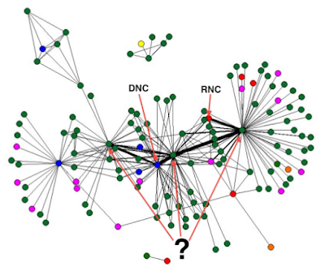

# Q&A - 14/8

The White House 

Trump 'condemns' white supremacists, KKK, neo-Nazi and all extremist groups

Shoulda Condemned Faster 

This jackass cannot be pandered to. Dude totally had plastic surgery done BTW, really supreme. He regularly hurls insults at the Jews too. WH should watch out for this fucker - can even be a government plant.

J. Rickards, Currency Wars 

One of the best measures of the rent seeking relationship between elites and citizens in a stagnant economy is the Gini coefficient, a measure of income inequality; a higher coefficient means greater income inequality. In 2006, shortly before the recent recession began, the coefficient for the United States reached an all-time high of 47, which contrasts sharply with the all-time low of 38.6, recorded in 1968 after two decades of stable gold- backed money. The Gini coefficient trended lower in 2007 but was near the all-time high again by 2009 and trending higher. The Gini coefficient for the United States is now approaching that of Mexico, which is a classic oligarchic society characterized by gross income inequality and concentration of wealth in elite hands.

Another measure of elite rent seeking is the ratio of amounts earned by the top 20 percent of Americans compared to amounts earned by those living below the poverty line. This ratio went from a low of 7.7 to 1 in 1968 to a high of 14.5 to 1 in 2010. These trends in both the Gini coefficient and the wealth-to-poverty income ratio in the United States are consistent with Tainter’s findings on civilizations nearing collapse. When society offers its masses negative returns on inputs, those masses opt out of society, which is ultimately destabilizing for masses and elites.

Right

Author, Social Network Analysis for Startups

We entered this fray in 2006, bringing with us a large-scale social network study of campaign finance and its influence on electoral outcome. In this section, we’ll give an overview of this study, and delve into the methods used to derive the results [..]

Every node on this chart is a political organization or political action committee (PAC) actively involved in the 2000 congressional and presidential elections. Red and blue nodes, respectively, are Republican and Democratic committees (national and state), green nodes are single-issue groups, purple nodes are industry associations, and yellow are non-profit organizations. The links between PACs are determined by where their money is spent—if PAC-A and PAC-B route donations to the same candidates, they become linked—and the more they have in common, the stronger this link becomes. The strongest links are shown with thicker lines on the diagram [..]

This study was based on data released by the Federal Election Commission, pursuant to the McCain-Finegold Campaign Finance Act (The Citizens United decision by the Supreme Court has seriously undermined our ability to study these sort of interactions in the future; much of the data has become unavailable in 2010). The data is based on forms that PACs are required to file every time they make a campaign contribution to a candidate. [..]

[T]he single-issue PACs dominate [..] On the right is the Republican cluster, led by the Republican National Committee (RNC), and on the left is the Democratic cluster and the Democratic National Committee (DNC). However, right next to the “official players,” connected to them with thickest link are three PACs that seem to wield a significant amount of power in the network. Can anyone guess what they are?

The nodes on the left and right of the strong-link triads are, in turn, NARAL (National Abortion and Reproductive Rights Action League), and the National Right to Life PAC—representing the two sides of the abortion issue, which, in 2000 as well as now, is one of the most divisive issues in American politics.

In the middle is the AFL-CIO Political Action Committee, representing America’s largest labor union and, by proxy, over 11 million voters. The union vote historically tended to be Democratic, but Republicans needed to win key industrial states such as Ohio and Michigan in order to gain control of Congress and elect a Republican president— and that meant peeling union vote away from its traditional constituency. This required a “fulcrum issue”: an issue that was divisive enough to make union members break with their party affiliation—and abortion was it.

Interesting

I see Sanders making some moves in this area. It can pay off.

Blogger

When I read today’s news about OpenAI’s DotA 2 [an action game, u can play 1-on-1 or team against team] bot beating human players at The International, an eSports tournament with a prize pool of over $24M, I was jumping with excitement [..T]he OpenAI news came as such a shock. How can this be true? Have there been recent breakthroughs that I wasn’t aware of? As I started looking more into what exactly the DotA 2 bot was doing, how it was trained, and what game environment it was in, I came to the conclusion that it’s an impressive achievement, but not the AI breakthrough the press would like you to believe it is. That’s what this post is about. I would like to offer a sober explanation of what’s actually new. There is a real danger of overhyping Artificial Intelligence progress [..]

Let me start out by saying that none of the hype or incorrect assumptions is the fault of OpenAI researchers. OpenAI has traditionally been very straightforward and explicit about the limitations of their research contributions. I am sure it will be the same in this case. OpenAI has not yet published technical details of their solution, so it is easy to jump to wrong conclusions for people not in the field [..]

Let’s start out by looking at how difficult the problem that the DotA 2 bot is solving actually is. How does it compare to something like AlphaGo?

1v1 is not comparable to 5v5. In a typical game of DotA 2, a team of 5 plays against another team of 5 players. These games require high-level strategy, team communication and coordination, and typically take around 45 minutes. 1v1 games are much more restricted. Two players basically move down a single lane and try to kill each other. It’s typically over in a few minutes. Beating an opponent in 1v1 requires mechanical skill and short-term tactics, but none of the things, like long term planning or coordination, that are challenging for current AI techniques. In fact, the number of useful actions you can take is less than in a game of Go. The effective state space (the player’s idea of what’s currently going on in the game), if represented in a smart way, should be smaller than in Go as well.

Bots have access to more information: The OpenAI bot was (most likely) built on top of the game’s bot API, giving it access to all kinds of information humans do not have access to. Even if OpenAI researchers restricted access to certain kinds of information, the bot still has access to more exact information than humans.

Well..

There is also this.

Genuine advances in this field are exciting, and welcome. But watch out for the hype.

at

August 14, 2017

