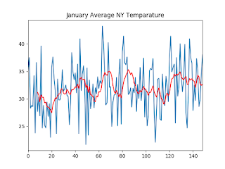

# January Temperatures

"But there is snow, it is really cold in New York, climate change is not real".

Let's look at the overall trend. Pick January in New York - here is a doc with data captured since 1879. Data, Code. Result

I see an upward trend.

We did the global one already. 

at

January 09, 2018

