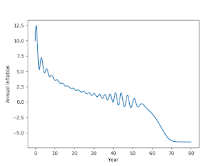

# Q&A - 23/2

Question

Previous model on employment / debt  was good; but what about inflation

What about inflation..

Here is the extended [model](keen_nb) (see bottom of same doc) with
price levels / inflation. This one demonstrates the "the great
moderation" followed by ka-boom. Here is the money shot,

Deflation right there. mmmmm hhmmmm - snap.

