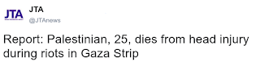

# Q&A - 5/5

News

Good one

I think what the post means to say is Palestinian died because a sniper shot him in the head. The sanitized wording above is like saying "Jews died from lung complications during the Holocaust".

Please.

Question

Did YouTube policies improve after author complaints?

Dunno

Ask them.

Link
Link

Question

Was Martin Luther King killed because he pointed out racial injustices?

No

He was most likely assassinated because he pointed out social injustices. Both him and R. F. Kennedy were talking against social, economic justice and the Vietnam War. Both were killed. 

at

May 05, 2018

