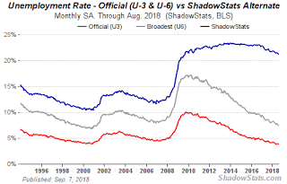

# Q&A - 16/9

Question

How did Trump do on unemployment?

Little better than previous admin

Graph is from Shadowstats. There is some decrease in the real unemployment. This # increased and remained steady during and until the end of previous admin. So some improvement.

But gov did nothing on the deficit and actually made it worse. Bubbles abound.

Question

Can Trump win the 2020 election?

Likely

Based on the statistical model here, and using a potential 3% GDP growth, -15% current Trump net approval rating (from Gallup), and the fact that he will be the leading the incumbent party in its first term in power, the confidence interval for Rep win is (49.84. 53.543). This is a high probability for a second term. The main factor here is incumbency, it is extremely hard for voters to switch leaders that fast. I tried growth figure of 1%, u still get (49.19  51.87), some chance for Dems but still Rep is favored. Unless there is an econ crisis, or Trump's popularity plunges further, 2nd term is likely. With less growth, and oppo pulls a Dubya... maybe there is a chance for Dems.

Benedict Evans

Its always weird when Americans on the right dismiss 'socialized' healthcare as a terrible idea without also condemning the 'socialized' police

Nice

Question

How do we explain the rise of the right in European countries with strong social state?

With that sentence

Maybe ppl were afraid to lose services of that social state bcz of the influx of refugees. I am not saying right or wrong, just saying that might have been the impression.
