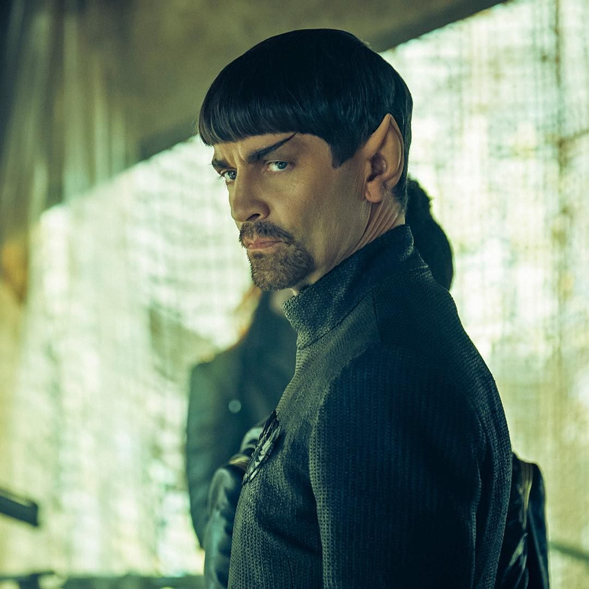

# Q&A - 29/10

Question

How does the dynamic of "opressed left leading to far-right" work?

Fucka me, fucka you

Left is there to help, providing social safety net, etc. If they are opressed, as in Brazil (Lula is the most popular politician, if he was not jailed he would won the election, polls confirm this), the public thinks "the guy who would help me is in jail, establishment is trying to hurt me, so I'll elect someone worse to hurt everyone". It's simple, really.

Twitter

Spot the robot dog dancing to UpTown Funk is simultaneously both terrifying and hilarious.

Not scary

.. but cool.

EFF

Stupid patent of the month [on VR]: Does the '599 patent belong to the
true inventors of VR? No. The patent itself acknowledges that VR
already existed when the application was filed in mid-1999. Rather, it
claims minor tweaks to existing VR systems such as having participants
see pre-recorded videos.

Ha ha

Comment

Military / Industrial / Media / Financial / Prison complex. This name keeps getting longer. Another one is LBTQA - keeps getting longer. Both are related to corporate Dems somehow. By only focusing on the latter and related issues, they forgot to limit the former.

Yes

Voit

Today’s result pretty much completely rules out generic versions for both the most popular SUSY models [relating to String Theory, and "multiverse"] still standing (Split SUSY), as well as the most popular class of GUTs. This provides another nail in the coffin of the SUSY-GUT paradigm

But but..

I just saw Spock's father in an alternate universe in ST Disco. With a goatee! How can SUSY be wrong?

(I kid you not - TV-movie land is still workin this thing..)

R. Roberts

If you think the economy is a zero-sum game and getting rich makes people poor, you have trouble explaining the last 250 years. That wealth can be created and not just rearranged or come at someone's expense is so basic but may be the single most important insight of economics.

Inequality breeds discontent

The rich need to fix it for their own good.

If QE money printing causes house prices to rise and new home buyers are priced out of the market this is not good. The rich would still afford those homes bcz QE would "raise their boat". This is inequality.

Roberts is probably libertarian and does not like most FED actions, so maybe he'd be against QE himself, but even then, there are many areas the free market does not work, contributing to inequality. Health insurance for example. Or policing, or the fire department. Or education.

The most crucial part of the modern economy is completely outside of the free market forces. Banks create new money while giving credit, since they cannot do this for everyone, they need to select potential winners. Demand outstrips supply for credit, pricing cannot work, so credit is not allocated according to free market rules, it is rationed.

Zizek

How strange today in our society the scope of what is possible and what is impossible is distributed [oddly]. On the one hand media is telling us soon we will be immortals, eternal life, singularity, collective mind, we will travel not only to the Moon but to Mars... Almost everything is possible. But it's not possible to raise taxes for the 1%.

Yes... very strange

Question

I saw a quantum eraser experiment and my mind is, like, so blown.

No need

Explanation

History

Rudolf Diesel, before he made diesel engines, made ammonia engines.

Too bad he stopped

Ammonia might make a comeback though. Ammonia is clean-fuel, either through H2 or on its own, it creates zero emissions.

Twitter

Here's a dystopian vision of the future: A real announcement I recorded on the Beijing-Shanghai bullet train. (I've subtitled it so you can watch in silence.)

Yuck

BTW, Uygurs are being opressed in China, through that system, and
more. Here is one dissident.

https://www.youtube.com/watch?v=eViswN602_k

One report says a million Uygurs are in Chinese concentration camps..

https://mobile.twitter.com/izakyol/status/1055688867435737088/video/1

Will NYT make a cover photo of *that*?

Or do we wait until Trump takes the other side of the issue so they
can hit him with it? Like in case of  / bcz of Saudis MSM suddently
remembers the war in Yemen?

