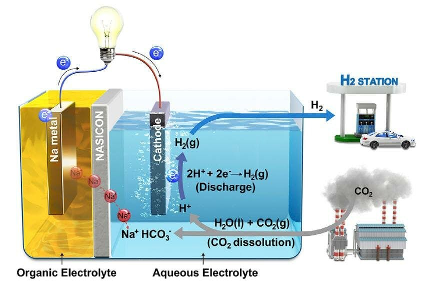

# Carbon Capture, Fuel Generation

[Link](https://newatlas.com/hybrid-co2-capture-hydrogen-system/58145/)

If we're going to reach the goal of keeping Earth from warming more
than 1.5° C (2.7° F) this century, it's not enough to just reduce our
carbon dioxide emissions – we need to actively clean it out of the
atmosphere too. Inspired by the ocean's role as a natural carbon sink,
researchers at Ulsan National Institute of Science and Technology
(UNIST) and Georgia Tech have developed a new system that absorbs CO2
and produces electricity and useable hydrogen fuel.

The new device, which the team calls a Hybrid Na-CO2 System, is
basically a big liquid battery. A sodium metal anode is placed in an
organic electrolyte, while the cathode is contained in an aqueous
solution. The two liquids are separated by a sodium Super Ionic
Conductor (NASICON) membrane.

When CO2 is injected into the aqueous electrolyte, it reacts with the
cathode, turning the solution more acidic, which in turn generates
electricity and creates hydrogen. In tests, the team reported a CO2
conversion efficiency of 50 percent, and the system was stable enough
to run for over 1,000 hours without causing any damage to the
electrodes. Unlike other designs, it doesn't release any CO2 as a gas
during normal operation – instead, the remaining half of the CO2 was
recovered from the electrolyte as plain old baking soda.

