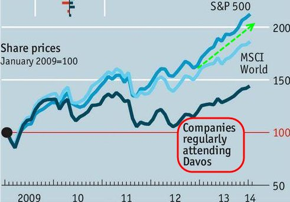

# QA - 22/1

[Comment](https://mobile.twitter.com/garrygolden/status/1084927765806284802:)

Example below of plug-in EVs falling short. System mgmt and
coordination costs for recharging are too high. Est. 30% can plug-in
at home. Julich (Germany) study shows hydrogen refueling is cheaper
beyond 10-20m EVs. H2 EVs cheaper per kW for OEMs. Molecules win long
EV game.

A: Yes

[Ralph
Nader](https://nader.org/2013/11/21/21-ways-canadian-health-care-system-better-obamacare/)

21 Ways the Canadian Health Care System is Better than Obamacare

A: Nice

Q: Who was [the Bitcoin inventor, whose identity remains hidden]
Satoshi Nakamoto?

A: Most likely Hal Finney. He was the #2 Bitcoin user, its first
tester. He sadly passed away.

Writing analysis showed Finney's writing most closely resembled
Satoshi's.

One thing he said shortly before his death had always bothered me.. 'I
have no worries my legacy is secure'. Ask any profiler: this is not
something the #2 guy would say before his death.

Hal was hard-core crypto guy himself. And: dude named Satoshi N. lived
nearby him. The Nakamoto living close to HF was burned during mortgage
crisis. So I bet HF saw his predicament, and planned BTC as a way to
correct the sys which burned his neighbor and many others.

CNN Conversation:

MP: People voted to get out of EU

CNN interviewer: they did not know what they were voting for

MP: Your comment was extremely patronizing..

A: Ha ha

Interviewer was right. Brit politicians dropped the ball by asking ppl
something that is extremely technical and their **fucking job to
decide**. As if populists, they asked for a solution when ppl are
imbeciles on policies they don't experience firsthand.

"Oh but asking ppl was democratic". Well that decision was made by
politicians, who are elected by the people, so if they *didn't* ask,
that decision would still be democratic. 

And let's be honest here, Cameron got into all this not bcz he wanted
to 'ask the people', but because he wanted to crush his detractors
inside the party. The vote was supposed to be a layup, remember?. But
the derractors sensed this, and campaigned in a do-or-die mode bcz it
was abt their survival which ironically increased their effectiveness,
they sold their message (read: lied) better. Now here we are.

Q: Where is the line between representation and direct democracy?

A: In a modern context they should be kept seperate

Industrial and post-industrial contexts are like oil and water. They
cannot mix. You can't have a little bit of this a little bit of that.
If you do, you end up with Brexit. 

Q: What are the energy densities of different energy storage methods?

A:

Liithium-ion battery - 265 Wh / kg

Ammonia - 6250 Wh / kg

Hydrogen - 33000 Wh / kg

Synthetic diesel - 13000 Wh / kg

Let's not forget Li-on degrades badly after a few years, and cold
weather does a number on them.

Also, synthetic diesel's density is *higher* than regular (dirty)
diesel. We posted about e-diesel tech b4, it is a drop-in replacement
for diesel.

Forbes:

In 2011 there were 115 billionaires in China. Since then, 72 have
died, with 15 murders, 17 suicides, 7 accidental deaths, and 19 from
illness. Another 14 were executed.

A: Sucks to be a Chinese billionaire?

Q: Companies that regularly attend Davos underperform the S&P 500 by a
lot

A: Ouch
