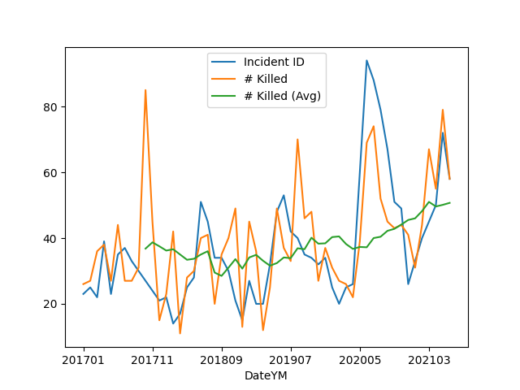

# Conflict Statistics

### UCDP/PRIO Armed Conflict Dataset

[Data](https://ucdp.uu.se/downloads/)

Deaths, Incidences, Globally

```python
import pandas as pd

def overall_deaths(mon):
   url = 'https://ucdp.uu.se/downloads/candidateged/GEDEvent_v21_0_%d.csv' % mon
   df = pd.read_csv(url)
   g = df[['country','deaths_b']].\
       groupby(['country']).\
       agg({'country':'count', 'deaths_b': 'sum'})
   g.columns = ['incidents','deaths']
   return g.sort_values('deaths',ascending=False)

print (overall_deaths(mon=5))
```

```text
                          incidents  deaths
country                                    
Afghanistan                    1236    6473
Yemen (North Yemen)              74    1676
Nigeria                         266     551
Chad                              6     440
Somalia                          50     339
Mali                             40     166
Syria                           118     156
Ethiopia                        132     138
DR Congo (Zaire)                173     128
Iraq                             61     109
Burkina Faso                     43      71
India                            47      57
Mexico                          566      54
Myanmar (Burma)                 131      50
Central African Republic         23      48
Israel                           35      44
Philippines                      27      44
Niger                            20      36
Cameroon                         61      33
Pakistan                         33      29
Sudan                            13      22
Iran                             11      22
Turkey                           11      21
Indonesia                        14      18
Ukraine                          43      17
Colombia                          9      17
Mozambique                       23      17
Tunisia                           5       8
Kenya                            10       8
Papua New Guinea                  2       7
Thailand                          7       4
Morocco                           1       3
Ivory Coast                       2       3
Egypt                            10       3
Rwanda                            1       2
Albania                           1       1
Russia (Soviet Union)             1       1
Algeria                           1       1
Brazil                            6       1
Venezuela                         1       1
South Sudan                      17       0
Uganda                            1       0
Tajikistan                        5       0
United States of America          8       0
Lebanon                           1       0
Peru                              1       0
Libya                             2       0
Kyrgyzstan                        2       0
Haiti                             6       0
Guinea                            1       0
Guatemala                         1       0
Ecuador                           1       0
Burundi                           9       0
Bangladesh                        1       0
Armenia                           1       0
Angola                            2       0
Zimbabwe (Rhodesia)               1       0
```

Details for Specific Country

```python
def country_attacked(mon, country):
   url = 'https://ucdp.uu.se/downloads/candidateged/GEDEvent_v21_0_%d.csv' % mon
   df = pd.read_csv(url)
   df1 = df[df.country == country]
   g = df1[['country','deaths_b','side_b']].\
       groupby(['side_b','country']).\
       agg({'side_b':'count', 'deaths_b': 'sum'})
   g.columns = ['incidents','deaths']
   return g.sort_values('deaths',ascending=False)

print (country_attacked(5, 'Syria'))
```

```text
                               incidents  deaths
side_b                country                   
IS                    Syria           29      90
SDF                   Syria           37      36
Syrian insurgents     Syria           32      19
Government of Syria   Syria            3       9
Hamza Division        Syria            1       2
Al-Jabha al-Shamiyyah Syria            1       0
Civilians             Syria           14       0
Government of Israel  Syria            1       0
```

<a name='gdelt'/>

### GDELT

GDELT uses natural language processing ("AI") to extract Actor -
Action - Actor triplets. The result is not curated, there can be
mistakes, but as an overall outlook, it can be useful.

US military bases, Syria, reverse-engineered from [source](https://bit.ly/3gOBQHx),
are also added.

[Codes](http://data.gdeltproject.org/documentation/CAMEO.Manual.1.1b3.pdf)

[Data](http://data.gdeltproject.org/events)

```python
from scipy import sin, cos, tan, arctan, arctan2, arccos, pi
import pandas as pd, datetime
from zipfile import ZipFile
from io import BytesIO
import urllib.request as urllib2
import folium

base_conflict_url = "http://data.gdeltproject.org/events"

conf_cols = ['GlobalEventID', 'Day', 'MonthYear', 'Year', 'FractionDate',\
       'Actor1Code', 'Actor1Name', 'Actor1CountryCode', 'Actor1KnownGroupCode',\
       'Actor1EthnicCode', 'Actor1Religion1Code', 'Actor1Religion2Code',\
       'Actor1Type1Code', 'Actor1Type2Code', 'Actor1Type3Code', \
       'Actor2Code', 'Actor2Name', 'Actor2CountryCode', 'Actor2KnownGroupCode',
       'Actor2EthnicCode', 'Actor2Religion1Code', 'Actor2Religion2Code',
       'Actor2Type1Code', 'Actor2Type2Code', 'Actor2Type3Code', \
       'IsRootEvent','EventCode', 'EventBaseCode','EventRootCode',\
       'QuadClass', 'GoldsteinScale','NumMentions','NumSources', \
       'NumArticles', 'AvgTone','Actor1Geo_Type', 'Actor1Geo_FullName',\
       'Actor1Geo_CountryCode', 'Actor1Geo_ADM1Code','Actor1Geo_Lat', \
       'Actor1Geo_Long', 'Actor1Geo_FeatureID','Actor2Geo_Type', \
       'Actor2Geo_FullName','Actor2Geo_CountryCode', 'Actor2Geo_ADM1Code',\
       'Actor2Geo_Lat', 'Actor2Geo_Long']

now = datetime.datetime.now()
dfs = []

clat,clon=33.01136975577918, 40.98527636859822
how_far = 600.0

m = folium.Map(location=[clat, clon], zoom_start=7, tiles="Stamen Terrain")

def spherical_distance(lat1, long1, lat2, long2):
    phi1 = 0.5*pi - lat1
    phi2 = 0.5*pi - lat2
    r = 0.5*(6378137 + 6356752) # mean radius in meters
    t = sin(phi1)*sin(phi2)*cos(long1-long2) + cos(phi1)*cos(phi2)
    return r * arccos(t) / 1000.

def dist(x):
    return spherical_distance(np.deg2rad(clat),np.deg2rad(clon),np.deg2rad(x['Actor2Geo_Lat']),np.deg2rad(x['Actor2Geo_Long']))

for i in range(5):
    d = now - datetime.timedelta(days=i+1)
    sd = "%d%02d%02d" % (d.year, d.month, d.day)
    url = base_conflict_url + "/%s.export.CSV.zip" % sd
    r = urllib2.urlopen(url).read()
    file = ZipFile(BytesIO(r))
    csv = file.open("%s.export.CSV" % sd)
    df = pd.read_csv(csv,sep='\t',header=None)    
    urls = df[57]        
    df2 = df[range(len(conf_cols))]
    df2 = pd.concat((df2,urls),axis=1)    
    df2.columns = conf_cols + ['url']
    df3 = df2[(df2.EventCode==190)|(df2.EventCode==195)|(df2.EventCode==194)]
    df3.loc[:,'dist'] = df3.apply(dist, axis=1)
    df3 = df3[df3.dist < how_far]
    dft = df3[['EventCode','Actor1CountryCode','Actor1Name','Actor2Name','Actor2Geo_Lat','Actor2Geo_Long','url']].copy()
    dfs.append(dft)

df4 = pd.concat(dfs,axis=0)

for index, row in df4.iterrows():
    if str(row['Actor2Geo_Lat'])=='nan': continue
    if str(row['Actor1CountryCode'])=='nan': continue
    folium.Marker(
        [row['Actor2Geo_Lat'], row['Actor2Geo_Long']], popup="<a href='%s' target='_blank' rel='noopener noreferrer'>Link</a>" % (row['url']), tooltip=row['Actor1CountryCode']
    ).add_to(m)

# add US bases
df = pd.read_csv('usbases.csv')
for index, row in df.iterrows():
    #folium.Marker([row['lat'], row['lon']]).add_to(m)
    folium.CircleMarker(location=[row['lat'], row['lon']],
                        radius=6,
			color='red',
                        weight=1).add_to(m)

stitle = "<h3> Attacks in the ME <br/></h3> <h5>US Bases in <font color='red'>Red</font></h5>"
m.get_root().html.add_child(folium.Element(stitle))

m.save('conflict-out.html')
```

The output of the code is below

[Output](conflict-out.html)


### US Gun Violence

```python
import pandas as pd, zipfile
with zipfile.ZipFile('mass-shooting-us.zip', 'r') as z:
      df =  pd.read_csv(z.open('USmassshooting.csv'))

df['Date'] = df.apply(lambda x: pd.to_datetime(x['Incident Date']), axis=1)
df['DateYM'] = df.apply(lambda x: "%d%02d" % (x['Date'].year, x['Date'].month), axis=1)
```

```python
g = df.groupby('DateYM').agg({'Incident ID':'count', '# Killed': 'sum'})
g['# Killed (Avg)'] = g['# Killed'].rolling(10).mean()
g.plot()
plt.savefig('gunvio.png')
```



