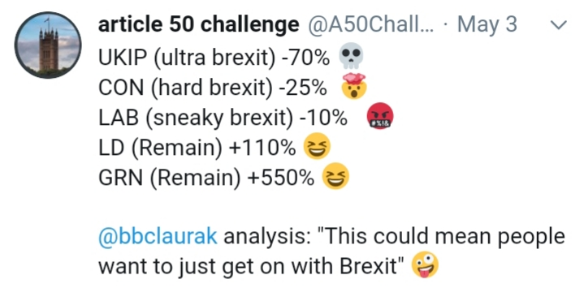

# Get On With It

The percentages shows are from the recent local elections, gains /
losses, for each party. What net acronym should I use here? LMAO?
ROFL?

"Get on with it" is a common phrase heard among the Brexiter
citizens. Ok, we voted and now you do your job. Except officials
*didn't* do their job by framing a question too much for your dumbass
to handle. This is a perfect example of a case where an idiom suggests
a course of action, but the action is shit. "Get on with it" - what
the fuck does that even mean? Byzantine rules, regulations, gazillion
different interests pullling to all different directions. No you cant
just "get on with it". 