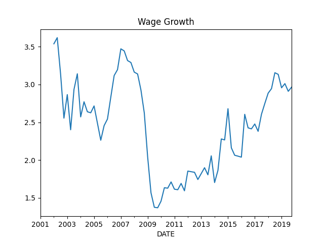
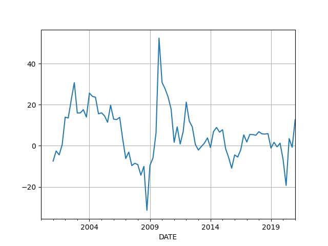
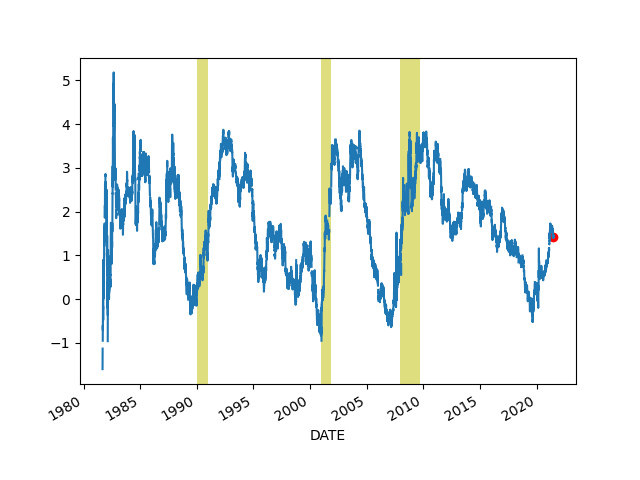
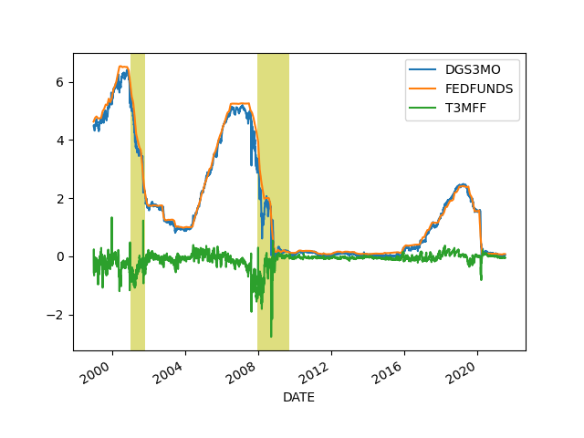
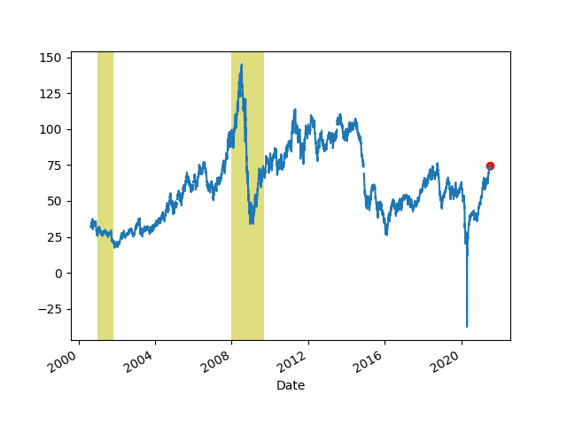

# Economy, Calculations, Data

<a name="prez"></a>

## Potus, Incumbent Elec. College Percentage Prediction 

Time for Change [model](https://pollyvote.com/en/components/models/hybrid/time-for-change-model/),
([my post](../../2015/04/predicting-2016-presidential-election.md))

GDP is taken as annualized quarterly growth rate, quarter growth compared to
previous quarter, [annualized](https://www.fool.com/knowledge-center/how-to-calculate-the-annual-growth-rate-for-real-g.aspx). 


```python
import pandas as pd, datetime
from pandas_datareader import data

today = datetime.datetime.now()
start=datetime.datetime(1945, 1, 1)
end=datetime.datetime(today.year, today.month, today.day)
df = data.DataReader(['GDPC1'], 'fred', start, end)
df['growann'] = (  (  (1+df.pct_change())**4  )-1.0  )*100.0
#print (df[pd.DatetimeIndex(df.index).year == 1984]['growann'])
print (df['growann'].tail(5))
# look at Q2, 04-01 date
```

```text
DATE
2019-07-01     2.572102
2019-10-01     2.365628
2020-01-01    -4.955763
2020-04-01   -31.383181
2020-07-01    33.067993
Name: growann, dtype: float64
```

```python
from io import StringIO
import statsmodels.formula.api as smf
import pandas as pd

s="""year,gdp_growth,net_approval,two_terms,incumbent_vote
2012,1.3,-0.8,0,52
2008,1.3,-37,1,46.3
2004,2.6,-0.5,0,51.2
2000,8,19.5,1,50.3
1996,7.1,15.5,0,54.7
1992,4.3,-18,1,46.5
1988,5.2,10,1,53.9
1984,7.1,20,0,59.2
1980,-7.9,-21.7,0,44.7
1976,3,5,1,48.9
1972,9.8,26,0,61.8
1968,7,-5,1,49.6
1964,4.7,60.3,0,61.3
1960,-1.9,37,1,49.9
1956,3.2,53.5,0,57.8
1952,0.4,-27,1,44.5
1948,7.5,-6,1,52.4
"""
df = pd.read_csv(StringIO(s))
regr = 'incumbent_vote ~ gdp_growth + net_approval + two_terms'
results = smf.ols(regr, data=df).fit()

print ('R^2', results.rsquared)
conf = results.conf_int()

net_approv = -10.0; gdp_growth = 0.0
pred = [1., gdp_growth, net_approv, 0]
print (np.dot(pred, conf), np.dot(pred, results.params))
```

```text
R^2 0.9011858911763367
[49.14454875 51.75431018] 50.4494294659622
```


## The Cycle

<a name="cycle"/>


```python
import pandas as pd, datetime
from pandas_datareader import data

today = datetime.datetime.now()
start=datetime.datetime(1970, 1, 1)
end=datetime.datetime(today.year, today.month, today.day)

fig, axs = plt.subplots(2)

df = data.DataReader(['GDPC1'], 'fred', start, end)
df['gdpyoy'] = (df.GDPC1 - df.GDPC1.shift(4)) / df.GDPC1.shift(4) * 100.0
df['gdpyoy'].plot(ax=axs[0],title="GDP and Inflation YoY")
axs[0].axvspan('01-11-1973', '01-03-1975', color='y', alpha=0.5, lw=0)
axs[0].axvspan('01-07-1981', '01-11-1982', color='y', alpha=0.5, lw=0)
axs[0].axvspan('01-09-1990', '01-07-1991', color='y', alpha=0.5, lw=0)
axs[0].axvspan('01-03-2001', '27-10-2001', color='y', alpha=0.5, lw=0)
axs[0].axvspan('22-12-2007', '09-05-2009', color='y', alpha=0.5, lw=0)
print (df[['gdpyoy']].tail(6))

df = data.DataReader(['CPIAUCNS'], 'fred', start, end)
df['infyoy'] = (df.CPIAUCNS - df.CPIAUCNS.shift(12)) / df.CPIAUCNS.shift(12) * 100.0
df['infyoy'].plot(ax=axs[1])
axs[1].axvspan('01-11-1973', '01-03-1975', color='y', alpha=0.5, lw=0)
axs[1].axvspan('01-07-1981', '01-11-1982', color='y', alpha=0.5, lw=0)
axs[1].axvspan('01-09-1990', '01-07-1991', color='y', alpha=0.5, lw=0)
axs[1].axvspan('01-03-2001', '27-10-2001', color='y', alpha=0.5, lw=0)
axs[1].axvspan('22-12-2007', '09-05-2009', color='y', alpha=0.5, lw=0)
print (df[['infyoy']].tail(6))
            
plt.savefig('cycle.png')
```

```text
              gdpyoy
DATE                
2019-07-01  2.076481
2019-10-01  2.338885
2020-01-01  0.319261
2020-04-01 -9.032775
2020-07-01 -2.848345
2020-10-01 -2.459930
              infyoy
DATE                
2020-08-01  1.309645
2020-09-01  1.371325
2020-10-01  1.182066
2020-11-01  1.174536
2020-12-01  1.362005
2021-01-01  1.399770
```

## Wages and Unemployment

<a name="nfp"/>

```python
import pandas as pd, datetime
from pandas_datareader import data

today = datetime.datetime.now()
start=datetime.datetime(1986, 1, 1)
end=datetime.datetime(today.year, today.month, today.day)
cols = ['PAYEMS']
df = data.DataReader(cols, 'fred', start, end)
df['nfpyoy'] = (df.PAYEMS - df.PAYEMS.shift(12)) / df.PAYEMS.shift(12) * 100.0
print (df.tail(7))
df.nfpyoy.plot()
plt.grid(True)
plt.axvspan('01-09-1990', '01-07-1991', color='y', alpha=0.5, lw=0)
plt.axvspan('01-03-2001', '27-10-2001', color='y', alpha=0.5, lw=0)
plt.axvspan('22-12-2007', '09-05-2009', color='y', alpha=0.5, lw=0)
plt.title('Non-Farm Payroll YoY Change %')
plt.savefig('nfp.png')
```

```text
            PAYEMS    nfpyoy
DATE                        
2020-07-01  139566 -7.518902
2020-08-01  141149 -6.590650
2020-09-01  141865 -6.253924
2020-10-01  142545 -5.925794
2020-11-01  142809 -5.896888
2020-12-01  142582 -6.146038
2021-01-01  142631 -6.308052
```


```python
import pandas as pd, datetime
from pandas_datareader import data

start=datetime.datetime(1950, 1, 1)
end=datetime.datetime(2019, 11, 1)
cols = ['ECIWAG']
df3 = data.DataReader(cols, 'fred', start, end)
df3 = df3.dropna()
df3['ECIWAG2'] = df3.shift(4).ECIWAG
df3['wagegrowth'] = (df3.ECIWAG-df3.ECIWAG2) / df3.ECIWAG2 * 100.
print (df3['wagegrowth'].tail(4))
df3['wagegrowth'].plot(title='Wage Growth')
plt.savefig('wages.png')
```

```text
DATE
2019-01-01    2.954545
2019-04-01    3.012048
2019-07-01    2.987304
2019-10-01    2.965159
Name: wagegrowth, dtype: float64
```



<a name="claims"></a>

```python
import pandas as pd, datetime
from pandas_datareader import data

today = datetime.datetime.now()
start=datetime.datetime(1995, 1, 1)
end=datetime.datetime(today.year, today.month, today.day)
cols = ['ICSA']
df = data.DataReader(cols, 'fred', start, end)
df.ICSA.plot()
print (df.tail(4))
plt.title("Initial Unemployment Claims")
plt.axvspan('01-03-2001', '27-10-2001', color='y', alpha=0.5, lw=0)
plt.axvspan('22-12-2007', '09-05-2009', color='y', alpha=0.5, lw=0)
plt.savefig('icsa.png')
```

```text
              ICSA
DATE              
2021-01-23  812000
2021-01-30  812000
2021-02-06  848000
2021-02-13  861000
```


<a name="unempl"></a>

Unemployment: Reverse of Employment-to-Population Ratio

```python
import pandas as pd, datetime
from pandas_datareader import data

today = datetime.datetime.now()
start=datetime.datetime(1980, 1, 1)
end=datetime.datetime(today.year, today.month, today.day)
cols = ['CLF16OV','LFWA64TTUSM647S']
df = data.DataReader(cols, 'fred', start, end)
df = df.interpolate()
df['ratio'] = 100.0 - ((df.CLF16OV*1000.0 / df.LFWA64TTUSM647S) * 100.0)
print (df[['ratio','LFWA64TTUSM647S']].tail(5))
df.ratio.plot()
plt.savefig('unemploy.png')
```

```text
                ratio  LFWA64TTUSM647S
DATE                                  
2020-09-01  22.352157     2.061590e+08
2020-10-01  21.919663     2.058367e+08
2020-11-01  22.017721     2.058622e+08
2020-12-01  21.900340     2.055924e+08
2021-01-01  21.956048     2.052190e+08
```


<a name="pmi"></a>

## PMI

```python
import quandl, os, datetime
from datetime import timedelta

today = datetime.datetime.now()
start=datetime.datetime(1985, 1, 1)
end=datetime.datetime(today.year, today.month, today.day)
today = datetime.datetime.now()
df = quandl.get("ISM/MAN_PMI-PMI-Composite-Index", 
returns="pandas",
start_date=start.strftime('%Y-%m-%d'),
end_date=today.strftime('%Y-%m-%d'),
authtoken=open(".quandl").read())

print (df['PMI'].tail(4))
df['PMI'].plot()
plt.axvspan('01-09-1990', '01-07-1991', color='y', alpha=0.5, lw=0)
plt.axvspan('01-03-2001', '27-10-2001', color='y', alpha=0.5, lw=0)
plt.axvspan('22-12-2007', '09-05-2009', color='y', alpha=0.5, lw=0)
plt.savefig('pmi.png')
```

```text
Date
2020-10-01    58.8
2020-11-01    57.7
2020-12-01    60.5
2021-01-01    58.7
Name: PMI, dtype: float64
```


<a name="gdpism"></a>

## GDP vs ISM

```python
import pandas as pd, datetime
from pandas_datareader import data
import quandl

today = datetime.datetime.now()
start=datetime.datetime(1992, 1, 1)
end=datetime.datetime(today.year, today.month, today.day)
cols = ['GDPC1']
df = data.DataReader(cols, 'fred', start, end)

df['gdpyoy'] = (df.GDPC1 - df.GDPC1.shift(4)) / df.GDPC1.shift(4) * 100.0

df2 = quandl.get("ISM/MAN_PMI-PMI-Composite-Index", 
returns="pandas",
start_date=start.strftime('%Y-%m-%d'),
end_date=end.strftime('%Y-%m-%d'),
authtoken=open(".quandl").read())

plt.figure(figsize=(12,5))
ax1 = df2.PMI.plot(color='blue', grid=True, label='ISM')
ax2 = df.gdpyoy.plot(color='red', grid=True, label='GDP',secondary_y=True)
h1, l1 = ax1.get_legend_handles_labels()
h2, l2 = ax2.get_legend_handles_labels()
plt.legend(h1+h2, l1+l2, loc=2)
plt.savefig('gdp-ism.png')
```


<a name="cpyoy"></a>

## Profits

```python
import pandas as pd, datetime
from pandas_datareader import data

today = datetime.datetime.now()
start=datetime.datetime(1980, 1, 1)
end=datetime.datetime(today.year, today.month, today.day)
cols = ['CPROFIT']
df = data.DataReader(cols, 'fred', start, end)
df['cpyoy'] = (df.CPROFIT - df.CPROFIT.shift(4)) / df.CPROFIT.shift(4) * 100.0
print (df.tail(4))
df.cpyoy.plot()
plt.grid(True)
plt.savefig('profit.png')
```

```text
             CPROFIT      cpyoy
DATE                           
2019-10-01  2311.272   1.260370
2020-01-01  2035.030  -6.700416
2020-04-01  1826.137 -19.309944
2020-07-01  2325.730   3.528294
```



## Dollar

<a name="dollar"></a>

```python
import pandas as pd, datetime
from pandas_datareader import data

import pandas_datareader.data as web
today = datetime.datetime.now()
start=datetime.datetime(1980, 1, 1)
end=datetime.datetime(today.year, today.month, today.day)
df = web.DataReader("DX-Y.NYB", 'yahoo', start, end)['Adj Close']
print (df.tail(4))
m,s = df.mean(),df.std()
print (np.array([m-s,m+s]).T)
df.tail(1000).plot()
plt.grid(True)
plt.savefig('dollar.png')
```

```text
Date
2021-02-08    90.930000
2021-02-09    90.440002
2021-02-10    90.370003
2021-02-11    90.400002
Name: Adj Close, dtype: float64
[ 80.65387323 111.46019544]
```


<a name="wagepayroll"></a>

## Difference Between Wage Growth YoY and Payrolls (Hiring)

```python
import pandas as pd, datetime
from pandas_datareader import data

today = datetime.datetime.now()
start=datetime.datetime(1986, 1, 1)
end=datetime.datetime(today.year, today.month, today.day)
cols = ['PAYEMS','AHETPI']
df = data.DataReader(cols, 'fred', start, end)
df['nfpyoy'] = (df.PAYEMS - df.PAYEMS.shift(12)) / df.PAYEMS.shift(12) * 100.0
df['wageyoy'] = (df.AHETPI - df.AHETPI.shift(12)) / df.AHETPI.shift(12) * 100.0
df[['wageyoy','nfpyoy']].plot()
plt.axvspan('01-09-1990', '01-07-1991', color='y', alpha=0.5, lw=0)
plt.axvspan('01-03-2001', '27-10-2001', color='y', alpha=0.5, lw=0)
plt.axvspan('22-12-2007', '09-05-2009', color='y', alpha=0.5, lw=0)
print (df['wageyoy'].tail(5))
print (df['nfpyoy'].tail(5))
plt.savefig('pay-wage.png')
```

```text
DATE
2020-09-01    4.643309
2020-10-01    4.459403
2020-11-01    4.703906
2020-12-01    5.494966
2021-01-01    5.443886
Name: wageyoy, dtype: float64
DATE
2020-09-01   -6.253924
2020-10-01   -5.925794
2020-11-01   -5.896888
2020-12-01   -6.146038
2021-01-01   -6.308052
Name: nfpyoy, dtype: float64
```


<a name="p2s"></a>

## SP 500 Price to Sales Ratio

```python
import datetime, quandl
today = datetime.datetime.now()
start=datetime.datetime(1980, 1, 1)
end=datetime.datetime(today.year, today.month, today.day)
df = quandl.get("MULTPL/SP500_PSR_QUARTER-S-P-500-Price-to-Sales-Ratio-by-Quarter", 
returns="pandas",
start_date=start.strftime('%Y-%m-%d'),
end_date=end.strftime('%Y-%m-%d'),
authtoken=open(".quandl").read())
print (df.tail(5))

df.plot()
plt.axvspan('01-03-2001', '27-10-2001', color='y', alpha=0.5, lw=0)
plt.axvspan('22-12-2007', '09-05-2009', color='y', alpha=0.5, lw=0)
plt.savefig('price-sales.png')
```

```text
            Value
Date             
2020-10-01   2.40
2020-11-30   2.64
2020-12-01   2.67
2020-12-31   2.75
2021-02-01   2.77
```


<a name="sp500prof"></a>

## SP 500 vs Corporate Profits

```python
import pandas as pd, datetime
from pandas_datareader import data

today = datetime.datetime.now()
start=datetime.datetime(1990, 1, 1)
end=datetime.datetime(today.year, today.month, today.day)
cols = ['CP']
df = data.DataReader(cols, 'fred', start, end)

import pandas_datareader.data as web
df2 = web.DataReader("^GSPC", 'yahoo', start, end)
df2 = df2[['Adj Close']]; df2['CP'] = df['CP']
df2 = df2.interpolate().dropna()
df2.columns = ['SP500','Corporate Profits']
df2.plot()
plt.axvspan('01-09-1990', '01-07-1991', color='y', alpha=0.5, lw=0)
plt.axvspan('01-03-2001', '27-10-2001', color='y', alpha=0.5, lw=0)
plt.axvspan('22-12-2007', '09-05-2009', color='y', alpha=0.5, lw=0)
plt.savefig('sp500-profits.png')
```


<a name="wilshire"></a>

## Total Market Cap / GDP

```python
import pandas as pd, datetime
from pandas_datareader import data

today = datetime.datetime.now()
start=datetime.datetime(1995, 1, 1)
end=datetime.datetime(today.year, today.month, today.day)
cols = ['WILL5000IND']
df = data.DataReader(cols, 'fred', start, end)
df.plot()
print (df.tail(4))
plt.axvspan('01-03-2001', '27-10-2001', color='y', alpha=0.5, lw=0)
plt.axvspan('22-12-2007', '09-05-2009', color='y', alpha=0.5, lw=0)
plt.savefig('wilshire.png')
```

```text
            WILL5000IND
DATE                   
2021-02-05       194.20
2021-02-08       195.97
2021-02-09       195.94
2021-02-10       195.87
```


<a name="junkbond"></a>

## Junk Bond Yields

```python
import pandas as pd, datetime
from pandas_datareader import data

today = datetime.datetime.now()
start=datetime.datetime(1980, 1, 1)
end=datetime.datetime(today.year, today.month, today.day)
cols = ['BAMLH0A2HYBEY']
df = data.DataReader(cols, 'fred', start, end)
print (df.tail(6))
df.plot()
plt.plot(df.tail(1).index, df.tail(1),'ro')
plt.axvspan('2001-03-03', '2001-10-27', color='y', alpha=0.5, lw=0)
plt.axvspan('2007-12-22', '2009-05-09', color='y', alpha=0.5, lw=0)
plt.savefig('junkbond.png')
```

```text
            BAMLH0A2HYBEY
DATE                     
2021-02-03           4.64
2021-02-04           4.58
2021-02-05           4.54
2021-02-08           4.49
2021-02-09           4.45
2021-02-10           4.41
```


## Yield Curve, Rates

<a name="curve"></a>

10 Year Treasury Yield - 3 Month Bills

```python
import pandas as pd, datetime
from pandas_datareader import data

pd.set_option('display.max_columns', 10)

today = datetime.datetime.now()
start=datetime.datetime(1980, 1, 1)
end=datetime.datetime(today.year, today.month, today.day)
cols = ['DGS10','DGS3MO']
df = data.DataReader(cols, 'fred', start, end)
df['Yield Curve'] = df.DGS10 - df.DGS3MO
print (df.tail(6))
plt.plot(df.tail(1).index, df.tail(1)['Yield Curve'],'ro')
df['Yield Curve'].plot()
plt.axvspan('01-09-1990', '01-07-1991', color='y', alpha=0.5, lw=0)
plt.axvspan('01-03-2001', '27-10-2001', color='y', alpha=0.5, lw=0)
plt.axvspan('22-12-2007', '09-05-2009', color='y', alpha=0.5, lw=0)
plt.savefig('yield-curve.png')
```

```text
            DGS10  DGS3MO  Yield Curve
DATE                                  
2021-02-02   1.12    0.07         1.05
2021-02-03   1.15    0.04         1.11
2021-02-04   1.15    0.04         1.11
2021-02-05   1.19    0.03         1.16
2021-02-08   1.19    0.05         1.14
2021-02-09   1.18    0.04         1.14
```



<a name='t3mff'/>

3-Month Treasury Constant Maturity Minus Federal Funds Rate

```python
import pandas as pd, datetime
from pandas_datareader import data

pd.set_option('display.max_columns', 10)

today = datetime.datetime.now()
start=datetime.datetime(1999, 1, 1)
end=datetime.datetime(today.year, today.month, today.day)
cols = ['T3MFF']
df = data.DataReader(cols, 'fred', start, end)
print (df.tail(6))
df.plot()
plt.axvspan('01-03-2001', '27-10-2001', color='y', alpha=0.5, lw=0)
plt.axvspan('22-12-2007', '09-05-2009', color='y', alpha=0.5, lw=0)
plt.savefig('t3mff.png')
```

```text
            T3MFF
DATE             
2021-02-02  -0.01
2021-02-03  -0.04
2021-02-04  -0.04
2021-02-05  -0.05
2021-02-08  -0.02
2021-02-09  -0.04
```



<a name="vix"></a>

## VIX

```python
import pandas as pd, datetime
import pandas_datareader.data as web

today = datetime.datetime.now()
start=datetime.datetime(2000, 1, 1)
end=datetime.datetime(today.year, today.month, today.day)
df = web.DataReader("^VIX", 'yahoo', start, end)['Adj Close']
df.plot()
plt.axvspan('01-03-2001', '27-10-2001', color='y', alpha=0.5, lw=0)
plt.axvspan('22-12-2007', '09-05-2009', color='y', alpha=0.5, lw=0)
print (df.tail(7))
plt.plot(df.tail(1).index, df.tail(1),'ro')
plt.savefig('vix.png')
```

```text
Date
2021-02-03    22.910000
2021-02-04    21.770000
2021-02-05    20.870001
2021-02-08    21.240000
2021-02-09    21.629999
2021-02-10    21.990000
2021-02-11    22.190001
Name: Adj Close, dtype: float64
```


<a name="oil"></a>

## Oil

Futures, Continuous Contract, Front Month

```python
import pandas_datareader.data as web, datetime
today = datetime.datetime.now()
start=datetime.datetime(1980, 1, 1)
end=datetime.datetime(today.year, today.month, today.day)
df = web.DataReader("CL=F", 'yahoo', start, end)
df = df['Close']
print (df.tail(5))
plt.plot(df.tail(1).index, df.tail(1),'ro')
df.plot()
plt.axvspan('01-03-2001', '27-10-2001', color='y', alpha=0.5, lw=0)
plt.axvspan('22-12-2007', '09-05-2009', color='y', alpha=0.5, lw=0)
plt.savefig('oil.png')
```

```text
Date
2021-02-05    56.849998
2021-02-08    57.970001
2021-02-09    58.360001
2021-02-10    58.680000
2021-02-11    58.340000
Name: Close, dtype: float64
```



<a name="credit"/>

## Private Debt to GDP Ratio

```python
import pandas as pd, datetime
from pandas_datareader import data

today = datetime.datetime.now()
start=datetime.datetime(1960, 1, 1)
end=datetime.datetime(today.year, today.month, today.day)

df = data.DataReader(['GDPC1','QUSPAMUSDA'], 'fred', start, end)
df = df.interpolate()
df['Credit to GDP'] = (df.QUSPAMUSDA / df.GDPC1)*100.0
df['Credit to GDP'].plot()
plt.axvspan('01-09-1990', '01-07-1991', color='y', alpha=0.5, lw=0)
plt.axvspan('01-03-2001', '27-10-2001', color='y', alpha=0.5, lw=0)
plt.axvspan('22-12-2007', '09-05-2009', color='y', alpha=0.5, lw=0)
plt.savefig('creditgdp.png')
print (df['Credit to GDP'].tail(4))
```

```text
DATE
2020-01-01    173.870119
2020-04-01    194.590641
2020-07-01    181.050353
2020-10-01    179.278404
Freq: QS-OCT, Name: Credit to GDP, dtype: float64
```


<a name="debt"/>

# Total Consumer Credit Outstanding as % of GDP

```python
import pandas as pd, datetime
from pandas_datareader import data

pd.set_option('display.max_columns', 10)
today = datetime.datetime.now()
start=datetime.datetime(1980, 1, 1)
end=datetime.datetime(today.year, today.month, today.day)
cols = ['TOTALSL','GDP']
df = data.DataReader(cols, 'fred', start, end)
df = df.interpolate(method='linear')
df['debt'] =   df.TOTALSL / df.GDP * 100.0
print (df.debt.tail(4))
df.debt.plot()
plt.axvspan('01-09-1990', '01-07-1991', color='y', alpha=0.5, lw=0)
plt.axvspan('01-03-2001', '27-10-2001', color='y', alpha=0.5, lw=0)
plt.axvspan('22-12-2007', '09-05-2009', color='y', alpha=0.5, lw=0)
plt.savefig('debt.png')
```

```text
DATE
2020-09-01    19.443011
2020-10-01    19.369866
2020-11-01    19.434713
2020-12-01    19.480033
Freq: MS, Name: debt, dtype: float64
```


<a name="gini"/>

# Wealth Inequality - GINI Index

```python
import pandas as pd, datetime
from pandas_datareader import data

def gini(pop,val):
    pop = list(pop); pop.insert(0,0.0)
    val = list(val); val.insert(0,0.0)        
    poparg = np.array(pop)
    valarg = np.array(val)
    z = valarg * poparg;
    ord = np.argsort(val)
    poparg    = poparg[ord]
    z = z[ord]
    poparg    = np.cumsum(poparg)
    z    = np.cumsum(z)
    relpop = poparg/poparg[-1]
    relz = z/z[-1]    
    g = 1 - np.sum((relz[0:-1]+relz[1:]) * np.diff(relpop))
    return np.round(g,3)

today = datetime.datetime.now()
start=datetime.datetime(1989, 1, 1)
end=datetime.datetime(today.year, today.month, today.day)
cols = ['WFRBLT01026', 'WFRBLN09053','WFRBLN40080','WFRBLB50107']
df = data.DataReader(cols, 'fred', start, end)
p = [0.01, 0.09, 0.40, 0.50]
g = df.apply(lambda x: gini(p,x),axis=1)
print (g.tail(4))
g.plot()
plt.axvspan('1993-01-01','1993-01-01',color='y')
plt.axvspan('2001-01-01','2001-01-01',color='y')
plt.axvspan('2009-01-01','2009-01-01',color='y')
plt.axvspan('2017-01-01','2017-01-01',color='y')
plt.text('1990-01-01',0.44,'HW')
plt.text('1994-01-01',0.46,'Clinton')
plt.text('2003-01-01',0.47,'Bush')
plt.text('2011-01-01',0.44,'Obama')
plt.text('2018-01-01',0.42,'DJT')
plt.savefig('gini.png')
```

```text
DATE
2019-10-01    0.468
2020-01-01    0.464
2020-04-01    0.463
2020-07-01    0.460
dtype: float64
```


---

Note: for Quandl retrieval get the API key from Quandl, and place the
key in a `.quandl` file in the same directory as this file.

