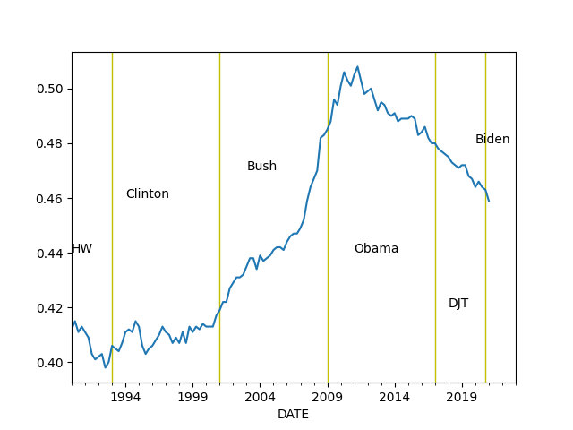

# Economy, Calculations, Data

<a name="prez"></a>

## Potus, Incumbent Elec. College Percentage Prediction 

Time for Change [model](https://pollyvote.com/en/components/models/hybrid/time-for-change-model/).

GDP is taken as annualized quarterly growth rate, quarter growth compared to
previous quarter, [annualized](https://www.fool.com/knowledge-center/how-to-calculate-the-annual-growth-rate-for-real-g.aspx). 


```python
import pandas as pd, datetime
from pandas_datareader import data

today = datetime.datetime.now()
start=datetime.datetime(1945, 1, 1)
end=datetime.datetime(today.year, today.month, today.day)
df = data.DataReader(['GDPC1'], 'fred', start, end)
df['growann'] = (  (  (1+df.pct_change())**4  )-1.0  )*100.0
print (df[pd.DatetimeIndex(df.index).year == 1984]['growann'])
# look at Q2, 04-01 date
```

```text
DATE
1984-01-01    8.051348
1984-04-01    7.092351
1984-07-01    3.912381
1984-10-01    3.324102
Name: growann, dtype: float64
```

```python
from io import StringIO
import statsmodels.formula.api as smf
import pandas as pd

s="""year,gdp_growth,net_approval,two_terms,incumbent_vote
2012,1.3,-0.8,0,52
2008,1.3,-37,1,46.3
2004,2.6,-0.5,0,51.2
2000,8,19.5,1,50.3
1996,7.1,15.5,0,54.7
1992,4.3,-18,1,46.5
1988,5.2,10,1,53.9
1984,7.1,20,0,59.2
1980,-7.9,-21.7,0,44.7
1976,3,5,1,48.9
1972,9.8,26,0,61.8
1968,7,-5,1,49.6
1964,4.7,60.3,0,61.3
1960,-1.9,37,1,49.9
1956,3.2,53.5,0,57.8
1952,0.4,-27,1,44.5
1948,7.5,-6,1,52.4
"""
df = pd.read_csv(StringIO(s))
regr = 'incumbent_vote ~ gdp_growth + net_approval + two_terms'
results = smf.ols(regr, data=df).fit()

print ('R^2', results.rsquared)
conf = results.conf_int()

net_approv = -11.8; gdp_growth = 2.0
pred = [1., gdp_growth, net_approv, 0]
print (np.dot(pred, conf), np.dot(pred, results.params))

net_approv = -11.8; gdp_growth = 1.0
pred = [1., gdp_growth, net_approv, 0]
print (np.dot(pred, conf), np.dot(pred, results.params))

net_approv = -4.0; gdp_growth = -4.0
pred = [1., gdp_growth, net_approv, 0]
print (np.dot(pred, conf), np.dot(pred, results.params))
```

```text
R^2 0.9011858911763367
[49.6962248  53.16687853] 51.431551669024834
[49.37184684 52.33149113] 50.85166898486028
[48.17063647 49.27344876] 48.72204261352556
```


## The Cycle

<a name="cycle"/>


```python
import pandas as pd, datetime
from pandas_datareader import data

today = datetime.datetime.now()
start=datetime.datetime(1970, 1, 1)
end=datetime.datetime(today.year, today.month, today.day)

fig, axs = plt.subplots(2)

df = data.DataReader(['GDPC1'], 'fred', start, end)
df['gdpyoy'] = (df.GDPC1 - df.GDPC1.shift(4)) / df.GDPC1.shift(4) * 100.0
df['gdpyoy'].plot(ax=axs[0],title="GDP and Inflation YoY")
axs[0].axvspan('01-09-1990', '01-07-1991', color='y', alpha=0.5, lw=0)
axs[0].axvspan('01-03-2001', '27-10-2001', color='y', alpha=0.5, lw=0)
axs[0].axvspan('22-12-2007', '09-05-2009', color='y', alpha=0.5, lw=0)
print (df[['gdpyoy']].tail(6))

df = data.DataReader(['CPIAUCNS'], 'fred', start, end)
df['infyoy'] = (df.CPIAUCNS - df.CPIAUCNS.shift(12)) / df.CPIAUCNS.shift(12) * 100.0
df['infyoy'].plot(ax=axs[1])
axs[1].axvspan('01-09-1990', '01-07-1991', color='y', alpha=0.5, lw=0)
axs[1].axvspan('01-03-2001', '27-10-2001', color='y', alpha=0.5, lw=0)
axs[1].axvspan('22-12-2007', '09-05-2009', color='y', alpha=0.5, lw=0)
print (df[['infyoy']].tail(6))
            
plt.savefig('cycle.png')
```

```text
              gdpyoy
DATE                
2018-07-01  3.133538
2018-10-01  2.516496
2019-01-01  2.652241
2019-04-01  2.278320
2019-07-01  2.073335
2019-10-01  2.334074
              infyoy
DATE                
2019-09-01  1.711305
2019-10-01  1.764043
2019-11-01  2.051278
2019-12-01  2.285130
2020-01-01  2.486572
2020-02-01  2.334874
```


## Wages and Unemployment

<a name="unemp"></a>

```python
import pandas as pd, datetime
from pandas_datareader import data

today = datetime.datetime.now()
start=datetime.datetime(1986, 1, 1)
end=datetime.datetime(today.year, today.month, today.day)
cols = ['PAYEMS']
df = data.DataReader(cols, 'fred', start, end)
df['nfpyoy'] = (df.PAYEMS - df.PAYEMS.shift(12)) / df.PAYEMS.shift(12) * 100.0
print (df.tail(7))
df.nfpyoy.plot()
plt.grid(True)
plt.axvspan('01-09-1990', '01-07-1991', color='y', alpha=0.5, lw=0)
plt.axvspan('01-03-2001', '27-10-2001', color='y', alpha=0.5, lw=0)
plt.axvspan('22-12-2007', '09-05-2009', color='y', alpha=0.5, lw=0)
plt.title('Non-Farm Payroll YoY Change %')
plt.savefig('nfp.png')
```

```text
            PAYEMS    nfpyoy
DATE                        
2019-09-01  151368  1.352546
2019-10-01  151553  1.340029
2019-11-01  151814  1.423675
2019-12-01  151998  1.423281
2020-01-01  152212  1.384097
2020-02-01  152487  1.566590
2020-03-01  151786  1.000785
```


```python
import pandas as pd, datetime
from pandas_datareader import data

start=datetime.datetime(1950, 1, 1)
end=datetime.datetime(2019, 11, 1)
cols = ['ECIWAG','CIVPART']
df3 = data.DataReader(cols, 'fred', start, end)
df3 = df3.dropna()
df3['ECIWAG2'] = df3.shift(4).ECIWAG
df3['wagegrowth'] = (df3.ECIWAG-df3.ECIWAG2) / df3.ECIWAG2 * 100.
df3['unempl'] = 100.0 - df3.CIVPART
print (df3['wagegrowth'].tail(7))
plt.figure(figsize=(14, 5))
plt.subplot(121)
df3['wagegrowth'].plot(title='Wave Growth')
plt.subplot(122)
df3['unempl'].plot(title='Unemployment') 
plt.savefig('unemploy.png')
```

```text
DATE
2018-04-01    2.945736
2018-07-01    3.000000
2018-10-01    3.134557
2019-01-01    2.954545
2019-04-01    2.936747
2019-07-01    2.987304
2019-10-01    2.965159
Freq: 3MS, Name: wagegrowth, dtype: float64
```


<a name="claims"></a>

## Initial Unemployment Claims

```python
import pandas as pd, datetime
from pandas_datareader import data

today = datetime.datetime.now()
start=datetime.datetime(1995, 1, 1)
end=datetime.datetime(today.year, today.month, today.day)
cols = ['ICSA']
df = data.DataReader(cols, 'fred', start, end)
df.ICSA.plot()
print (df.tail(4))
plt.axvspan('01-03-2001', '27-10-2001', color='y', alpha=0.5, lw=0)
plt.axvspan('22-12-2007', '09-05-2009', color='y', alpha=0.5, lw=0)
plt.savefig('icsa.png')
```

```text
               ICSA
DATE               
2020-03-07   211000
2020-03-14   282000
2020-03-21  3307000
2020-03-28  6648000
```


<a name="pmi"></a>

## PMI

```python
import quandl, os, datetime
from datetime import timedelta

today = datetime.datetime.now()
start=datetime.datetime(1985, 1, 1)
end=datetime.datetime(today.year, today.month, today.day)
today = datetime.datetime.now()
df = quandl.get("ISM/MAN_PMI-PMI-Composite-Index", 
                returns="pandas",
                start_date=start.strftime('%Y-%m-%d'),
                end_date=today.strftime('%Y-%m-%d'),
                authtoken=open(".quandl").read())

print (df['PMI'].tail(4))
df['PMI'].plot()
plt.axvspan('01-09-1990', '01-07-1991', color='y', alpha=0.5, lw=0)
plt.axvspan('01-03-2001', '27-10-2001', color='y', alpha=0.5, lw=0)
plt.axvspan('22-12-2007', '09-05-2009', color='y', alpha=0.5, lw=0)
plt.savefig('pmi.png')
```

```text
Date
2019-12-01    47.8
2020-01-01    50.9
2020-02-01    50.1
2020-03-01    49.1
Name: PMI, dtype: float64
```


<a name="cpyoy"></a>

## Profits

```python
import pandas as pd, datetime
from pandas_datareader import data

today = datetime.datetime.now()
start=datetime.datetime(1980, 1, 1)
end=datetime.datetime(today.year, today.month, today.day)
cols = ['CPROFIT']
df = data.DataReader(cols, 'fred', start, end)
df['cpyoy'] = (df.CPROFIT - df.CPROFIT.shift(4)) / df.CPROFIT.shift(4) * 100.0
print (df.tail(4))
df.cpyoy.plot()
plt.grid(True)
plt.savefig('profit.png')
```

```text
             CPROFIT     cpyoy
DATE                          
2019-01-01  2006.864 -2.212810
2019-04-01  2082.711  1.278730
2019-07-01  2077.979 -1.247722
2019-10-01  2131.002  2.176781
```


## Dollar

<a name="dollar"></a>

```python
import pandas as pd, datetime
from pandas_datareader import data

import quandl
df = quandl.get("CHRIS/ICE_DX1-US-Dollar-Index-Futures-Continuous-Contract", 
                returns="pandas",authtoken=open(".quandl").read())
df = df['Settle']		
print (df.tail(4))
m,s = df.mean(),df.std()
print (np.array([m-s,m+s]).T)
df.tail(1000).plot()
plt.grid(True)
plt.savefig('dollar.png')
```

```text
Date
2020-04-03    100.677
2020-04-06    100.755
2020-04-07     99.914
2020-04-08    100.170
Name: Settle, dtype: float64
[ 81.82352548 102.76095664]
```


<a name="wagepayroll"></a>

## Difference Between Wage Growth YoY and Payrolls (Hiring)

```python
import pandas as pd, datetime
from pandas_datareader import data

today = datetime.datetime.now()
start=datetime.datetime(1986, 1, 1)
end=datetime.datetime(today.year, today.month, today.day)
cols = ['PAYEMS','AHETPI']
df = data.DataReader(cols, 'fred', start, end)
df['nfpyoy'] = (df.PAYEMS - df.PAYEMS.shift(12)) / df.PAYEMS.shift(12) * 100.0
df['wageyoy'] = (df.AHETPI - df.AHETPI.shift(12)) / df.AHETPI.shift(12) * 100.0
df[['wageyoy','nfpyoy']].plot()
plt.axvspan('01-09-1990', '01-07-1991', color='y', alpha=0.5, lw=0)
plt.axvspan('01-03-2001', '27-10-2001', color='y', alpha=0.5, lw=0)
plt.axvspan('22-12-2007', '09-05-2009', color='y', alpha=0.5, lw=0)
print (df['wageyoy'].tail(5))
print (df['nfpyoy'].tail(5))
plt.savefig('pay-wage.png')
```

```text
DATE
2019-11-01    3.521739
2019-12-01    3.248159
2020-01-01    3.331891
2020-02-01    3.363519
2020-03-01    3.393471
Freq: MS, Name: wageyoy, dtype: float64
DATE
2019-11-01    1.423675
2019-12-01    1.423281
2020-01-01    1.384097
2020-02-01    1.566590
2020-03-01    1.000785
Freq: MS, Name: nfpyoy, dtype: float64
```


<a name="gdpism"></a>

## GDP vs ISM

```python
import pandas as pd, datetime
from pandas_datareader import data
import quandl

today = datetime.datetime.now()
start=datetime.datetime(1992, 1, 1)
end=datetime.datetime(today.year, today.month, today.day)
cols = ['GDPC1']
df = data.DataReader(cols, 'fred', start, end)

df['gdpyoy'] = (df.GDPC1 - df.GDPC1.shift(4)) / df.GDPC1.shift(4) * 100.0

df2 = quandl.get("ISM/MAN_PMI-PMI-Composite-Index", 
                returns="pandas",
                start_date=start.strftime('%Y-%m-%d'),
                end_date=end.strftime('%Y-%m-%d'),
                authtoken=open(".quandl").read())

df['pmi'] = df2.PMI
plt.figure(figsize=(12,5))
ax1 = df.pmi.plot(color='blue', grid=True, label='ISM')
ax2 = df.gdpyoy.plot(color='red', grid=True, label='GDP',secondary_y=True)
h1, l1 = ax1.get_legend_handles_labels()
h2, l2 = ax2.get_legend_handles_labels()
plt.legend(h1+h2, l1+l2, loc=2)
plt.savefig('gdp-ism.png')
```


<a name="p2s"></a>

## SP 500 Price to Sales Ratio

```python
import datetime, quandl
today = datetime.datetime.now()
start=datetime.datetime(1980, 1, 1)
end=datetime.datetime(today.year, today.month, today.day)
df = quandl.get("MULTPL/SP500_PSR_QUARTER-S-P-500-Price-to-Sales-Ratio-by-Quarter", 
                returns="pandas",
                start_date=start.strftime('%Y-%m-%d'),
                end_date=end.strftime('%Y-%m-%d'),
                authtoken=open(".quandl").read())
print (df.tail(5))

df.plot()
plt.axvspan('01-03-2001', '27-10-2001', color='y', alpha=0.5, lw=0)
plt.axvspan('22-12-2007', '09-05-2009', color='y', alpha=0.5, lw=0)
plt.savefig('price-sales.png')
```

```text
            Value
Date             
2019-12-31   2.32
2020-01-31   2.32
2020-02-28   2.12
2020-03-31   1.86
2020-04-01   1.77
```


<a name="sp500prof"></a>

## SP 500 vs Corporate Profits

```python
import pandas as pd, datetime
from pandas_datareader import data

today = datetime.datetime.now()
start=datetime.datetime(1990, 1, 1)
end=datetime.datetime(today.year, today.month, today.day)
cols = ['CP']
df = data.DataReader(cols, 'fred', start, end)

import pandas_datareader.data as web
df2 = web.DataReader("^GSPC", 'yahoo', start, end)
df2 = df2[['Adj Close']]; df2['CP'] = df['CP']
df2 = df2.interpolate().dropna()
df2.columns = ['SP500','Corporate Profits']
df2.plot()
plt.axvspan('01-09-1990', '01-07-1991', color='y', alpha=0.5, lw=0)
plt.axvspan('01-03-2001', '27-10-2001', color='y', alpha=0.5, lw=0)
plt.axvspan('22-12-2007', '09-05-2009', color='y', alpha=0.5, lw=0)
plt.savefig('sp500-profits.png')
```


<a name="wilshire"></a>

## Total Market Cap / GDP

```python
import pandas as pd, datetime
from pandas_datareader import data

today = datetime.datetime.now()
start=datetime.datetime(1995, 1, 1)
end=datetime.datetime(today.year, today.month, today.day)
cols = ['WILL5000IND']
df = data.DataReader(cols, 'fred', start, end)
df.plot()
print (df.tail(4))
plt.axvspan('01-03-2001', '27-10-2001', color='y', alpha=0.5, lw=0)
plt.axvspan('22-12-2007', '09-05-2009', color='y', alpha=0.5, lw=0)
plt.savefig('wilshire.png')
```

```text
            WILL5000IND
DATE                   
2020-04-03       116.53
2020-04-06       124.83
2020-04-07       124.75
2020-04-08       129.19
```


<a name="junkbond"></a>

## Junk Bond Yields

```python
import pandas as pd, datetime
from pandas_datareader import data

today = datetime.datetime.now()
start=datetime.datetime(1980, 1, 1)
end=datetime.datetime(today.year, today.month, today.day)
cols = ['BAMLH0A2HYBEY']
df = data.DataReader(cols, 'fred', start, end)
print (df.tail(6))
df.plot()
plt.axvspan('01-03-2001', '27-10-2001', color='y', alpha=0.5, lw=0)
plt.axvspan('22-12-2007', '09-05-2009', color='y', alpha=0.5, lw=0)
plt.savefig('junkbond.png')
```

```text
            BAMLH0A2HYBEY
DATE                     
2020-04-01          10.39
2020-04-02          10.51
2020-04-03          10.76
2020-04-06          10.65
2020-04-07          10.29
2020-04-08          10.24
```


## Yield Curve

<a name="curve"></a>

10 Year Treasury Yield - 3 Month Bills

```python
import pandas as pd, datetime
from pandas_datareader import data

pd.set_option('display.max_columns', 10)

today = datetime.datetime.now()
start=datetime.datetime(1980, 1, 1)
end=datetime.datetime(today.year, today.month, today.day)
cols = ['DGS10','DGS3MO']
df = data.DataReader(cols, 'fred', start, end)
df['Yield Curve'] = df.DGS10 - df.DGS3MO
print (df.tail(6))
df['Yield Curve'].plot()
plt.axvspan('01-09-1990', '01-07-1991', color='y', alpha=0.5, lw=0)
plt.axvspan('01-03-2001', '27-10-2001', color='y', alpha=0.5, lw=0)
plt.axvspan('22-12-2007', '09-05-2009', color='y', alpha=0.5, lw=0)
plt.savefig('yield-curve.png')
```

```text
            DGS10  DGS3MO  Yield Curve
DATE                                  
2020-04-01   0.62    0.09         0.53
2020-04-02   0.63    0.09         0.54
2020-04-03   0.62    0.10         0.52
2020-04-06   0.67    0.15         0.52
2020-04-07   0.75    0.14         0.61
2020-04-08   0.77    0.22         0.55
```


<a name="vix"></a>

## VIX

```python
import pandas as pd, datetime
import pandas_datareader.data as web

today = datetime.datetime.now()
start=datetime.datetime(2000, 1, 1)
end=datetime.datetime(today.year, today.month, today.day)
df = web.DataReader("^VIX", 'yahoo', start, end)['Adj Close']
df.plot()
plt.axvspan('01-03-2001', '27-10-2001', color='y', alpha=0.5, lw=0)
plt.axvspan('22-12-2007', '09-05-2009', color='y', alpha=0.5, lw=0)
print (df.tail(7))
plt.savefig('vix.png')
```

```text
Date
2020-03-31    53.540001
2020-04-01    57.060001
2020-04-02    50.910000
2020-04-03    46.799999
2020-04-06    45.240002
2020-04-07    46.700001
2020-04-08    43.349998
Name: Adj Close, dtype: float64
```


<a name="oil"></a>

## Oil

Futures, Continuous Contract, Front Month

```python
import datetime, quandl
today = datetime.datetime.now()
start=datetime.datetime(1980, 1, 1)
end=datetime.datetime(today.year, today.month, today.day)
df = quandl.get("CHRIS/CME_CL1-Crude-Oil-Futures-Continuous-Contract-1-CL1-Front-Month", 
                returns="pandas",
                start_date=start.strftime('%Y-%m-%d'),
                end_date=end.strftime('%Y-%m-%d'),
                authtoken=open(".quandl").read())
df = df['Settle']
print (df.tail(5))

df.plot()
plt.axvspan('01-03-2001', '27-10-2001', color='y', alpha=0.5, lw=0)
plt.axvspan('22-12-2007', '09-05-2009', color='y', alpha=0.5, lw=0)
plt.savefig('oil.png')
```

```text
Date
2020-04-03    28.34
2020-04-06    26.08
2020-04-07    23.63
2020-04-08    25.09
2020-04-09    22.76
Name: Settle, dtype: float64
```


<a name="credit"/>

## Private Debt to GDP Ratio

```python
import pandas as pd, datetime
from pandas_datareader import data

today = datetime.datetime.now()
start=datetime.datetime(1960, 1, 1)
end=datetime.datetime(today.year, today.month, today.day)

df = data.DataReader(['GDPC1','QUSPAMUSDA'], 'fred', start, end)
df = df.interpolate()
df['Credit to GDP'] = (df.QUSPAMUSDA / df.GDPC1)*100.0
df['Credit to GDP'].plot()
plt.axvspan('01-09-1990', '01-07-1991', color='y', alpha=0.5, lw=0)
plt.axvspan('01-03-2001', '27-10-2001', color='y', alpha=0.5, lw=0)
plt.axvspan('22-12-2007', '09-05-2009', color='y', alpha=0.5, lw=0)
plt.savefig('creditgdp.png')
print (df['Credit to GDP'].tail(4))
```

```text
DATE
2019-01-01    164.956789
2019-04-01    165.978921
2019-07-01    166.998080
2019-10-01    166.121839
Freq: QS-OCT, Name: Credit to GDP, dtype: float64
```


<a name="debt"/>

# Total Consumer Credit Outstanding as % of GDP

```python
import pandas as pd, datetime
from pandas_datareader import data

pd.set_option('display.max_columns', 10)
today = datetime.datetime.now()
start=datetime.datetime(1980, 1, 1)
end=datetime.datetime(today.year, today.month, today.day)
cols = ['TOTALSL','GDP']
df = data.DataReader(cols, 'fred', start, end)
df = df.interpolate(method='linear')
df['debt'] =   df.TOTALSL / df.GDP * 100.0
print (df.debt.tail(4))
df.debt.plot()
plt.axvspan('01-09-1990', '01-07-1991', color='y', alpha=0.5, lw=0)
plt.axvspan('01-03-2001', '27-10-2001', color='y', alpha=0.5, lw=0)
plt.axvspan('22-12-2007', '09-05-2009', color='y', alpha=0.5, lw=0)
plt.savefig('debt.png')
```

```text
DATE
2019-11-01    19.191457
2019-12-01    19.288086
2020-01-01    19.343587
2020-02-01    19.446355
Freq: MS, Name: debt, dtype: float64
```


<a name="gini"/>

# Inequality - GINI Index

[Data](https://www.federalreserve.gov/releases/z1/dataviz/dfa/distribute/chart/#range:1989.3,2019.4)

```python
import finutil

wealth = [[1992, 5.69, 8.16, 8.32, 0.95],
          [1996, 8.18, 9.79, 9.89, 1.24],
       	  [2000, 12.59, 14.56, 13.86, 1.45],
	  [2004, 14.26, 18.33, 17.57, 1.26],
	  [2008, 18.99, 24.60, 19.73, 1.17],
	  [2012, 19.80, 26.25, 20.33, 0.38],
	  [2016, 27.27, 33.29, 25.43, 1.00],
	  [2019, 34.54, 40.12, 30.90, 1.67]]
	  
p = [0.01, 0.09, 0.40, 0.50]
gini = [finutil.gini(p, r[1:]) for r in wealth]
yrs = [r[0] for r in wealth]
plt.ylim(0,1)
plt.bar(yrs, gini)
print (gini)
plt.savefig('gini.png')
```

```text
[0.401, 0.39, 0.41, 0.438, 0.463, 0.503, 0.485, 0.472]
```




---

Note: for Quandl retrieval get the API key from Quandl, and place the
key in a `.quandl` file in the same directory as this file.

