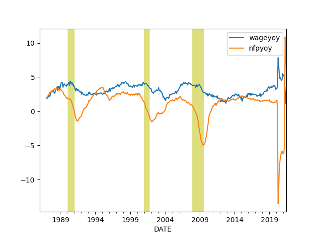

# Calculations, Data

<a name="prezyoy"></a>

## Potus, Incumbent Elec. College Percentage Prediction (GDP YoY)

```python
from io import StringIO
import statsmodels.formula.api as smf
import pandas as pd

s="""year,gdp_growth,net_approval,two_terms,incumbent_vote
2012,2.3,-0.8,0,52
2008,1.09,-37,1,46.3
2004,4.2,-0.5,0,51.2
2000,5.2,19.5,1,50.3
1996,4.0,15.5,0,54.7
1992,3.1,-18,1,46.5
1988,4.4,10,1,53.9
1984,7.9,20,0,59.2
1980,-0.77,-21.7,0,44.7
1976,6.1,5,1,48.9
1972,5.2,26,0,61.8
1968,5.5,-5,1,49.6
1964,6.18,60.3,0,61.3
1960,2.05,37,1,49.9
1956,2.40,53.5,0,57.8
1952,3.60,-27,1,44.5
"""
df = pd.read_csv(StringIO(s))
regr = 'incumbent_vote ~ gdp_growth + net_approval + two_terms'
results = smf.ols(regr, data=df).fit()
print (results.rsquared)
conf = results.conf_int()
```

```text
0.8503762798952246
```

```python
conf = results.conf_int()
net_approv = -11.8

gdg_growth = 3.0
pred = [1., gdg_growth, net_approv, 0]
print (np.dot(pred, conf), np.dot(pred, results.params))

gdg_growth = 2.0
pred = [1., gdg_growth, net_approv, 0]
print (np.dot(pred, conf), np.dot(pred, results.params))

gdg_growth = 1.0
pred = [1., gdg_growth, net_approv, 0]
print (np.dot(pred, conf), np.dot(pred, results.params))

gdg_growth = 0.0
pred = [1., gdg_growth, net_approv, 0]
print (np.dot(pred, conf), np.dot(pred, results.params))
```

```text
[46.81763238 55.80082374] 51.30922806106811
[46.61402821 54.19870793] 50.406368068424605
[46.41042404 52.59659212] 49.5035080757811
[46.20681986 50.9944763 ] 48.600648083137585
```

## 2016 Re-run

```python
bama_net_approv = 9.0
gdp_growth = 1.34
pred = [1., gdp_growth, bama_net_approv, 1]
print (np.dot(pred, conf), np.dot(pred, results.params))
```

```text
[40.0733668  55.07939153] 47.57637916830154
```

## Potus, Incumbent Elec. College Percentage Prediction (Old)

Latest net-aproval = -11.8 % (approval 42 % minus 53.8 % disproval)

```python
from io import StringIO
import statsmodels.formula.api as smf
import pandas as pd

s="""year,gdp_growth,net_approval,two_terms,incumbent_vote
2012,1.3,-0.8,0,52
2008,1.3,-37,1,46.3
2004,2.6,-0.5,0,51.2
2000,8,19.5,1,50.3
1996,7.1,15.5,0,54.7
1992,4.3,-18,1,46.5
1988,5.2,10,1,53.9
1984,7.1,20,0,59.2
1980,-7.9,-21.7,0,44.7
1976,3,5,1,48.9
1972,9.8,26,0,61.8
1968,7,-5,1,49.6
1964,4.7,60.3,0,61.3
1960,-1.9,37,1,49.9
1956,3.2,53.5,0,57.8
1952,0.4,-27,1,44.5
1948,7.5,-6,1,52.4
"""
df = pd.read_csv(StringIO(s))
regr = 'incumbent_vote ~ gdp_growth + net_approval + two_terms'
results = smf.ols(regr, data=df).fit()

conf = results.conf_int()
net_approv = -11.8

gdg_growth = 2.0
pred = [1., gdg_growth, net_approv, 0]
print (np.dot(pred, conf), np.dot(pred, results.params))

gdg_growth = 1.0
pred = [1., gdg_growth, net_approv, 0]
print (np.dot(pred, conf), np.dot(pred, results.params))

gdg_growth = 0.0
pred = [1., gdg_growth, net_approv, 0]
print (np.dot(pred, conf), np.dot(pred, results.params))
```

```text
[49.6962248  53.16687853] 51.431551669024834
[49.37184684 52.33149113] 50.85166898486028
[49.04746888 51.49610372] 50.27178630069573
```

## Wages and Unemployment

<a name="unemp"></a>

```python
import pandas as pd, datetime
from pandas_datareader import data

today = datetime.datetime.now()
start=datetime.datetime(1986, 1, 1)
end=datetime.datetime(today.year, today.month, today.day)
cols = ['PAYEMS']
df = data.DataReader(cols, 'fred', start, end)
df['nfpyoy'] = (df.PAYEMS - df.PAYEMS.shift(12)) / df.PAYEMS.shift(12) * 100.0
print (df.tail(7))
```

```text
            PAYEMS    nfpyoy
DATE                        
2019-05-01  151074  1.565767
2019-06-01  151252  1.506641
2019-07-01  151418  1.496799
2019-08-01  151637  1.451825
2019-09-01  151830  1.507605
2019-10-01  151986  1.424072
2019-11-01  152252  1.468863
```

```python
df.nfpyoy.plot()
plt.grid(True)
plt.title('Non-Farm Payroll YoY Change %')
plt.savefig('nfp.png')
```


```python
import pandas as pd, datetime
from pandas_datareader import data

start=datetime.datetime(1950, 1, 1)
end=datetime.datetime(2019, 11, 1)
cols = ['ECIWAG','CIVPART']
df3 = data.DataReader(cols, 'fred', start, end)
df3 = df3.dropna()
df3['ECIWAG2'] = df3.shift(4).ECIWAG
df3['wagegrowth'] = (df3.ECIWAG-df3.ECIWAG2) / df3.ECIWAG2 * 100.
df3['unempl'] = 100.0 - df3.CIVPART
print (df3['ECIWAG2'].tail(7))
```

```text
DATE
2018-01-01    128.2
2018-04-01    129.0
2018-07-01    130.0
2018-10-01    130.8
2019-01-01    132.0
2019-04-01    132.8
2019-07-01    133.9
Freq: 3MS, Name: ECIWAG2, dtype: float64
```

```python
plt.figure(figsize=(14, 5))
plt.subplot(121)
df3['wagegrowth'].plot(title='Wave Growth')
plt.subplot(122)
df3['unempl'].plot(title='Unemployment') 
plt.savefig('unemploy.png')
```


<a name="pmi"></a>

## PMI

```python
import quandl, os, datetime
from datetime import timedelta

bdays = int(180)
today = datetime.datetime.now()
end_d=datetime.datetime(today.year, today.month, today.day)
start_d = end_d - timedelta(days=bdays)
today = datetime.datetime.now()
df = quandl.get("ISM/MAN_PMI-PMI-Composite-Index", 
                returns="pandas",
                start_date=start_d.strftime('%Y-%m-%d'),
                end_date=today.strftime('%Y-%m-%d'),
                authtoken=open(".quandl").read())

print (df['PMI'].tail(8))
df['PMI'].plot()
plt.savefig('pmi.png')
```

```text
Date
2019-08-01    49.1
2019-09-01    47.8
2019-10-01    48.3
2019-11-01    48.1
2019-12-01    47.2
Name: PMI, dtype: float64
```


<a name="gdpyoy"></a>

# GDP YoY

```python
import pandas as pd, datetime
from pandas_datareader import data

today = datetime.datetime.now()
start=datetime.datetime(1950, 1, 1)
end=datetime.datetime(today.year, today.month, today.day)
cols = ['GDPC1']
df = data.DataReader(cols, 'fred', start, end)

df['gdpyoy'] = (df.GDPC1 - df.GDPC1.shift(4)) / df.GDPC1.shift(4) * 100.0
print (df.tail(10))
```

```text
                GDPC1    gdpyoy
DATE                           
2017-04-01  18021.048  2.163513
2017-07-01  18163.558  2.416026
2017-10-01  18322.464  2.795257
2018-01-01  18438.254  2.861873
2018-04-01  18598.135  3.202294
2018-07-01  18732.720  3.133538
2018-10-01  18783.548  2.516496
2019-01-01  18927.281  2.652241
2019-04-01  19021.860  2.278320
2019-07-01  19121.112  2.073335
```

<a name="infyoy"></a>

# Inflation

```python
import quandl
df = quandl.get("RATEINF/INFLATION_USA-Inflation-YOY-USA", 
                returns="pandas",authtoken=open(".quandl").read())
print (df.tail(10))
```

```text
            Value
Date             
2019-02-28  1.520
2019-03-31  1.863
2019-04-30  1.996
2019-05-31  1.790
2019-06-30  1.648
2019-07-31  1.811
2019-08-31  1.750
2019-09-30  1.711
2019-10-31  1.764
2019-11-30  2.051
```

<a name="cpyoy"></a>

# Profits

```python
import pandas as pd, datetime
from pandas_datareader import data

today = datetime.datetime.now()
start=datetime.datetime(1950, 1, 1)
end=datetime.datetime(today.year, today.month, today.day)
cols = ['CPROFIT']
df = data.DataReader(cols, 'fred', start, end)
df['cpyoy'] = (df.CPROFIT - df.CPROFIT.shift(4)) / df.CPROFIT.shift(4) * 100.0
print (df.tail(4))
```

```text
             CPROFIT     cpyoy
DATE                          
2018-10-01  2085.603  4.208611
2019-01-01  2006.864 -2.212810
2019-04-01  2082.711  1.278730
2019-07-01  2077.979 -1.247722
```

```python
df.tail(60).cpyoy.plot()
plt.grid(True)
plt.savefig('profit.png')
```


# Dollar

<a name="dollar"></a>

```python
import pandas as pd, datetime
from pandas_datareader import data

today = datetime.datetime.now()
start=datetime.datetime(2001, 1, 1)
end=datetime.datetime(today.year, today.month, today.day)
cols = ['DTWEXM']
df = data.DataReader(cols, 'fred', start, end)
print (df.tail(4))
m,s = df.mean(),df.std()
print (np.array([m-s,m+s]).T)
```

```text
             DTWEXM
DATE               
2019-12-24  92.0516
2019-12-25      NaN
2019-12-26  91.9234
2019-12-27  91.4593
[[74.59819295 95.84173602]]
```

```python
df.DTWEXM.plot()
plt.grid(True)
plt.savefig('dollar.png')
```


<a name="wagepayroll"></a>

# Difference Between Wage Growth YoY and Payrolls (Hiring)

```python
import pandas as pd, datetime
from pandas_datareader import data

today = datetime.datetime.now()
start=datetime.datetime(1986, 1, 1)
end=datetime.datetime(today.year, today.month, today.day)
cols = ['PAYEMS','AHETPI']
df = data.DataReader(cols, 'fred', start, end)
df['nfpyoy'] = (df.PAYEMS - df.PAYEMS.shift(12)) / df.PAYEMS.shift(12) * 100.0
df['wageyoy'] = (df.AHETPI - df.AHETPI.shift(12)) / df.AHETPI.shift(12) * 100.0
df[['wageyoy','nfpyoy']].plot()
plt.savefig('pay-wage.png')
```




