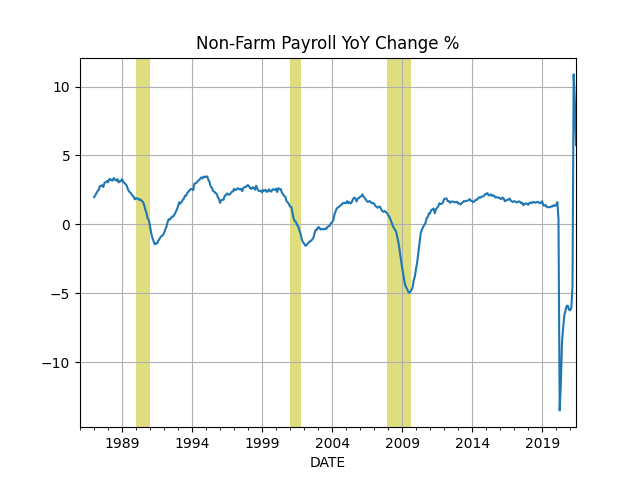
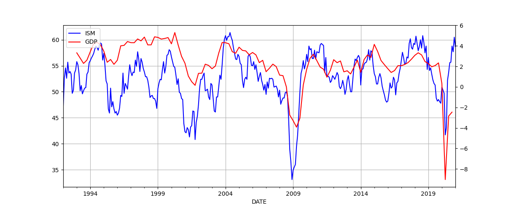
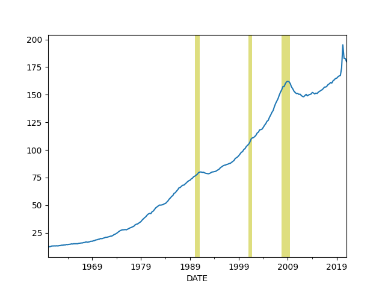

# Economy, Calculations, Data

<a name="prez"></a>

## Potus, Incumbent Elec. College Percentage Prediction 

Time for Change [model](https://pollyvote.com/en/components/models/hybrid/time-for-change-model/),
([my post](../../2015/04/predicting-2016-presidential-election.md))

GDP is taken as annualized quarterly growth rate, quarter growth compared to
previous quarter, [annualized](https://www.fool.com/knowledge-center/how-to-calculate-the-annual-growth-rate-for-real-g.aspx). 


```python
import pandas as pd, datetime
from pandas_datareader import data

today = datetime.datetime.now()
start=datetime.datetime(1945, 1, 1)
end=datetime.datetime(today.year, today.month, today.day)
df = data.DataReader(['GDPC1'], 'fred', start, end)
df['growann'] = (  (  (1+df.pct_change())**4  )-1.0  )*100.0
#print (df[pd.DatetimeIndex(df.index).year == 1984]['growann'])
print (df['growann'].tail(5))
# look at Q2, 04-01 date
```

```text
DATE
2019-01-01    3.096140
2019-04-01    2.013819
2019-07-01    2.103507
2019-10-01    2.126630
2020-01-01   -5.047091
Name: growann, dtype: float64
```

```python
from io import StringIO
import statsmodels.formula.api as smf
import pandas as pd

s="""year,gdp_growth,net_approval,two_terms,incumbent_vote
2012,1.3,-0.8,0,52
2008,1.3,-37,1,46.3
2004,2.6,-0.5,0,51.2
2000,8,19.5,1,50.3
1996,7.1,15.5,0,54.7
1992,4.3,-18,1,46.5
1988,5.2,10,1,53.9
1984,7.1,20,0,59.2
1980,-7.9,-21.7,0,44.7
1976,3,5,1,48.9
1972,9.8,26,0,61.8
1968,7,-5,1,49.6
1964,4.7,60.3,0,61.3
1960,-1.9,37,1,49.9
1956,3.2,53.5,0,57.8
1952,0.4,-27,1,44.5
1948,7.5,-6,1,52.4
"""
df = pd.read_csv(StringIO(s))
regr = 'incumbent_vote ~ gdp_growth + net_approval + two_terms'
results = smf.ols(regr, data=df).fit()

print ('R^2', results.rsquared)
conf = results.conf_int()

net_approv = -10.0; gdp_growth = 0.0
pred = [1., gdp_growth, net_approv, 0]
print (np.dot(pred, conf), np.dot(pred, results.params))

net_approv = -10.0; gdp_growth = -2.0
pred = [1., gdp_growth, net_approv, 0]
print (np.dot(pred, conf), np.dot(pred, results.params))

net_approv = -10.0; gdp_growth = -5.0
pred = [1., gdp_growth, net_approv, 0]
print (np.dot(pred, conf), np.dot(pred, results.params))
```

```text
R^2 0.9011858911763367
[49.14454875 51.75431018] 50.4494294659622
[48.49579282 50.08353537] 49.28966409763309
[47.52265893 47.57737316] 47.550016045139444
```


## The Cycle

<a name="cycle"/>


```python
import pandas as pd, datetime
from pandas_datareader import data

today = datetime.datetime.now()
start=datetime.datetime(1970, 1, 1)
end=datetime.datetime(today.year, today.month, today.day)

fig, axs = plt.subplots(2)

df = data.DataReader(['GDPC1'], 'fred', start, end)
df['gdpyoy'] = (df.GDPC1 - df.GDPC1.shift(4)) / df.GDPC1.shift(4) * 100.0
df['gdpyoy'].plot(ax=axs[0],title="GDP and Inflation YoY")
axs[0].axvspan('01-11-1973', '01-03-1975', color='y', alpha=0.5, lw=0)
axs[0].axvspan('01-07-1981', '01-11-1982', color='y', alpha=0.5, lw=0)
axs[0].axvspan('01-09-1990', '01-07-1991', color='y', alpha=0.5, lw=0)
axs[0].axvspan('01-03-2001', '27-10-2001', color='y', alpha=0.5, lw=0)
axs[0].axvspan('22-12-2007', '09-05-2009', color='y', alpha=0.5, lw=0)
print (df[['gdpyoy']].tail(6))

df = data.DataReader(['CPIAUCNS'], 'fred', start, end)
df['infyoy'] = (df.CPIAUCNS - df.CPIAUCNS.shift(12)) / df.CPIAUCNS.shift(12) * 100.0
df['infyoy'].plot(ax=axs[1])
axs[1].axvspan('01-11-1973', '01-03-1975', color='y', alpha=0.5, lw=0)
axs[1].axvspan('01-07-1981', '01-11-1982', color='y', alpha=0.5, lw=0)
axs[1].axvspan('01-09-1990', '01-07-1991', color='y', alpha=0.5, lw=0)
axs[1].axvspan('01-03-2001', '27-10-2001', color='y', alpha=0.5, lw=0)
axs[1].axvspan('22-12-2007', '09-05-2009', color='y', alpha=0.5, lw=0)
print (df[['infyoy']].tail(6))
            
plt.savefig('cycle.png')
```

```text
              gdpyoy
DATE                
2018-10-01  2.516496
2019-01-01  2.652241
2019-04-01  2.278320
2019-07-01  2.073335
2019-10-01  2.334074
2020-01-01  0.250543
              infyoy
DATE                
2019-12-01  2.285130
2020-01-01  2.486572
2020-02-01  2.334874
2020-03-01  1.539327
2020-04-01  0.329097
2020-05-01  0.117926
```

## Wages and Unemployment

<a name="nfp"/>

```python
import pandas as pd, datetime
from pandas_datareader import data

today = datetime.datetime.now()
start=datetime.datetime(1986, 1, 1)
end=datetime.datetime(today.year, today.month, today.day)
cols = ['PAYEMS']
df = data.DataReader(cols, 'fred', start, end)
df['nfpyoy'] = (df.PAYEMS - df.PAYEMS.shift(12)) / df.PAYEMS.shift(12) * 100.0
print (df.tail(7))
df.nfpyoy.plot()
plt.grid(True)
plt.axvspan('01-09-1990', '01-07-1991', color='y', alpha=0.5, lw=0)
plt.axvspan('01-03-2001', '27-10-2001', color='y', alpha=0.5, lw=0)
plt.axvspan('22-12-2007', '09-05-2009', color='y', alpha=0.5, lw=0)
plt.title('Non-Farm Payroll YoY Change %')
plt.savefig('nfp.png')
```

```text
            PAYEMS     nfpyoy
DATE                         
2019-11-01  151814   1.423675
2019-12-01  151998   1.423281
2020-01-01  152212   1.384097
2020-02-01  152463   1.550604
2020-03-01  151090   0.537656
2020-04-01  130403 -13.348882
2020-05-01  132912 -11.731539
```




```python
import pandas as pd, datetime
from pandas_datareader import data

start=datetime.datetime(1950, 1, 1)
end=datetime.datetime(2019, 11, 1)
cols = ['ECIWAG']
df3 = data.DataReader(cols, 'fred', start, end)
df3 = df3.dropna()
df3['ECIWAG2'] = df3.shift(4).ECIWAG
df3['wagegrowth'] = (df3.ECIWAG-df3.ECIWAG2) / df3.ECIWAG2 * 100.
print (df3['wagegrowth'].tail(4))
df3['wagegrowth'].plot(title='Wage Growth')
plt.savefig('wages.png')
```

```text
DATE
2019-01-01    2.954545
2019-04-01    3.012048
2019-07-01    2.987304
2019-10-01    2.965159
Name: wagegrowth, dtype: float64
```


<a name="claims"></a>

```python
import pandas as pd, datetime
from pandas_datareader import data

today = datetime.datetime.now()
start=datetime.datetime(1995, 1, 1)
end=datetime.datetime(today.year, today.month, today.day)
cols = ['ICSA']
df = data.DataReader(cols, 'fred', start, end)
df.ICSA.plot()
print (df.tail(4))
plt.title("Initial Unemployment Claims")
plt.axvspan('01-03-2001', '27-10-2001', color='y', alpha=0.5, lw=0)
plt.axvspan('22-12-2007', '09-05-2009', color='y', alpha=0.5, lw=0)
plt.savefig('icsa.png')
```

```text
ICSA
DATE               
2020-05-09  2687000
2020-05-16  2446000
2020-05-23  2126000
2020-05-30  1877000
```


<a name="unempl"></a>

Unemployment: Reverse of Employment-to-Population Ratio

```python
import pandas as pd, datetime
from pandas_datareader import data

today = datetime.datetime.now()
start=datetime.datetime(1980, 1, 1)
end=datetime.datetime(today.year, today.month, today.day)
cols = ['CLF16OV','LFWA64TTUSM647S']
df = data.DataReader(cols, 'fred', start, end)
df = df.interpolate()
df['ratio'] = 100.0 - ((df.CLF16OV*1000.0 / df.LFWA64TTUSM647S) * 100.0)
print (df.ratio.tail(5))
df.ratio.plot()
plt.savefig('unemploy.png')
```

```text
DATE
2020-01-01    20.057115
2020-02-01    20.078739
2020-03-01    20.805102
2020-04-01    24.032452
2020-05-01    23.184813
Freq: MS, Name: ratio, dtype: float64
```


<a name="pmi"></a>

## PMI

```python
import quandl, os, datetime
from datetime import timedelta

today = datetime.datetime.now()
start=datetime.datetime(1985, 1, 1)
end=datetime.datetime(today.year, today.month, today.day)
today = datetime.datetime.now()
df = quandl.get("ISM/MAN_PMI-PMI-Composite-Index", 
returns="pandas",
start_date=start.strftime('%Y-%m-%d'),
end_date=today.strftime('%Y-%m-%d'),
authtoken=open(".quandl").read())

print (df['PMI'].tail(4))
df['PMI'].plot()
plt.axvspan('01-09-1990', '01-07-1991', color='y', alpha=0.5, lw=0)
plt.axvspan('01-03-2001', '27-10-2001', color='y', alpha=0.5, lw=0)
plt.axvspan('22-12-2007', '09-05-2009', color='y', alpha=0.5, lw=0)
plt.savefig('pmi.png')
```

```text
Date
2020-02-01    50.1
2020-03-01    49.1
2020-04-01    41.5
2020-05-01    43.1
Name: PMI, dtype: float64
```


<a name="gdpism"></a>

## GDP vs ISM

```python
import pandas as pd, datetime
from pandas_datareader import data
import quandl

today = datetime.datetime.now()
start=datetime.datetime(1992, 1, 1)
end=datetime.datetime(today.year, today.month, today.day)
cols = ['GDPC1']
df = data.DataReader(cols, 'fred', start, end)

df['gdpyoy'] = (df.GDPC1 - df.GDPC1.shift(4)) / df.GDPC1.shift(4) * 100.0

df2 = quandl.get("ISM/MAN_PMI-PMI-Composite-Index", 
returns="pandas",
start_date=start.strftime('%Y-%m-%d'),
end_date=end.strftime('%Y-%m-%d'),
authtoken=open(".quandl").read())

plt.figure(figsize=(12,5))
ax1 = df2.PMI.plot(color='blue', grid=True, label='ISM')
ax2 = df.gdpyoy.plot(color='red', grid=True, label='GDP',secondary_y=True)
h1, l1 = ax1.get_legend_handles_labels()
h2, l2 = ax2.get_legend_handles_labels()
plt.legend(h1+h2, l1+l2, loc=2)
plt.savefig('gdp-ism.png')
```




<a name="cpyoy"></a>

## Profits

```python
import pandas as pd, datetime
from pandas_datareader import data

today = datetime.datetime.now()
start=datetime.datetime(1980, 1, 1)
end=datetime.datetime(today.year, today.month, today.day)
cols = ['CPROFIT']
df = data.DataReader(cols, 'fred', start, end)
df['cpyoy'] = (df.CPROFIT - df.CPROFIT.shift(4)) / df.CPROFIT.shift(4) * 100.0
print (df.tail(4))
df.cpyoy.plot()
plt.grid(True)
plt.savefig('profit.png')
```

```text
CPROFIT     cpyoy
DATE                          
2019-04-01  2082.711  1.278730
2019-07-01  2077.979 -1.247722
2019-10-01  2131.002  2.176781
2020-01-01  1835.613 -8.533264
```


## Dollar

<a name="dollar"></a>

```python
import pandas as pd, datetime
from pandas_datareader import data

import pandas_datareader.data as web
df = web.DataReader("DX-Y.NYB", 'yahoo', start, end)['Adj Close']
print (df.tail(4))
m,s = df.mean(),df.std()
print (np.array([m-s,m+s]).T)
df.tail(1000).plot()
plt.grid(True)
plt.savefig('dollar.png')
```

```text
Date
2020-06-02    97.669998
2020-06-03    97.279999
2020-06-04    96.680000
2020-06-05    96.940002
Name: Adj Close, dtype: float64
[ 80.58343636 111.62990997]
```


<a name="wagepayroll"></a>

## Difference Between Wage Growth YoY and Payrolls (Hiring)

```python
import pandas as pd, datetime
from pandas_datareader import data

today = datetime.datetime.now()
start=datetime.datetime(1986, 1, 1)
end=datetime.datetime(today.year, today.month, today.day)
cols = ['PAYEMS','AHETPI']
df = data.DataReader(cols, 'fred', start, end)
df['nfpyoy'] = (df.PAYEMS - df.PAYEMS.shift(12)) / df.PAYEMS.shift(12) * 100.0
df['wageyoy'] = (df.AHETPI - df.AHETPI.shift(12)) / df.AHETPI.shift(12) * 100.0
df[['wageyoy','nfpyoy']].plot()
plt.axvspan('01-09-1990', '01-07-1991', color='y', alpha=0.5, lw=0)
plt.axvspan('01-03-2001', '27-10-2001', color='y', alpha=0.5, lw=0)
plt.axvspan('22-12-2007', '09-05-2009', color='y', alpha=0.5, lw=0)
print (df['wageyoy'].tail(5))
print (df['nfpyoy'].tail(5))
plt.savefig('pay-wage.png')
```

```text
DATE
2020-01-01    3.331891
2020-02-01    3.320397
2020-03-01    3.522337
2020-04-01    7.758251
2020-05-01    6.746371
Freq: MS, Name: wageyoy, dtype: float64
DATE
2020-01-01     1.384097
2020-02-01     1.550604
2020-03-01     0.537656
2020-04-01   -13.348882
2020-05-01   -11.731539
Freq: MS, Name: nfpyoy, dtype: float64
```


<a name="p2s"></a>

## SP 500 Price to Sales Ratio

```python
import datetime, quandl
today = datetime.datetime.now()
start=datetime.datetime(1980, 1, 1)
end=datetime.datetime(today.year, today.month, today.day)
df = quandl.get("MULTPL/SP500_PSR_QUARTER-S-P-500-Price-to-Sales-Ratio-by-Quarter", 
returns="pandas",
start_date=start.strftime('%Y-%m-%d'),
end_date=end.strftime('%Y-%m-%d'),
authtoken=open(".quandl").read())
print (df.tail(5))

df.plot()
plt.axvspan('01-03-2001', '27-10-2001', color='y', alpha=0.5, lw=0)
plt.axvspan('22-12-2007', '09-05-2009', color='y', alpha=0.5, lw=0)
plt.savefig('price-sales.png')
```

```text
Value
Date             
2020-03-31   1.83
2020-04-01   1.77
2020-04-30   2.06
2020-05-01   2.00
2020-06-01   2.16
```


<a name="sp500prof"></a>

## SP 500 vs Corporate Profits

```python
import pandas as pd, datetime
from pandas_datareader import data

today = datetime.datetime.now()
start=datetime.datetime(1990, 1, 1)
end=datetime.datetime(today.year, today.month, today.day)
cols = ['CP']
df = data.DataReader(cols, 'fred', start, end)

import pandas_datareader.data as web
df2 = web.DataReader("^GSPC", 'yahoo', start, end)
df2 = df2[['Adj Close']]; df2['CP'] = df['CP']
df2 = df2.interpolate().dropna()
df2.columns = ['SP500','Corporate Profits']
df2.plot()
plt.axvspan('01-09-1990', '01-07-1991', color='y', alpha=0.5, lw=0)
plt.axvspan('01-03-2001', '27-10-2001', color='y', alpha=0.5, lw=0)
plt.axvspan('22-12-2007', '09-05-2009', color='y', alpha=0.5, lw=0)
plt.savefig('sp500-profits.png')
```


<a name="wilshire"></a>

## Total Market Cap / GDP

```python
import pandas as pd, datetime
from pandas_datareader import data

today = datetime.datetime.now()
start=datetime.datetime(1995, 1, 1)
end=datetime.datetime(today.year, today.month, today.day)
cols = ['WILL5000IND']
df = data.DataReader(cols, 'fred', start, end)
df.plot()
print (df.tail(4))
plt.axvspan('01-03-2001', '27-10-2001', color='y', alpha=0.5, lw=0)
plt.axvspan('22-12-2007', '09-05-2009', color='y', alpha=0.5, lw=0)
plt.savefig('wilshire.png')
```

```text
WILL5000IND
DATE                   
2020-06-01       145.81
2020-06-02       147.01
2020-06-03       149.22
2020-06-04       148.75
```


<a name="junkbond"></a>

## Junk Bond Yields

```python
import pandas as pd, datetime
from pandas_datareader import data

today = datetime.datetime.now()
start=datetime.datetime(1980, 1, 1)
end=datetime.datetime(today.year, today.month, today.day)
cols = ['BAMLH0A2HYBEY']
df = data.DataReader(cols, 'fred', start, end)
print (df.tail(6))
df.plot()
plt.plot(df.tail(1).index, df.tail(1),'ro')
plt.axvspan('01-03-2001', '27-10-2001', color='y', alpha=0.5, lw=0)
plt.axvspan('22-12-2007', '09-05-2009', color='y', alpha=0.5, lw=0)
plt.savefig('junkbond.png')
```

```text
BAMLH0A2HYBEY
DATE                     
2020-05-29           7.16
2020-05-31           6.95
2020-06-01           6.84
2020-06-02           6.59
2020-06-03           6.23
2020-06-04           6.33
```


## Yield Curve

<a name="curve"></a>

10 Year Treasury Yield - 3 Month Bills

```python
import pandas as pd, datetime
from pandas_datareader import data

pd.set_option('display.max_columns', 10)

today = datetime.datetime.now()
start=datetime.datetime(1980, 1, 1)
end=datetime.datetime(today.year, today.month, today.day)
cols = ['DGS10','DGS3MO']
df = data.DataReader(cols, 'fred', start, end)
df['Yield Curve'] = df.DGS10 - df.DGS3MO
print (df.tail(6))
plt.plot(df.tail(1).index, df.tail(1)['Yield Curve'],'ro')
df['Yield Curve'].plot()
plt.axvspan('01-09-1990', '01-07-1991', color='y', alpha=0.5, lw=0)
plt.axvspan('01-03-2001', '27-10-2001', color='y', alpha=0.5, lw=0)
plt.axvspan('22-12-2007', '09-05-2009', color='y', alpha=0.5, lw=0)
plt.savefig('yield-curve.png')
```

```text
DGS10  DGS3MO  Yield Curve
DATE                                  
2020-05-28   0.70    0.15         0.55
2020-05-29   0.65    0.14         0.51
2020-06-01   0.66    0.14         0.52
2020-06-02   0.68    0.15         0.53
2020-06-03   0.77    0.16         0.61
2020-06-04   0.82    0.15         0.67
```


<a name="vix"></a>

## VIX

```python
import pandas as pd, datetime
import pandas_datareader.data as web

today = datetime.datetime.now()
start=datetime.datetime(2000, 1, 1)
end=datetime.datetime(today.year, today.month, today.day)
df = web.DataReader("^VIX", 'yahoo', start, end)['Adj Close']
df.plot()
plt.axvspan('01-03-2001', '27-10-2001', color='y', alpha=0.5, lw=0)
plt.axvspan('22-12-2007', '09-05-2009', color='y', alpha=0.5, lw=0)
print (df.tail(7))
plt.plot(df.tail(1).index, df.tail(1),'ro')
plt.savefig('vix.png')
```

```text

gaierrorTraceback (most recent call last)
~/Documents/env3/lib/python3.5/site-packages/urllib3/connection.py in _new_conn(self)
    159             conn = connection.create_connection(
--> 160                 (self._dns_host, self.port), self.timeout, **extra_kw)
    161 

~/Documents/env3/lib/python3.5/site-packages/urllib3/util/connection.py in create_connection(address, timeout, source_address, socket_options)
     56 
---> 57     for res in socket.getaddrinfo(host, port, family, socket.SOCK_STREAM):
     58         af, socktype, proto, canonname, sa = res

/usr/lib/python3.5/socket.py in getaddrinfo(host, port, family, type, proto, flags)
    731     addrlist = []
--> 732     for res in _socket.getaddrinfo(host, port, family, type, proto, flags):
    733         af, socktype, proto, canonname, sa = res

gaierror: [Errno -3] Temporary failure in name resolution

During handling of the above exception, another exception occurred:

NewConnectionErrorTraceback (most recent call last)
~/Documents/env3/lib/python3.5/site-packages/urllib3/connectionpool.py in urlopen(self, method, url, body, headers, retries, redirect, assert_same_host, timeout, pool_timeout, release_conn, chunked, body_pos, **response_kw)
    602                                                   body=body, headers=headers,
--> 603                                                   chunked=chunked)
    604 

~/Documents/env3/lib/python3.5/site-packages/urllib3/connectionpool.py in _make_request(self, conn, method, url, timeout, chunked, **httplib_request_kw)
    343         try:
--> 344             self._validate_conn(conn)
    345         except (SocketTimeout, BaseSSLError) as e:

~/Documents/env3/lib/python3.5/site-packages/urllib3/connectionpool.py in _validate_conn(self, conn)
    842         if not getattr(conn, 'sock', None):  # AppEngine might not have  `.sock`
--> 843             conn.connect()
    844 

~/Documents/env3/lib/python3.5/site-packages/urllib3/connection.py in connect(self)
    315         # Add certificate verification
--> 316         conn = self._new_conn()
    317         hostname = self.host

~/Documents/env3/lib/python3.5/site-packages/urllib3/connection.py in _new_conn(self)
    168             raise NewConnectionError(
--> 169                 self, "Failed to establish a new connection: %s" % e)
    170 

NewConnectionError: <urllib3.connection.VerifiedHTTPSConnection object at 0x7f5216b92da0>: Failed to establish a new connection: [Errno -3] Temporary failure in name resolution

During handling of the above exception, another exception occurred:

MaxRetryErrorTraceback (most recent call last)
~/Documents/env3/lib/python3.5/site-packages/requests/adapters.py in send(self, request, stream, timeout, verify, cert, proxies)
    448                     retries=self.max_retries,
--> 449                     timeout=timeout
    450                 )

~/Documents/env3/lib/python3.5/site-packages/urllib3/connectionpool.py in urlopen(self, method, url, body, headers, retries, redirect, assert_same_host, timeout, pool_timeout, release_conn, chunked, body_pos, **response_kw)
    640             retries = retries.increment(method, url, error=e, _pool=self,
--> 641                                         _stacktrace=sys.exc_info()[2])
    642             retries.sleep()

~/Documents/env3/lib/python3.5/site-packages/urllib3/util/retry.py in increment(self, method, url, response, error, _pool, _stacktrace)
    398         if new_retry.is_exhausted():
--> 399             raise MaxRetryError(_pool, url, error or ResponseError(cause))
    400 

MaxRetryError: HTTPSConnectionPool(host='finance.yahoo.com', port=443): Max retries exceeded with url: /quote/%5EVIX/history?filter=history&interval=1d&frequency=1d&period2=1592009999&period1=946692000 (Caused by NewConnectionError('<urllib3.connection.VerifiedHTTPSConnection object at 0x7f5216b92da0>: Failed to establish a new connection: [Errno -3] Temporary failure in name resolution',))

During handling of the above exception, another exception occurred:

ConnectionErrorTraceback (most recent call last)
<ipython-input-1-d310e47ba4b4> in <module>
      7 start=datetime.datetime(2000, 1, 1)
      8 end=datetime.datetime(today.year, today.month, today.day)
----> 9 df = web.DataReader("^VIX", 'yahoo', start, end)['Adj Close']
     10 df.plot()
     11 plt.axvspan('01-03-2001', '27-10-2001', color='y', alpha=0.5, lw=0)

~/Documents/env3/lib/python3.5/site-packages/pandas_datareader/data.py in DataReader(name, data_source, start, end, retry_count, pause, session, access_key)
    308                                 adjust_price=False, chunksize=25,
    309                                 retry_count=retry_count, pause=pause,
--> 310                                 session=session).read()
    311 
    312     elif data_source == "google":

~/Documents/env3/lib/python3.5/site-packages/pandas_datareader/base.py in read(self)
    208         if isinstance(self.symbols, (compat.string_types, int)):
    209             df = self._read_one_data(self.url,
--> 210                                      params=self._get_params(self.symbols))
    211         # Or multiple symbols, (e.g., ['GOOG', 'AAPL', 'MSFT'])
    212         elif isinstance(self.symbols, DataFrame):

~/Documents/env3/lib/python3.5/site-packages/pandas_datareader/yahoo/daily.py in _read_one_data(self, url, params)
    127         url = url.format(symbol)
    128 
--> 129         resp = self._get_response(url, params=params)
    130         ptrn = r'root\.App\.main = (.*?);\n}\(this\)\);'
    131         try:

~/Documents/env3/lib/python3.5/site-packages/pandas_datareader/base.py in _get_response(self, url, params, headers)
    130             response = self.session.get(url,
    131                                         params=params,
--> 132                                         headers=headers)
    133             if response.status_code == requests.codes.ok:
    134                 return response

~/Documents/env3/lib/python3.5/site-packages/requests/sessions.py in get(self, url, **kwargs)
    544 
    545         kwargs.setdefault('allow_redirects', True)
--> 546         return self.request('GET', url, **kwargs)
    547 
    548     def options(self, url, **kwargs):

~/Documents/env3/lib/python3.5/site-packages/requests/sessions.py in request(self, method, url, params, data, headers, cookies, files, auth, timeout, allow_redirects, proxies, hooks, stream, verify, cert, json)
    531         }
    532         send_kwargs.update(settings)
--> 533         resp = self.send(prep, **send_kwargs)
    534 
    535         return resp

~/Documents/env3/lib/python3.5/site-packages/requests/sessions.py in send(self, request, **kwargs)
    644 
    645         # Send the request
--> 646         r = adapter.send(request, **kwargs)
    647 
    648         # Total elapsed time of the request (approximately)

~/Documents/env3/lib/python3.5/site-packages/requests/adapters.py in send(self, request, stream, timeout, verify, cert, proxies)
    514                 raise SSLError(e, request=request)
    515 
--> 516             raise ConnectionError(e, request=request)
    517 
    518         except ClosedPoolError as e:

ConnectionError: HTTPSConnectionPool(host='finance.yahoo.com', port=443): Max retries exceeded with url: /quote/%5EVIX/history?filter=history&interval=1d&frequency=1d&period2=1592009999&period1=946692000 (Caused by NewConnectionError('<urllib3.connection.VerifiedHTTPSConnection object at 0x7f5216b92da0>: Failed to establish a new connection: [Errno -3] Temporary failure in name resolution',))
```


<a name="oil"></a>

## Oil

Futures, Continuous Contract, Front Month

```python
import pandas_datareader.data as web, datetime
today = datetime.datetime.now()
start=datetime.datetime(1980, 1, 1)
end=datetime.datetime(today.year, today.month, today.day)
df = web.DataReader("CL=F", 'yahoo', start, end)
df = df['Close']
print (df.tail(5))
plt.plot(df.tail(1).index, df.tail(1),'ro')
df.plot()
plt.axvspan('01-03-2001', '27-10-2001', color='y', alpha=0.5, lw=0)
plt.axvspan('22-12-2007', '09-05-2009', color='y', alpha=0.5, lw=0)
plt.savefig('oil.png')
```

```text
Date
2020-06-08    38.590000
2020-06-09    38.389999
2020-06-10    38.730000
2020-06-11    35.790001
2020-06-12    36.599998
Name: Close, dtype: float64
```


<a name="credit"/>

## Private Debt to GDP Ratio

```python
import pandas as pd, datetime
from pandas_datareader import data

today = datetime.datetime.now()
start=datetime.datetime(1960, 1, 1)
end=datetime.datetime(today.year, today.month, today.day)

df = data.DataReader(['GDPC1','QUSPAMUSDA'], 'fred', start, end)
df = df.interpolate()
df['Credit to GDP'] = (df.QUSPAMUSDA / df.GDPC1)*100.0
df['Credit to GDP'].plot()
plt.axvspan('01-09-1990', '01-07-1991', color='y', alpha=0.5, lw=0)
plt.axvspan('01-03-2001', '27-10-2001', color='y', alpha=0.5, lw=0)
plt.axvspan('22-12-2007', '09-05-2009', color='y', alpha=0.5, lw=0)
plt.savefig('creditgdp.png')
print (df['Credit to GDP'].tail(4))
```

```text
DATE
2019-04-01    165.964864
2019-07-01    167.001312
2019-10-01    167.550808
2020-01-01    169.734239
Freq: QS-OCT, Name: Credit to GDP, dtype: float64
```



<a name="debt"/>

# Total Consumer Credit Outstanding as % of GDP

```python
import pandas as pd, datetime
from pandas_datareader import data

pd.set_option('display.max_columns', 10)
today = datetime.datetime.now()
start=datetime.datetime(1980, 1, 1)
end=datetime.datetime(today.year, today.month, today.day)
cols = ['TOTALSL','GDP']
df = data.DataReader(cols, 'fred', start, end)
df = df.interpolate(method='linear')
df['debt'] =   df.TOTALSL / df.GDP * 100.0
print (df.debt.tail(4))
df.debt.plot()
plt.axvspan('01-09-1990', '01-07-1991', color='y', alpha=0.5, lw=0)
plt.axvspan('01-03-2001', '27-10-2001', color='y', alpha=0.5, lw=0)
plt.axvspan('22-12-2007', '09-05-2009', color='y', alpha=0.5, lw=0)
plt.savefig('debt.png')
```

```text
DATE
2020-01-01    19.453988
2020-02-01    19.544377
2020-03-01    19.512660
2020-04-01    19.193275
Freq: MS, Name: debt, dtype: float64
```


<a name="gini"/>

# Inequality - GINI Index

```python
import pandas as pd, datetime
from pandas_datareader import data
import finutil

today = datetime.datetime.now()
start=datetime.datetime(1989, 1, 1)
end=datetime.datetime(today.year, today.month, today.day)
cols = ['WFRBLT01026', 'WFRBLN09053','WFRBLN40080','WFRBLB50107']
df = data.DataReader(cols, 'fred', start, end)
p = [0.01, 0.09, 0.40, 0.50]
gini = df.apply(lambda x: finutil.gini(p,x),axis=1)
print (gini.tail(4))
gini.plot()
plt.axvspan('1993-01-01','1993-01-01',color='y')
plt.axvspan('2001-01-01','2001-01-01',color='y')
plt.axvspan('2009-01-01','2009-01-01',color='y')
plt.axvspan('2017-01-01','2017-01-01',color='y')
plt.text('1989-01-01',0.44,'HW')
plt.text('1994-01-01',0.46,'Clinton')
plt.text('2003-01-01',0.47,'Bush')
plt.text('2011-01-01',0.44,'Obama')
plt.savefig('gini.png')
```

```text
DATE
2019-01-01    0.481
2019-04-01    0.476
2019-07-01    0.475
2019-10-01    0.475
Freq: QS-OCT, dtype: float64
```


---

Code - [finutils.py](finutils.py)

---

Note: for Quandl retrieval get the API key from Quandl, and place the
key in a `.quandl` file in the same directory as this file.

