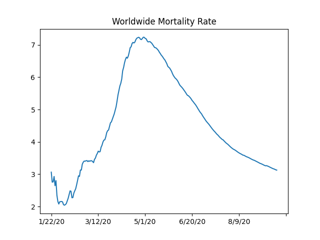
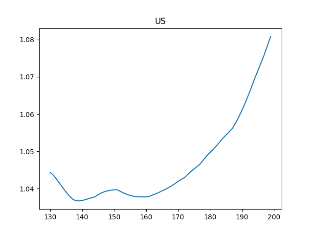

# Coronavirus Data, Analysis

# Mortality Rate

Code is from [2]

<a mame='mortality'/>

```python
import util
world_rate_df = util.mortality_rate()
world_rate_df['deaths / 100 confirmed'].plot(title='Worldwide Mortality Rate')
plt.savefig('mort.png')
```

```text
2/24/21    2.218918
2/25/21    2.219109
2/26/21    2.219643
2/27/21    2.219455
Name: deaths / 100 confirmed, dtype: float64
```




The SIR Model

$$
\frac{ds}{dt} = -\beta s i
$$

$$
\frac{di}{dt} = \beta s i - \gamma i
$$

$$
\frac{dr}{dt} = \gamma i
$$

Where does $R_0$ come from? Epidemic occurs if \# of infected ppl
increase, meaning $di / dt > 0$. That means (from 2nd eq above)

$$
\beta si - \gamma i > 0  \implies \frac{\beta s i }{\gamma} > i
$$

Then,

$$
\frac{\beta s }{\gamma} > 1
$$

At the beginning of the epidemic everyone is susceptible, so $s
\approx 1$. Substitute $s=1$

$$
\frac{\beta}{\gamma} = R_0 > 1
$$

To find $R_0$ from data, we fit the differential equation system above
to data, and using the found $\beta$ and $\gamma$ we calculate $R_0$.

Daily Change

<a name='daily'/>

```python
import pandas as pd, util
df = util.get_data()
```

```python
df['Germany +'] = df['Germany'].diff()
df['UK +'] = df['United Kingdom'].diff()
df['US +'] = df['US'].diff()
pd.set_option('display.width', 2000)
pd.set_option('display.max_columns', None)
print (df[['Germany +','UK +','US +']].tail(10))
```

```text
Country/Region  Germany +     UK +      US +
2/18/21            9845.0  12095.0   69266.0
2/19/21            9050.0  12099.0  106355.0
2/20/21            7162.0  10453.0   71510.0
2/21/21            6094.0   9835.0   56495.0
2/22/21            4984.0  10659.0   56044.0
2/23/21            5764.0   8523.0   71436.0
2/24/21           10774.0   9947.0   74502.0
2/25/21           11032.0  10020.0   77291.0
2/26/21            9437.0   8588.0   73006.0
2/27/21            7671.0   7457.0   68071.0
```

<a name='Rt'/>

Reproduction Rate $R_t$

This calculation is based on [1]

```python
tau = 7 # length of time window
si_mean = 6.3 # mean of serial interval
si_std = 4.2 # standard deviation of serial interval
conf = 0.95 # confidence level of estimated Reff
c = df['US'].tail(200)
R = util.Reff(c, si_mean, si_std, tau, conf)
df2 = pd.DataFrame(R.T)
print (df2[1].tail(5))
# 0,2 indices 95% conf
df2[1].tail(70).plot()
plt.title('US')
plt.ylim(1.0,1.1)
plt.savefig('Rt-US.png')
```

```text
195    1.017378
196    1.017080
197    1.016888
198    1.016570
199    1.016272
Name: 1, dtype: float64
```




Code

[util.py](util.py)

References

[1] https://github.com/tt-nakamura/Reff.git

[2] https://notebooks.ai/rmotr-curriculum/analyzing-covid19-outbreak-40c03c06

[4] https://web.stanford.edu/~jhj1/teachingdocs/Jones-on-R0.pdf


