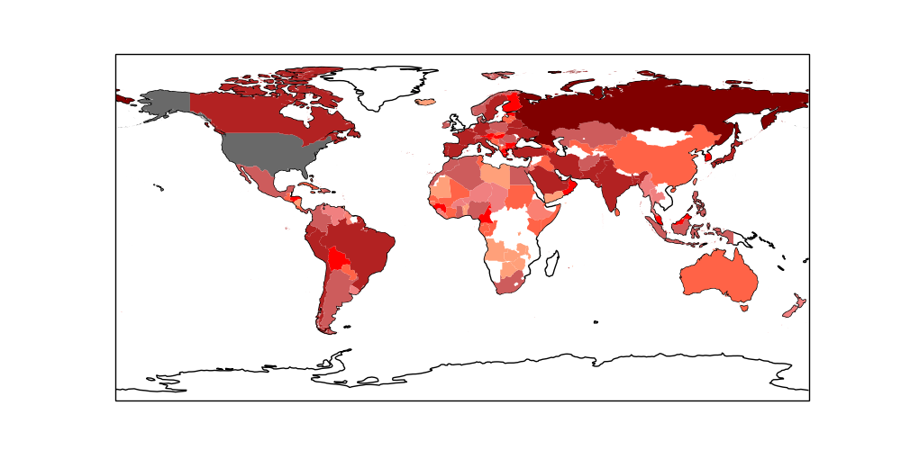

# The Coronavirus Map

```python
import pandas as pd

df1 = pd.read_csv('corona.csv',sep='\t')
d1 = df1[['Country','Confirmed']].set_index('Country').to_dict()
df2 = pd.read_csv('alpha3country.csv',sep=',', skipinitialspace=True)
d2 = df2[['Country','Alpha-3 code']].set_index('Country').to_dict()

res = []
for c in d1['Confirmed'].keys():
    code = d2['Alpha-3 code'].get(c.strip())
    val = float(d1['Confirmed'][c].replace(",",""))
    if code: res.append([val, code])
    
df = pd.DataFrame(res)

bins = [0, 20, 50, 100, 200, 1000, 2000, 100000]
colors = ["mistyrose","lightsalmon","salmon", \
          "lightcoral","tomato","red","firebrick"]
df['colors'] = pd.cut(np.array(df[0]), bins=bins, labels=colors)
col_dict = df.set_index(1)['colors'].to_dict()
```

```python
import matplotlib.pyplot as plt
import cartopy.io.shapereader as shpreader
import cartopy.crs as ccrs
import cartopy.feature as cfeature

fig = plt.figure(figsize=(10, 5))
ax = fig.add_subplot(1, 1, 1, projection=ccrs.PlateCarree())
ax = plt.axes(projection=ccrs.PlateCarree())
ax.coastlines()
shp = shpreader.natural_earth(resolution='10m',category='cultural',
                              name='admin_0_countries')
reader = shpreader.Reader(shp)
for n in reader.records() :
    if n.attributes['ADM0_A3'] in col_dict:
        c = col_dict[n.attributes['ADM0_A3']]
        if ('str' in str(type(c))): ax.add_geometries(n.geometry, ccrs.PlateCarree(), facecolor=col_dict[n.attributes['ADM0_A3']])
plt.savefig('corworld.png')
```



```python
import datetime
print ('Total Confirmed', df[0].sum())
print ('\nUpdated:',datetime.datetime.now())
```

```text
Total Confirmed 85273.0

Updated: 2020-02-29 21:27:46.926808
```

[corona.csv](corona.csv)

[Reference - Wiki](https://en.wikipedia.org/wiki/2019%E2%80%9320_coronavirus_outbreak)


