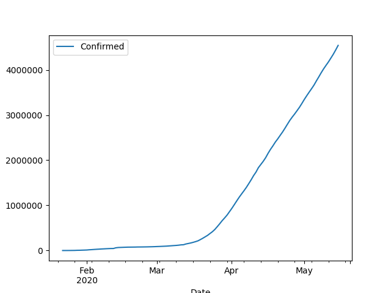

# The Coronavirus Map

```python
import util, pandas as pd

bins = [0, 100, 200, 1000, 2000, 10000, 100000, 800000, 1200000]
colors = ["lightsalmon","lightcoral", "tomato","red",\
	  "indianred","firebrick","maroon","dimgray"]
df, col_dict = util.retrieve_cor_data(bins,colors)
df = df.sort_values(by='Confirmed',ascending=False)
```

```python
import matplotlib.pyplot as plt
import cartopy.io.shapereader as shpreader
import cartopy.crs as ccrs
import cartopy.feature as cfeature

fig = plt.figure(figsize=(10, 5))
ax = fig.add_subplot(1, 1, 1, projection=ccrs.PlateCarree())
ax = plt.axes(projection=ccrs.PlateCarree())
ax.coastlines()
shp = shpreader.natural_earth(resolution='10m',category='cultural',
                              name='admin_0_countries')
reader = shpreader.Reader(shp)
for n in reader.records() :
    if n.attributes['ADM0_A3'] in col_dict:
        c = col_dict[n.attributes['ADM0_A3']]
        if 'nan' not in str(c): 
            ax.add_geometries(n.geometry, ccrs.PlateCarree(), facecolor=col_dict[n.attributes['ADM0_A3']])
plt.savefig('corworld.png')
```


```python
import datetime
print ('Total Confirmed', df['Confirmed'].sum() )
print ('\nUpdated:',datetime.datetime.now())
```

```text
Total Confirmed 4645386.0

Updated: 2020-05-16 14:06:33.016669
```

Symptomatic Death Rate

```python
recov = df['Recovered'].sum() 
death = df['Deaths'].sum()
print ( np.round(  death / (death + recov) * 100.0, 2) , '%')
```

```text
14.87 %
```

```python
pd.set_option('display.max_columns', 10)
pd.set_option('display.max_rows', 10000)
pd.set_option('precision', 2)
pd.set_option('display.float_format', lambda x: '%.0f' % x) 
print (df.set_index('Country').fillna('-'))
```

```text
                        Confirmed Deaths Recovered NewCases
Country                                                    
United States             1484287  88507    327751  1068029
Spain                      274367  27459    188967    57941
Russia                     272043   2537     63166   206340
United Kingdom             236711  33998         -        -
Italy                      223885  31610    120205    72070
Brazil                     220291  14962     84970   120359
France                     179506  27529     60448    91529
Germany                    175699   8001    152600    15098
Turkey                     146457   4055    106133    36269
Iran                       118392   6937     93147    18308
India                       86508   2760     30773    52975
Peru                        84495   2392     27147    54956
China                       82941   4633     78219       89
Canada                      74613   5562     36895    32156
Belgium                     54989   9005     14460    31524
Saudi Arabia                49176    292     21869    27015
Mexico                      45032   4767     30451     9814
Netherlands                 43681   5643         -        -
Chile                       39542    394     16614    22534
Pakistan                    38799    834     10880    27085
Ecuador                     31467   2594      3433    25440
Switzerland                 30514   1878     27100     1536
Qatar                       29425     14      3546    25865
Sweden                      29207   3646      4971    20590
Portugal                    28583   1190      3328    24065
Belarus                     27730    156      8807    18767
Singapore                   27356     21      7248    20087
Ireland                     23956   1518     19470     2968
United Arab Emirates        21831    210      7328    14293
Bangladesh                  20995    314      4117    16564
Poland                      18184    912      7175    10097
Ukraine                     17858    497      4906    12455
Indonesia                   17025   1089      3911    12025
Romania                     16704   1081      9574     6049
Israel                      16606    267     12820     3519
Japan                       16203    713     10338     5152
Austria                     16201    629     14524     1048
Colombia                    14216    546      3460    10210
South Africa                13524    247      6083     7194
Kuwait                      12860     96      3640     9124
Philippines                 12305    817      2561     8927
Dominican Republic          11739    424      3557     7758
Egypt                       11228    592      2799     7837
South Korea                 11037    262      9851      924
Denmark                     10791    537      8959     1295
Serbia                      10438    225      4301     5912
Panama                       9268    266      6080     2922
Czech Republic               8406    295      5381     2730
Norway                       8219    232        32     7955
Argentina                    7479    356      2497     4626
Australia                    7037     98      6353      586
Malaysia                     6872    113      5512     1247
Morocco                      6681    192      3475     3014
Algeria                      6629    536      3271     2822
Bahrain                      6583     12      2640     3931
Afghanistan                  6402    168       745     5489
Finland                      6286    297      5000      989
Kazakhstan                   5850     34      2707     3109
Moldova                      5745    202      2228     3315
Ghana                        5638     28      1460     4150
Nigeria                      5450    171      1320     3959
Oman                         5029     20      1436     3573
Armenia                      4283     55      1791     2437
Luxembourg                   3923    104      3682      137
Bolivia                      3577    164       434     2979
Hungary                      3473    448      1371     1654
Iraq                         3193    117      2089      987
Cameroon                     3105    140      1567     1398
Thailand                     3025     56      2855      114
Azerbaijan                   2980     36      1886     1058
Greece                       2810    160      1374     1276
Uzbekistan                   2691     11      2158      522
Guinea                       2531     15      1094     1422
Honduras                     2460    134       264     2062
Senegal                      2310     25       890     1395
Bosnia and Herzegovina       2236    128      1336      772
Croatia                      2222     95      1869      258
Bulgaria                     2175    105       573     1497
Ivory Coast                  2017     24       942     1051
Sudan                        1964     91       205     1668
Cuba                         1840     79      1425      336
Iceland                      1802     10      1782       10
Estonia                      1770     63       934      773
North Macedonia              1762     98      1267      397
Guatemala                    1643     30       135     1478
Lithuania                    1534     55       988      491
New Zealand                  1498     21      1428       49
Slovakia                     1493     28      1151      314
Slovenia                     1465    103       270     1092
DRC                          1370     61       229     1080
Djibouti                     1309      4       935      370
Somalia                      1284     53       135     1096
El Salvador                  1265     25       441      799
Mayotte                      1258     16       627      615
Gabon                        1209     10       219      980
Tajikistan                   1118     33         -        -
Kyrgyzstan                   1117     14       783      320
Hong Kong                    1053      4      1022       27
Tunisia                      1035     45       802      188
Maldives                     1031      4        49      978
Latvia                        997     19       662      316
Sri Lanka                     935      9       520      406
Albania                       933     31       714      188
Guinea-Bissau                 913      3        26      884
Cyprus                        910     17       481      412
Lebanon                       891     26       246      619
Niger                         885     51       684      150
Costa Rica                    843     10       542      291
Mali                          806     46       455      305
Kenya                         781     45       284      452
Burkina Faso                  780     51       595      134
Andorra                       761     49       604      108
Paraguay                      759     11       193      555
Uruguay                       732     19       553      160
Diamond Princess              712     13       651       48
Georgia                       677     12       419      246
Zambia                        668      7       152      509
San Marino                    653     41       198      414
Jordan                        596      9       401      186
Equatorial Guinea             594      7        22      565
Channel Islands               549     43       457       49
Malta                         546      6       450       90
Jamaica                       511      9       121      381
Tanzania                      509     21       183      305
Venezuela                     459     10       229      220
Sierra Leone                  447     27        97      323
Réunion                       441      -       354        -
Taiwan                        440      7       389       44
Chad                          428     48        88      292
Congo                         391     15        87      289
Palestine                     375      2       327       46
Benin                         339      2        83      254
Isle of Man                   334     24       285       25
Mauritius                     332     10       322        0
Cabo Verde                    326      2        67      257
Montenegro                    324      9       311        4
Vietnam                       314      -       260        -
Haiti                         310     20        29      261
Ethiopia                      306      5       113      188
CAR                           301      -        13        -
Rwanda                        287      -       177        -
Nepal                         278      -        36        -
Togo                          263     11        96      156
Madagascar                    238      -       112        -
South Sudan                   236      4         4      228
Sao Tome and Principe         235      7         4      224
Liberia                       219     20       108       91
Uganda                        203      -        63        -
Martinique                    192     14        91       87
Eswatini                      190      2        66      122
French Guiana                 189      1       124       64
Faeroe Islands                187      -       187        -
Myanmar                       182      6        89       87
Guadeloupe                    155     13       109       33
Gibraltar                     147      -       144        -
Brunei                        141      1       136        4
Mongolia                      135      -        20        -
Bermuda                       122      9        66       47
Cambodia                      122      -       122        -
Mozambique                    119      -        42        -
Trinidad and Tobago           116      8       107        1
Guyana                        116     10        43       63
Yemen                         106     15         1       90
Aruba                         101      3        93        5
Bahamas                        96     11        41       44
Monaco                         96      4        87        5
Cayman Islands                 94      1        55       38
Barbados                       85      7        65       13
Liechtenstein                  82      1        55       26
Sint Maarten                   76     15        46       15
Libya                          64      3        28       33
Malawi                         63      3        24       36
French Polynesia               60      -        59        -
Syria                          50      3        36       11
Angola                         48      2        17       29
Macao                          45      -        43        -
Zimbabwe                       42      4        13       25
Saint Martin                   39      3        30        6
Eritrea                        39      -        39        -
Mauritania                     29      3         7       19
Nicaragua                      25      8         7       10
Antigua and Barbuda            25      3        19        3
Botswana                       24      1        17        6
Timor-Leste                    24      -        24        -
Gambia                         23      1        12       10
Grenada                        22      -        14        -
Bhutan                         21      -         5        -
Laos                           19      -        14        -
New Caledonia                  18      -        18        -
Saint Lucia                    18      -        18        -
Belize                         18      2        16        0
Fiji                           18      -        15        -
St. Vincent Grenadines         17      -        14        -
Curaçao                        16      1        14        1
Dominica                       16      -        15        -
Namibia                        16      -        13        -
Burundi                        15      1         7        7
Saint Kitts and Nevis          15      -        14        -
Falkland Islands               13      -        13        -
Turks and Caicos               12      1        10        1
Vatican City                   12      -         2        -
Seychelles                     11      -        10        -
Greenland                      11      -        11        -
Montserrat                     11      1        10        0
Comoros                        11      1         3        7
Suriname                       10      1         9        0
MS Zaandam                      9      2         -        -
British Virgin Islands          8      1         6        1
Papua New Guinea                8      -         8        -
Caribbean Netherlands           6      -         6        -
St. Barth                       6      -         6        -
Western Sahara                  6      -         6        -
Anguilla                        3      -         3        -
Lesotho                         1      -         -        -
Saint Pierre Miquelon           1      -         1        -
```

Time Series


```python
! wget https://raw.githubusercontent.com/datasets/covid-19/master/data/time-series-19-covid-combined.csv
! zip /tmp/corona-time.zip time-series-19-covid-combined.csv
! rm time-series-19-covid-combined.csv
```

```python
import pandas as pd, zipfile

with zipfile.ZipFile('/tmp/corona-time.zip', 'r') as z:
    df =  pd.read_csv(z.open('time-series-19-covid-combined.csv'),parse_dates=['Date'])
df = df[['Date','Confirmed']]
df = df.set_index('Date')
confirmed = df.groupby('Date').sum()
print (confirmed.tail(4))
confirmed.plot() # in millions
plt.savefig('timeseries.png')
```

```text
            Confirmed
Date                 
2020-05-12  4261747.0
2020-05-13  4347018.0
2020-05-14  4442163.0
2020-05-15  4542347.0
```




```python
pd.set_option('display.float_format', lambda x: '%.2f' % x) 
chg = confirmed.pct_change()*100.0
chg.plot()
print (chg.tail(5))
plt.title('Daily % Change')
plt.savefig('rate.png')
```

```text
            Confirmed
Date                 
2020-05-11       1.85
2020-05-12       2.02
2020-05-13       2.00
2020-05-14       2.19
2020-05-15       2.26
```


County Level Data (NYT)

```python
! wget https://raw.githubusercontent.com/nytimes/covid-19-data/master/us-counties.csv
! zip /tmp/corona-county.zip us-counties.csv
! rm us-counties.csv
```

Files - [corona.csv](corona.csv), [alpha3country.csv](alpha3country.csv), [util.py](util.py)

[Colors](https://matplotlib.org/3.1.0/gallery/color/named_colors.html)

[Reference](https://www.worldometers.info/coronavirus/)

