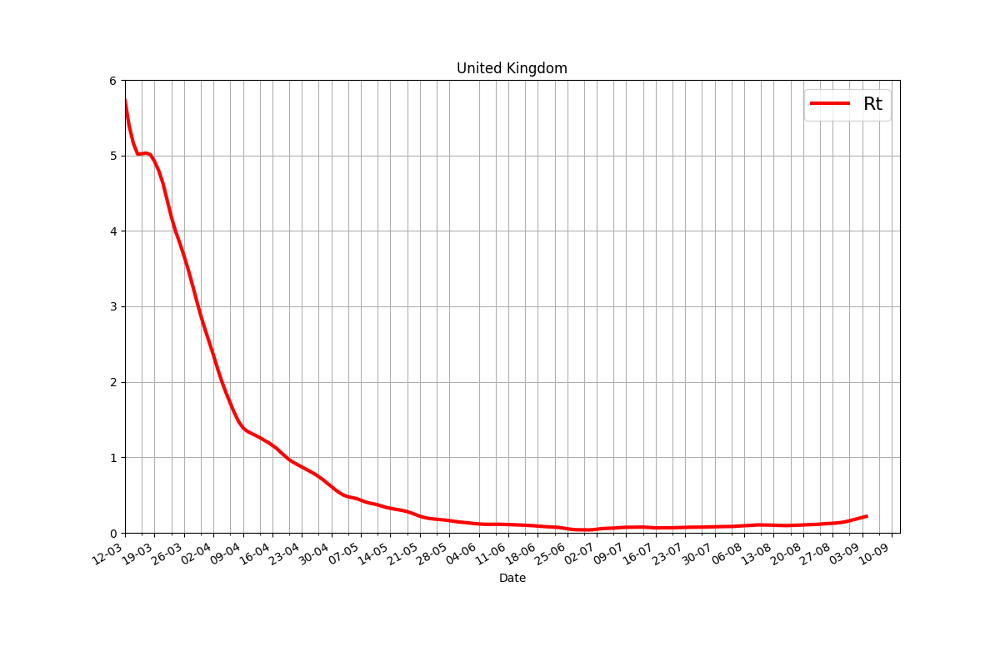

# The Coronavirus Map

```python
! wget https://raw.githubusercontent.com/datasets/covid-19/master/data/time-series-19-covid-combined.csv
! zip /tmp/corona-time.zip time-series-19-covid-combined.csv
! rm time-series-19-covid-combined.csv
```

```python
import pandas as pd, zipfile

with zipfile.ZipFile('/tmp/corona-time.zip', 'r') as z:
    df =  pd.read_csv(z.open('time-series-19-covid-combined.csv'),parse_dates=['Date'])
df = df[['Date','Confirmed']]
df = df.set_index('Date')
confirmed = df.groupby('Date').sum()
print (confirmed.tail(4))
confirmed.plot() # in millions
plt.savefig('timeseries.png')
```

```text
             Confirmed
Date                  
2020-08-15  21459699.0
2020-08-16  21672186.0
2020-08-17  21881858.0
2020-08-18  22136954.0
```


```python
pd.set_option('display.float_format', lambda x: '%.2f' % x) 
chg = confirmed.pct_change()*100.0
chg.plot()
print (chg.tail(5))
plt.title('Daily % Change')
plt.savefig('rate.png')
```

```text
            Confirmed
Date                 
2020-08-14       1.46
2020-08-15       1.17
2020-08-16       0.99
2020-08-17       0.97
2020-08-18       1.17
```


County Level Data (NYT)

```python
! wget https://raw.githubusercontent.com/nytimes/covid-19-data/master/us-counties.csv
! zip /tmp/corona-county.zip us-counties.csv
! rm us-counties.csv
```

The SIR Model

$$
\frac{ds}{dt} = -\beta s i
$$

$$
\frac{di}{dt} = \beta s i - \gamma i
$$

$$
\frac{dr}{dt} = \gamma i
$$

Where does $R_0$ come from? Epidemic occurs if \# of infected ppl
increase, meaning $di / dt > 0$. That means (from 2nd eq above)

$$
\beta si - \gamma i > 0  \implies \frac{\beta s i }{\gamma} > i
$$

Then,

$$
\frac{\beta s }{\gamma} > 1
$$

At the beginning of the epidemic everyone is susceptible, so $s
\approx 1$. Substitute $s=1$

$$
\frac{\beta}{\gamma} = R_0 > 1
$$

To find $R_0$ from data, we fit the differential equation system above
to data, and using the found $\beta$ and $\gamma$ we calculate $R_0$.

<a name='Rt'/>

# $R_t$ Estimate

```python
import util

country = 'United Kingdom'
pop, df = util.estimate_Rt_for_country(country)
import matplotlib.dates as mdates
ax = df.plot('Date','Rt',linewidth=3,color='red',grid=True,ylim=(0,6),figsize=(12,8))
ax.xaxis.grid(True, which='minor')
ax.xaxis.set_major_locator(mdates.DayLocator(interval=7))
ax.xaxis.set_major_formatter(mdates.DateFormatter('%d-%m'))
plt.gcf().autofmt_xdate()
plt.legend(fontsize=16)
plt.title(country)
plt.savefig('Rt-%s' % country.replace(" ",""))
print (df[['Date','Rt']].tail(10))
```

```text
          Date        Rt
225 2020-09-03  0.202808
226 2020-09-04  0.217387
227 2020-09-05       NaN
228 2020-09-06       NaN
229 2020-09-07       NaN
230 2020-09-08       NaN
231 2020-09-09       NaN
232 2020-09-10       NaN
233 2020-09-11       NaN
234 2020-09-12       NaN
```



References

https://web.stanford.edu/~jhj1/teachingdocs/Jones-on-R0.pdf

https://chengjunwang.com/post/en/2013-03-14-learn-basic-epidemic-models-with-python/

https://medium.com/analytics-vidhya/covid19-transmission-forecast-in-italy-a-python-tutorial-for-sri-model-8c103c0a95b9

[Reference](https://www.worldometers.info/coronavirus/)

https://web.stanford.edu/~jhj1/teachingdocs/Jones-on-R0.pdf

https://chengjunwang.com/post/en/2013-03-14-learn-basic-epidemic-models-with-python/

https://medium.com/analytics-vidhya/covid19-transmission-forecast-in-italy-a-python-tutorial-for-sri-model-8c103c0a95b9


