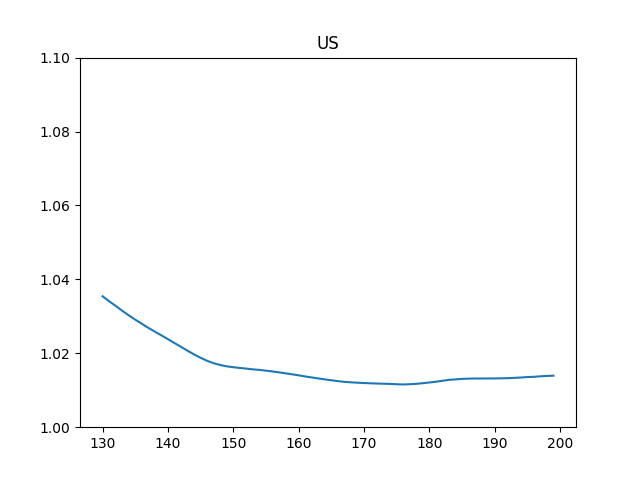

# Coronavirus Data, Analysis

# Mortality Rate

Code is from [2]

<a mame='mortality'/>

```python
import util
world_rate_df = util.mortality_rate()
world_rate_df['deaths / 100 confirmed'].plot(title='Worldwide Mortality Rate')
plt.savefig('mort.png')
```

```text
1/27/21    2.155877
1/28/21    2.159727
1/29/21    2.161726
1/30/21    2.164064
Name: deaths / 100 confirmed, dtype: float64
```


The SIR Model

$$
\frac{ds}{dt} = -\beta s i
$$

$$
\frac{di}{dt} = \beta s i - \gamma i
$$

$$
\frac{dr}{dt} = \gamma i
$$

Where does $R_0$ come from? Epidemic occurs if \# of infected ppl
increase, meaning $di / dt > 0$. That means (from 2nd eq above)

$$
\beta si - \gamma i > 0  \implies \frac{\beta s i }{\gamma} > i
$$

Then,

$$
\frac{\beta s }{\gamma} > 1
$$

At the beginning of the epidemic everyone is susceptible, so $s
\approx 1$. Substitute $s=1$

$$
\frac{\beta}{\gamma} = R_0 > 1
$$

To find $R_0$ from data, we fit the differential equation system above
to data, and using the found $\beta$ and $\gamma$ we calculate $R_0$.

Daily Change

<a name='daily'/>

```python
import pandas as pd, util
df = util.get_data()
```

```python
df['Germany +'] = df['Germany'].diff()
df['UK +'] = df['United Kingdom'].diff()
df['Germany %'] = df['Germany'].pct_change().rolling(10).mean()*100.0
df['UK %'] = df['United Kingdom'].pct_change().rolling(10).mean()*100.0
```

```python
pd.set_option('display.width', 2000)
pd.set_option('display.max_columns', None)
print (df[['Germany +','Germany %','UK +','UK %']].tail(10))
```

```text
Country/Region  Germany +  Germany %     UK +      UK %
1/21/21            8277.0   0.833230  37977.0  1.285756
1/22/21           16366.0   0.770658  40321.0  1.253265
1/23/21           12430.0   0.699258  33652.0  1.196699
1/24/21           10078.0   0.639360  30111.0  1.128181
1/25/21            6887.0   0.628786  22244.0  1.018077
1/26/21            9387.0   0.599139  20167.0  0.948306
1/27/21           15636.0   0.615061  25369.0  0.902018
1/28/21           14883.0   0.638208  28811.0  0.868919
1/29/21           12831.0   0.637274  29145.0  0.849391
1/30/21           17518.0   0.576633  23400.0  0.799088
```

<a name='Rt'/>

Reproduction Rate $R_t$

This calculation is based on [1]

```python
tau = 7 # length of time window
si_mean = 6.3 # mean of serial interval
si_std = 4.2 # standard deviation of serial interval
conf = 0.95 # confidence level of estimated Reff
c = df['US'].tail(200)
R = util.Reff(c, si_mean, si_std, tau, conf)
df2 = pd.DataFrame(R.T)
print (df2[1].tail(5))
# 0,2 indices 95% conf
df2[1].tail(70).plot()
plt.title('US')
plt.ylim(1.0,1.1)
plt.savefig('Rt-US.png')
```

```text
195    1.048635
196    1.047065
197    1.045581
198    1.044175
199    1.042812
Name: 1, dtype: float64
```




County Level Data (NYT)

```python
! wget https://raw.githubusercontent.com/nytimes/covid-19-data/master/us-counties.csv
! zip /tmp/corona-county.zip us-counties.csv
! rm us-counties.csv
```

Code

[util.py](util.py)

References

[1] https://github.com/tt-nakamura/Reff.git

[2] https://notebooks.ai/rmotr-curriculum/analyzing-covid19-outbreak-40c03c06

[4] https://web.stanford.edu/~jhj1/teachingdocs/Jones-on-R0.pdf


