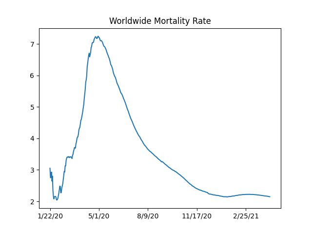

# Coronavirus Data, Analysis

# Mortality Rate

Code is from [2]

<a mame='mortality'/>

```python
import util
world_rate_df = util.mortality_rate()
world_rate_df['deaths / 100 confirmed'].plot(title='Worldwide Mortality Rate')
plt.savefig('mort.png')
```

```text
9/15/20    3.162778
9/16/20    3.149845
9/17/20    3.135215
9/18/20    3.126073
Name: deaths / 100 confirmed, dtype: float64
```




The SIR Model

$$
\frac{ds}{dt} = -\beta s i
$$

$$
\frac{di}{dt} = \beta s i - \gamma i
$$

$$
\frac{dr}{dt} = \gamma i
$$

Where does $R_0$ come from? Epidemic occurs if \# of infected ppl
increase, meaning $di / dt > 0$. That means (from 2nd eq above)

$$
\beta si - \gamma i > 0  \implies \frac{\beta s i }{\gamma} > i
$$

Then,

$$
\frac{\beta s }{\gamma} > 1
$$

At the beginning of the epidemic everyone is susceptible, so $s
\approx 1$. Substitute $s=1$

$$
\frac{\beta}{\gamma} = R_0 > 1
$$

To find $R_0$ from data, we fit the differential equation system above
to data, and using the found $\beta$ and $\gamma$ we calculate $R_0$.

<a name='Rt'/>


Daily Change

<a name='daily'/>

```python
import pandas as pd, util
df = util.get_data()
```

```python
df['Germany +'] = df['Germany'].diff()
df['UK +'] = df['United Kingdom'].diff()
df['Germany %'] = df['Germany'].pct_change().rolling(10).mean()*100.0
df['UK %'] = df['United Kingdom'].pct_change().rolling(10).mean()*100.0
```

```python
pd.set_option('display.width', 1000)
print (df[['Germany +','Germany %','UK +','UK %']].tail(10))
```

```text
Country/Region  Germany +  Germany %    UK +      UK %
9/9/20             1476.0   0.526991  2681.0  0.605502
9/10/20            1716.0   0.532382  2931.0  0.645432
9/11/20            1586.0   0.544269  3544.0  0.704330
9/12/20            1082.0   0.529182  3504.0  0.755964
9/13/20             920.0   0.506698  3338.0  0.794590
9/14/20            1485.0   0.505445  2625.0  0.807641
9/15/20            1792.0   0.542560  3115.0  0.838025
9/16/20            1855.0   0.585869  4007.0  0.858203
9/17/20            2179.0   0.592121  3410.0  0.863345
9/18/20            2199.0   0.621374  4329.0  0.905661
```


County Level Data (NYT)

```python
! wget https://raw.githubusercontent.com/nytimes/covid-19-data/master/us-counties.csv
! zip /tmp/corona-county.zip us-counties.csv
! rm us-counties.csv
```

Files

[util.py](util.py)

References

[2] https://notebooks.ai/rmotr-curriculum/analyzing-covid19-outbreak-40c03c06

[4] https://web.stanford.edu/~jhj1/teachingdocs/Jones-on-R0.pdf


