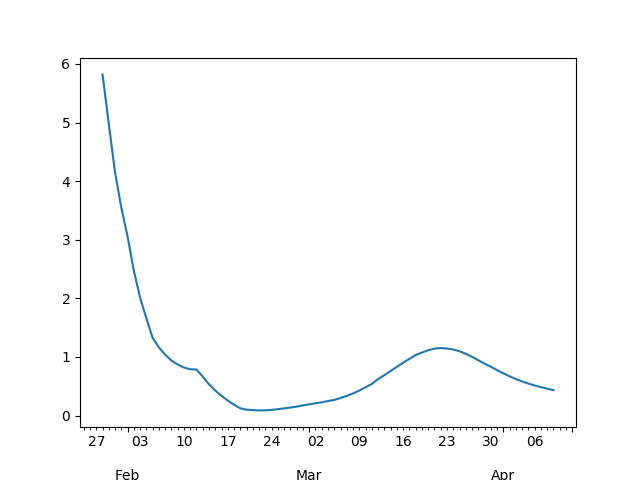

# Coronavirus Math

The SIR Model

$$
\frac{ds}{dt} = -\beta s i
$$

$$
\frac{di}{dt} = \beta s i - \gamma i
$$

$$
\frac{dr}{dt} = \gamma i
$$

Where does $R_0$ come from? Epidemic occurs if \# of infected ppl
increase, meaning $di / dt > 0$. That means (from 2nd eq above)

$$
\beta si - \gamma i > 0  \implies \frac{\beta s i }{\gamma} > i
$$

Then,

$$
\frac{\beta s }{\gamma} > 1
$$

At the beginning of the epidemic everyone is susceptible, so $s
\approx 1$. Substitute $s=1$

$$
\frac{\beta}{\gamma} = R_0 > 1
$$

To find $R_0$ from data, we fit the differential equation system above
to data, and using the found $\beta$ and $\gamma$ we calculate $R_0$.


```python
import scipy.integrate as spi
import pandas as pd
import zipfile

def fn(t_range, beta, gamma):
    S0=1-1e-6
    I0=1e-6
    INPUT = (S0, I0, 0.0)
    def diff_eqs(INP,t):
        Y=np.zeros((3))
        V = INP
        Y[0] = - beta * V[0] * V[1]
        Y[1] = beta * V[0] * V[1] - gamma * V[1]
        Y[2] = gamma * V[1]
        return Y   # For odeint

    RES = spi.odeint(diff_eqs,INPUT,t_range)
    # fit works on recovered numbers, indirectly assumes they
    # reached plateau, u can tweak this to fit other parts of
    # the model
    return RES[:,2]

from scipy import optimize
with zipfile.ZipFile('/tmp/corona-time.zip', 'r') as z:
    df =  pd.read_csv(z.open('time-series-19-covid-combined.csv'),parse_dates=['Date'])

#df = df[df['Country/Region']=='China']
#df = df[df['Country/Region']=='Korea, South']
df = df[df['Country/Region']=='Italy']
df = df[['Date','Recovered']]
df = df[df['Recovered'] > 0.0]
y_data = np.array(df.groupby('Date').sum()).T[0]
y_data = y_data / y_data.max()
x_data = np.arange(0, len(y_data), 1)

params, params_covariance = optimize.curve_fit(fn, x_data, y_data, p0=[1.0, 1.0], bounds=((0,0),(2,2)))

beta, gamma = params
print ('R0',beta / gamma)

import matplotlib.pyplot as plt

y_data_mod = fn(x_data, beta, gamma)

print ('MSE', np.mean(np.sum((y_data-y_data_mod)**2)))

plt.plot(x_data, y_data, 'r.')
plt.plot(x_data, y_data_mod, '.')
plt.savefig('R0fit.png')
```

```text
R0 5.52041369594885
MSE 0.12442312589429806
```


<a name="r0est"/>

## R0 Estimate

```python
import pandas as pd, zipfile

with zipfile.ZipFile('/tmp/corona-time.zip', 'r') as z:
    df =  pd.read_csv(z.open('time-series-19-covid-combined.csv'),parse_dates=['Date'])
#df = df[df['Country/Region']=='Korea, South']
#df = df[df['Country/Region']=='US']
df = df[['Date','Confirmed']]
conf = df.groupby('Date').sum()
ahead = 10
conf['ma'] = conf.rolling(ahead).mean()
conf['ah'] = conf.ma.shift(-ahead)
conf['R0'] = (conf.ah - conf.ma) / conf.ma
conf.R0.plot()
print (conf.R0.dropna().tail(5))
plt.savefig('R0est.png')
```

```text
Date
2020-04-02    1.080244
2020-04-03    1.001685
2020-04-04    0.927791
2020-04-05    0.863704
2020-04-06    0.810089
Name: R0, dtype: float64
```



References

https://web.stanford.edu/~jhj1/teachingdocs/Jones-on-R0.pdf

https://chengjunwang.com/post/en/2013-03-14-learn-basic-epidemic-models-with-python/

https://medium.com/analytics-vidhya/covid19-transmission-forecast-in-italy-a-python-tutorial-for-sri-model-8c103c0a95b9


