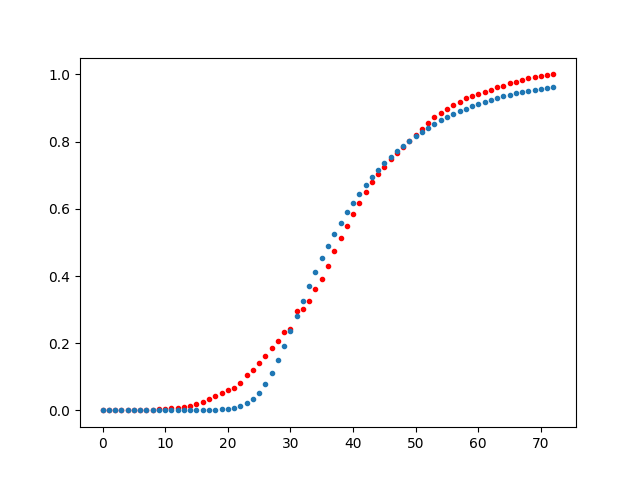

# Coronavirus Math

$$
\frac{ds}{dt} = -\beta s i
$$

$$
\frac{di}{dt} = \beta s i - \gamma i
$$

$$
\frac{dr}{dt} = \gamma i
$$

$$
R_0 = \frac{\beta}{\gamma}
$$


```python
import scipy.integrate as spi
import pandas as pd
import zipfile

def fn(t_range, beta, gamma):
    S0=1-1e-6
    I0=1e-6
    INPUT = (S0, I0, 0.0)
    def diff_eqs(INP,t):
        Y=np.zeros((3))
        V = INP
        Y[0] = - beta * V[0] * V[1]
        Y[1] = beta * V[0] * V[1] - gamma * V[1]
        Y[2] = gamma * V[1]
        return Y   # For odeint

    RES = spi.odeint(diff_eqs,INPUT,t_range)
    return RES[:,2]

from scipy import optimize
with zipfile.ZipFile('corona-time.zip', 'r') as z:
    df =  pd.read_csv(z.open('time-series-19-covid-combined.csv'),parse_dates=['Date'])

#print (df['Country/Region'].unique())
#df = df[df['Country/Region']=='Korea, South']
df = df[df['Country/Region']=='Italy']
df = df[['Date','Recovered']]
df = df[df['Recovered'] > 0.0]
y_data = np.array(df.groupby('Date').sum()).T[0]
y_data = y_data / y_data.max()
x_data = np.arange(0, len(y_data), 1)

params, params_covariance = optimize.curve_fit(fn, x_data, y_data, p0=[2.0, 2.0], bounds=((0,0),(3,2.0)))

beta, gamma = params
print ('R0',beta / gamma)

import matplotlib.pyplot as plt

y_data_mod = fn(x_data, beta, gamma)

print ('MSE', np.mean(np.sum((y_data-y_data_mod)**2)))

plt.plot(x_data, y_data, 'r.')
plt.plot(x_data, y_data_mod, '.')
plt.savefig('R0fit.png')
```

```text
R0 5.520820206702226
MSE 0.12442312407662531
```




https://web.stanford.edu/~jhj1/teachingdocs/Jones-on-R0.pdf

https://chengjunwang.com/post/en/2013-03-14-learn-basic-epidemic-models-with-python/

https://medium.com/analytics-vidhya/covid19-transmission-forecast-in-italy-a-python-tutorial-for-sri-model-8c103c0a95b9


