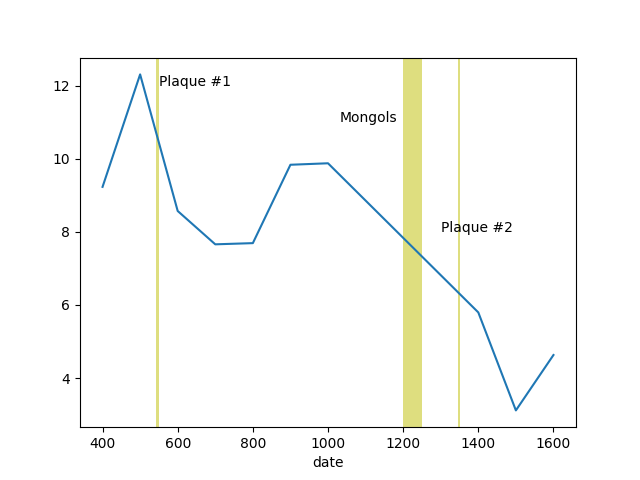
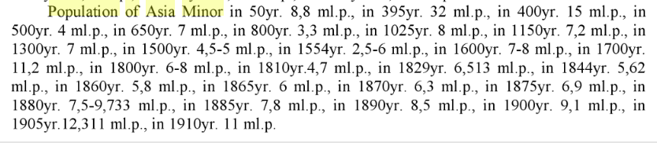

# Population of Asia Minor 

Analysis using the Seshat data below. We used the Equinox-2020 dataset,

http://seshatdatabank.info/datasets/

The encoding of this dataset carries different attributes in seperate
rows, instead of columns, so preprocessing was necessary.

We filter out population and territory data for Anatolia, and adjust
the population for the current size of TR, ~780K sq meters. This way
in a sense we are always looking at "the same area" no matter which
empire, gov that seems to be in charge, however big, in that region.


```python
import pandas as pd, zipfile

pd.set_option('display.max_columns', None)
with zipfile.ZipFile('seshat-row.zip', 'r') as z:
     df = pd.read_csv(z.open('seshat-row.csv'))
df = df[df.NGA == 'Konya Plain']
df1 = df[df['Variable'] == 'Polity territory'][['NGA','Polity','Date.From','Value.From']]
df2 = df[df['Variable'] == 'Polity Population'][['NGA','Polity','Date.From','Value.From']]
df1 = df1.dropna()
df2 = df2.dropna()
df3 = df1.merge(df2, left_on=['NGA','Date.From'], right_on=['NGA','Date.From'])
df3 = df3.rename(columns={"Value.From_x": "area", "Value.From_y": "pop"})
df3['date'] = df3['Date.From'].str.replace("CE","").astype(float)
df3['pop'] = df3['pop'].astype(float)
df3['area'] = df3['area'].astype(float)
df3 = df3.sort_values('date', ascending=True)
df3['pop_scaled'] = (800000.0 / df3['area']) * df3['pop'] / 1e6

df4 = df3.set_index('date')
df4['pop_scaled'].plot()
plt.axvspan(541, 549, color='y', alpha=0.5, lw=0)
plt.axvspan(1200, 1250, color='y', alpha=0.5, lw=0)
plt.axvspan(1347, 1351, color='y', alpha=0.5, lw=0)
plt.text(550,12,'Plaque #1')
plt.text(1030,11,'Mongols')
plt.text(1300,8,'Plaque #2')
plt.savefig('asiaminor.png')
```



The arrival of new ppl into Asia Minor (Anatolia) starting from 600s
and continuing for a few centuries seems to be around 1 million
arriving into a population of 8 million. These people came to settle,
not to battle (unlike Mongols later who did). Once governance
structures formed, around them, including them, they battled with
Byzantium but also with eachother. Many pop decreases have probably to
do with this, but also with the plaque, and later the Mongols who beat
the dominant gov at the time, the Seljuks.

As an alternative source, data from *Demography, Part 1* by Vinogradov is also below.



Accoring to this source, population hovers mostly around 7 million, it
was 8 million at 1025, 7.2 million on 1300, 7 million 1500...

Both datasets support a minority thesis, and since culture codes are
the important element here which is tied to geography, arrivals wld
mostly be assimilated and be part of their region. This is the reason
today's Anatolians are close in culture to Greeks, Armenians, or
Kurds, one cld say *are* a combination of all these cultures / peoples.

