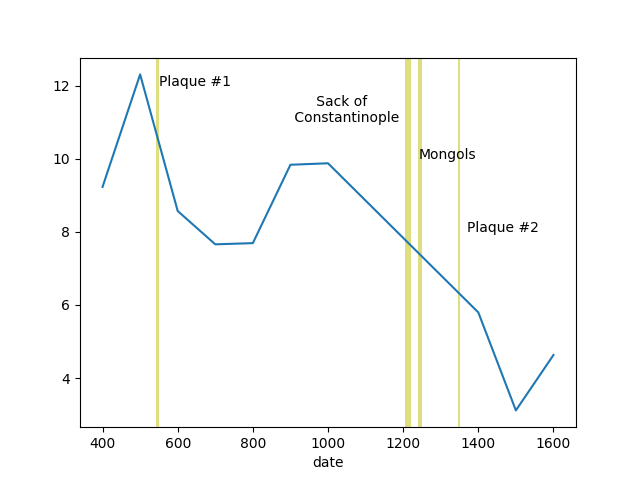

# Population of Asia Minor 


```python
import pandas as pd, zipfile

pd.set_option('display.max_columns', None)
with zipfile.ZipFile('seshat-row.zip', 'r') as z:
     df = pd.read_csv(z.open('seshat-row.csv'))
df = df[df.NGA == 'Konya Plain']
df1 = df[df['Variable'] == 'Polity territory'][['NGA','Polity','Date.From','Value.From']]
df2 = df[df['Variable'] == 'Polity Population'][['NGA','Polity','Date.From','Value.From']]
df1 = df1.dropna()
df2 = df2.dropna()
df3 = df1.merge(df2, left_on=['NGA','Date.From'], right_on=['NGA','Date.From'])
df3 = df3.rename(columns={"Value.From_x": "area", "Value.From_y": "pop"})
df3['date'] = df3['Date.From'].str.replace("CE","").astype(float)
df3['pop'] = df3['pop'].astype(float)
df3['area'] = df3['area'].astype(float)
df3 = df3.sort_values('date', ascending=True)
df3['pop_scaled'] = (800000.0 / df3['area']) * df3['pop'] / 1e6
```

(1347–1351).[4][5] The latter was much shorter, but still killed an
estimated one-third to one-half of Europeans.

```python
df4 = df3.set_index('date')
df4['pop_scaled'].plot()
plt.axvspan(541, 549, color='y', alpha=0.5, lw=0)
plt.axvspan(1200, 1250, color='y', alpha=0.5, lw=0)
plt.axvspan(1347, 1351, color='y', alpha=0.5, lw=0)
plt.text(550,12,'Plaque #1')
plt.text(1030,11,'Mongols')
plt.text(1300,8,'Plaque #2')
plt.savefig('asiaminor.png')
```


