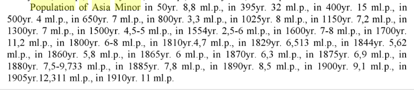

# Turks, Culture, National Narrative

What is culture, national narrative? How is the interplay?

Brain is made-up of three layers; the reptilian brain, culture codes
and intellect. Any group of people staying at a geography long enough
will converge to a common sets of codes. This happens organically,
wout anyone telling a kid how things are, it does not happen through
modern education, or through stories told by a parent, or an uncle. It
is an osmosis at a gargantuan level where an infant sucks in all
available information at a young age from everything, and everyone
around him, bcz this info is needed to fit in. Such task could not be
outsourced to a single person, or few persons. The entire society, the
life itself plays a part.

The codes are cemented near age 7 and locked in.

National narrative is something else, it is but a weak paint on top of
existing structure. It can be changed, ignored, it can help or hinder
a national conversation. Nationalism is second-wave, so narrative
inescapably carries certain central, concentrated tendencies -- it is
in a country's interest to make this narrative as sensible as
possible, and it should be compatible with the culture codes of a
populace. If not, it will be ignored, ridiculed, or worse create
pathologies among the intellectuals.

What is the culture of the people of Anatolia? Simple, it is the
culture of that particular geography, Surely some pre-agro codes like
everyone else, then it invented organized agriculture (the first ones
to do so), so it carries some of that baggage, but also has some
decentralized airs being away from most "ancient" centers in the
beginning of written history. Its governance culture is inescapably
Roman however, bcz it was smack in the middle of Rome II and III,
Byzantium and Ottomans, infecting people through a peasant/palace
dynamic.

Everyone who came to these lands, assimilated into this culture. 

<a name='identity'/>

The national narrative is the more crooked part. 1923 was probably the
worst time to found a Republic. Ethnic nationalism was on the rise,
WWI was over, WWII was not (so Mussolini, Hitler are not around yet),
and here is the Anatolians trying to tailor a new national narrative
for themselves. The existing structures around Ottomans had imploded
along with the empire. Balkans, Middle Eastern "vassals" were gone,
each worrying about their own nationalities. The founders needed an
identity to inspire people, to make them forget about the "here and
now" so they chose something "outside". This was the Turk. He was from
Central Asia, and he was the ideal, the pure.

However this particular ethnicity was never known as imagined then,
usually it would be conflated with religion, and/or (rightfully) to
the few number of *Turkomans* who arrived at a some point, and settled
in Anatolia in a particular region. Within the ball busting ethnic
relations the particular word's standing wasn't that hot either, the
ethnic label could even be considered a slur, no more than 100 years
ago.

Best account of this comes from an officer in the Ottoman army. At the
last days of the empire the new nationalism was circulating among the
cadres, and he wanted to check how much the regular soldiers knew of
"their identity". He starts easy, first asks them about the sultan,
the Caliph, etc. The soldiers weren't really sure, many were confused,
they thought sultan was prophet, Caliph was God, etc.  the answers
were a big mess. Frustrated, the officer asks "but aren't we all
Turks!??". They knew the answer to that one. The responded, in unison
with the word *estağfurullah*. Let me try to translate what this
means... Say your friend drops something, or makes a mistake, and says
"ah I'm such a putz", and this is the word you use. It's like "oh
c'mon", "don't sell yourself short", forgive urself. IT CAN'T BE THAT
BAD.

<a name='add1'/>

To top if off, TR identity went through some incarnations that turned
it defunct. As it was constructed, as delusional it might have been,
it was imagined to be a secular identity. That was the other reason
for "the Turk" to come "from outside", "Central Asia", meaning outside
the realm of Islam. In fact many of the Turkists performed "research"
that found that Turk to be followers of shamanistic religions, living
as one with nature etc. In some ways they found what they wanted to
find, a non-Islamic Turk.

But later, after the political upheavals, coups in the country, and
finally after the final 1980 fascist coup (which was also trying to
ingratiate itself into the 'green belt' strategy against the "Godless"
Soviets) changed the identity to be religious as well. Ottomans were
also back in vogue. So now the identity became both secular and
religious, Kemalist and Ottomanist (Kemal was a staunch
anti-royalist), right and left, anything under the sun (I guess except
Kurds, who stayed away from this crooked identity en masse, to their
detriment).

<a name='whyfix'/>

Obivously one of the founders Kemal took the name Ataturk (Father of
all Turks) himself, so he was setting an example. But he was always
more into this stuff than others in his circle. He reportedly told an
American journalist who was visiting "you are also a Turk (because
everyone was)" which flummoxed the man. Kemal went to some odd places
with these theories, the last thing he came up was a
Sun-Language-Theory that many researchers could not make heads or
tails of, after his death the theory was quitely shelved. A minister
when asked why this was done answered "what good is the
Sun-Language-Theory after the Sun has set?".

If more and more admins to follow emphasized the fairy tales less and
less in this manner, gradually it would help alleviate the
bizarreness. The problem is the narrative is too tied with the
foundation of the Republic, and whenever there is a crisis, the
tendency is to get back to it, as if moving away from bizarreness
wasn't the right thing to do to begin with. Since shit is always wrong
in TR, such returns are common. The most recent flare-up happened
after the 80 fascist coup, admin doubled down on crazy, even added
some of its own -- now Otto past was fine along wolves, meandering
treks, so niggers are now both from outside, and not.

That's why the objection "well if the narrative works, keep it" is
moot. All indications are it stopped working long ago. A portion of
the country did not embrace the identity which is seen as a
prerequisite for citizenship, that puts these ppl at odds with the
state. Kurds are the best example, I am sure when their elites heard
of these fairy tales first, they must have said "waaat we come from
central whaaat? I don't __think__ so". That bullshit would never fly
with them. Some groups could go along, ignore, lip sync to it, but
Kurds definitely could not. Which made them the odd man out. Coupled
with the decentralization needs of the region, Kurds are hounded ever
since. These problems are not their fault.

The solution

The solution lies in the identity being rebuilt based on historic
reality. First pick a different name, Anatolians, New Galatians, South
Eurasians, whatever. The identity needs to be something that signifies
*the place*, instead of an oddball ethnicity, distant past that noone
can truly define.

The narrative, identity needs to be as simple, core as
possible. Imbuing certain political choices on this identity turns it
into a fascist propaganda tool. Any particular choice of religion (or
rejection of) cannot be part of it. Neither can be synphatizes toward
long-gone royals, or left / right ideological preferences which change
from person to person.

Addendums

<a name='population'/>

Population

Population of Asia Minor from *Demography, Part 1* by Vinogradov,

As is seen the population hovers mostly around 7 million, it was 8
million at 1025, 7.2 million on 1300, 7 million 1500... There is no
noticable effect of people arriving here, especially at the famed date
of 1071 AD. Whatever number of ppl arrived, were little in numbers, and
melted away in the existing population.

<a name='gene'/>

A recent research [1]
biologically only 9% of genetic structure (95% CI 7-11) of today's
Anatolia is Central Asian. This fits to other numbers, if we consider
the nationalist claim a 1071 war after migrants settled in Anatolia,
TR side had maximum 80K troops, assuming hailing from families of avg
of 5-6, roughly arriving at a half a million. Anatolia at this point
already abt 7 million.

There are claims of 1 million, but if we follow the references up to
their original source, we reach a B. Lewis, an historian oddball who
was quite fond of TR nationalists (an American), married to an Otto
female royalty (whose family fled TR, settled in UK after being kicked
out by Kemal), and also known as an avid "alleged" Armenian Holocaust denier.

<a name='religion'/>

The religious make-up of 1800s proves the point, since the so-called
"Turk" is closely related to Sunni Islam, was seen carrier of the
religion, and some claim, forced people to adapt it. But in the 1890s,
after loss of territory (lots of Christians gone) and before bigger
waves of Tatar migrations, the proportion of Muslims was 76.2%. Note
that a sizeable chunk of that would be Alevites, a branch of Islam so
different that it could well be considered Christian, meaning as
different as. So what kind of culture carriers are these "Turks" if
they could not even carry their own religion to half the people? All
this suggests the presence of these migrants was irrelevant. Even the
"carrier" label itself suggests their role was nothing bigger than
their numbers, tied to the region, whose realities would forge them as
deeply as any other.

Urban Legends

WWI

Here is what TR text claims why it lost during World War I. Uh, like,
our big ally Germany lost, so we lost, indirectly, *by association*.
This sounds like a B-movie tough guy routine. I wanted-a smash-a but
they would not-a let meeee! It is not only wrong, it is childish.

Wolf

Let's not get into stories around wolves, weird treks out of nowhere
to f-ck knows where, whose at least wolf part sound awefully like the
Romulus and Remus story, two lost babies who were suckled by a
she-wolf, which was the beginning of the Roman legend (as much as a
lie as anything). Delusional nats today making a variation of the
heavy metal sign extended two mid fingers (wolve's nose) are on this
particular drug. Sadly, not even my people's fairy tales are original.

Other countries

How does the narrative compare to other countries? Some countries do
better than others. Russia nationalist stories are a crock. US does
better; Here is portion of the US narrative; "Why did we seperate from
England?". "Because ruling from a distance was not effective". Fine.

Question: Why do we hear some lastnames that have the word "Turk" in
them in TR?"

When the state came up with its delusional origin story, some ppl took
as their lastname something Turkic, to make themselves friendly to the
state. The lastnames are quite comical, walking turk, born soldier, or
my favorite: soldier turk. Then, by implication, the Turkic lastnames
can be taken to indicate a certain unawareness of history on the part
of that family, due to lack of education, being far from the center,
etc. It is sad in a way, the names scream not only "I am a pleb" they
try to scream "I am *your* pleb".

I am certain once the descendants realize how foolish their ancestors
have been to chose these stupid shit of names, they will rush to legal
services __en masse__ to have them changed. One day.

Nationalism in many countries, but especially in TR, is like a
reverse-telephone game. The guy at the end of the line hears the
message much more clearly than the people in the beginning of the
line. The people at the beginning, closer to circle, know the nuances,
warts, ignore and get around stuff. The guy at the end drinks the
Kool-Aid, he is the true believer. He doesn't know any better.

References

[1] [Turkish Population Structure and Genetic Ancestry](https://www.ncbi.nlm.nih.gov/pmc/articles/PMC4904778/)

[2] [Christians In Turkey, Social Eng](https://www.researchgate.net/publication/265476406_HOW_A_SOCIAL_ENGINEERING_PROJECT_AFFECTED_CHRISTIANS_IN_TURKEY)

